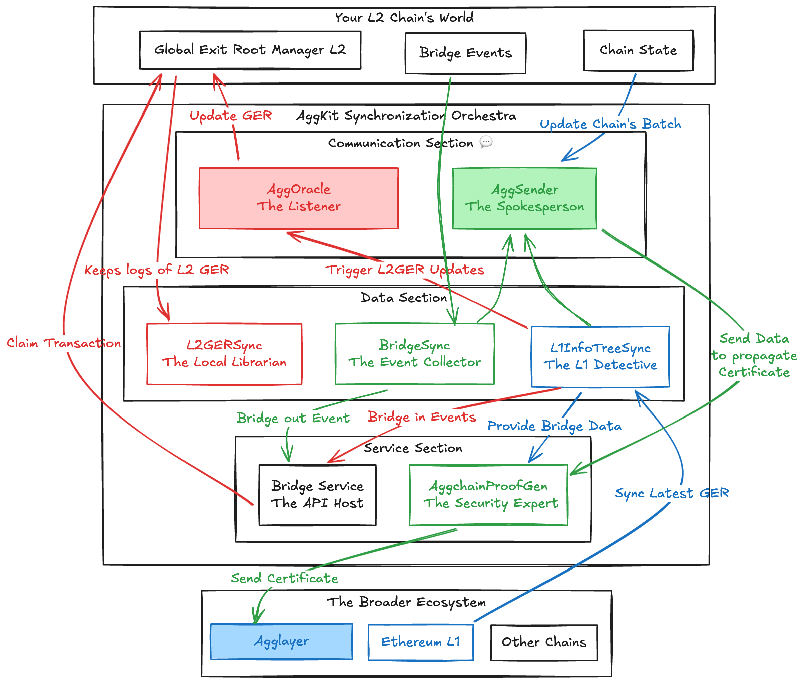
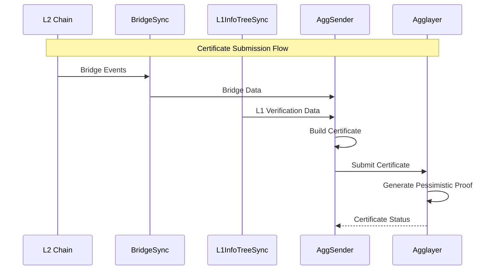
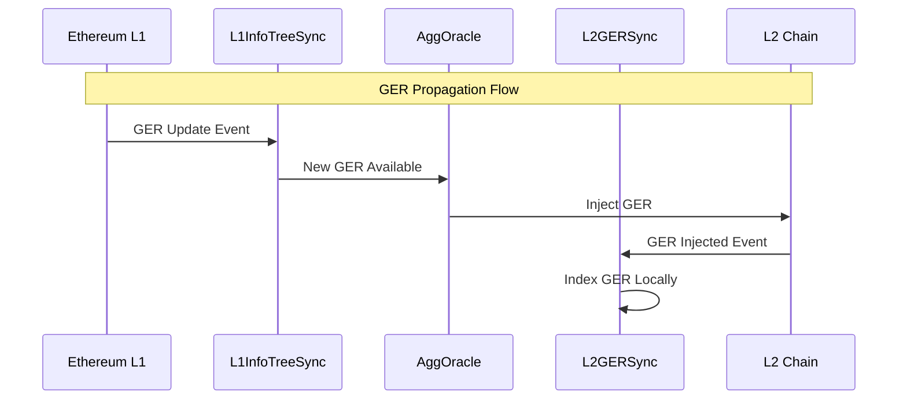
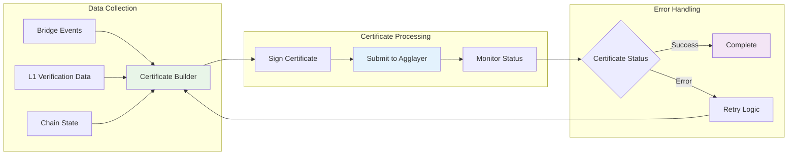
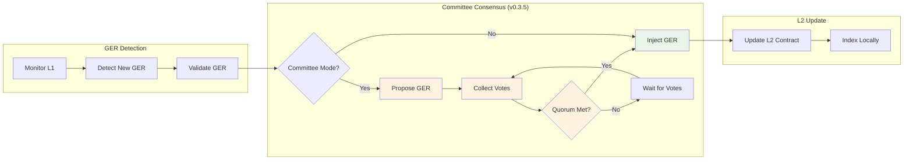
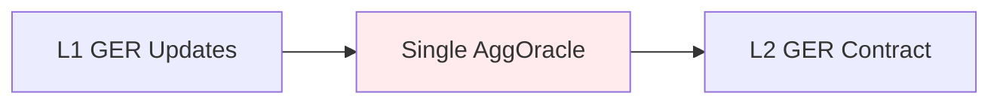
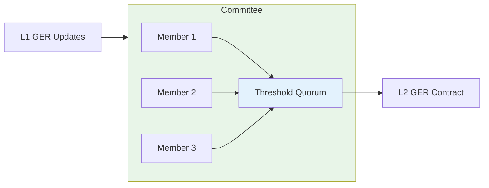

<!-- Page Header Component -->
<h1 style="text-align: left; font-size: 38px; font-weight: 700; font-family: 'Inter Tight', sans-serif;">
  Architecture
</h1>

  

    Discover how AggKit's ingenious architecture makes complex cross-chain synchronization feel effortless
  

## The Architecture Story: Building a Synchronization Symphony

Imagine conducting an orchestra where the musicians are scattered across different buildings, in different time zones, playing different instruments, but they all need to stay perfectly synchronized to create beautiful music together. That's essentially the challenge AggKit solves for blockchain networks.

Traditional blockchain architecture assumes you're dealing with a single network. But in the Agglayer ecosystem, you're dealing with **multiple sovereign chains** that each have their own rhythm, their own pace, their own way of doing things – yet they all need to work together seamlessly.

AggKit's architecture is the **conductor's baton** that keeps everyone in perfect harmony.

## The Three-Tier Architecture: How the Magic Happens

Let's break down AggKit's architecture into three distinct tiers, each with its own purpose and personality:

### Tier 1: Your Chain's Domain

At the foundation, you have **your L2 chain** doing what it does best – processing transactions, executing smart contracts, maintaining state. This is your domain, where you have full sovereignty and control.

When users perform bridge operations on your chain, several things happen simultaneously: bridge contracts emit events, state gets updated, and your chain needs to communicate these changes to the broader ecosystem. This is where AggKit steps in.

### Tier 2: The AggKit Synchronization Orchestra

In the middle tier, you have **AggKit components** working together like a well-orchestrated symphony. Each component has its specialized role, but they all coordinate to ensure seamless synchronization:

*Figure 1: The three-tier architecture – your chain, AggKit synchronization, and the broader ecosystem*

### Tier 3: The Unified Ecosystem

At the top tier, you have **the broader Agglayer ecosystem** – Agglayer itself, Ethereum L1, and all the other chains connected to the network. This is where the global state lives, where final settlement happens, and where the unified liquidity that makes everything possible is maintained.

## Data Flow Architecture

### The Two Essential Conversations

Understanding AggKit's architecture means understanding the **two critical conversations** that keep everything synchronized:

#### **Upward Flow: L2 → Agglayer**

**Purpose**: Submits L2 state transitions to Agglayer for validation and proof generation.

**Components Involved**:

- **BridgeSync**: Captures bridge events from L2 contracts
- **L1InfoTreeSync**: Provides L1 verification data and Merkle proofs
- **AggSender**: Packages data into signed certificates and submits to Agglayer

#### **Downward Flow: Agglayer → L2**

**Purpose**: Propagates global state updates from Agglayer/L1 to L2 chains for claim verification.

**Components Involved**:

- **L1InfoTreeSync**: Monitors L1 for Global Exit Root updates
- **AggOracle**: Propagates GER updates to L2 contracts (with v0.3.5 committee security)
- **L2GERSync**: Indexes and manages GER state locally on L2

## Component Interaction Patterns

### **Certificate Generation Pattern**

*Figure 2: Certificate generation and submission pattern*

### **Oracle Propagation Pattern**

*Figure 3: GER propagation with v0.3.5 committee security*

### **v0.3.5 Security Enhancements**

The major architectural improvement in v0.3.5 is the **elimination of single-address vulnerabilities**:

#### **Before v0.3.5: Single Point of Failure**

**Risk**: Single compromised address could steal funds or mint unauthorized assets.

#### **After v0.3.5: Distributed Security**

**Security**: Multiple parties must agree before any GER injection, eliminating single points of failure.

