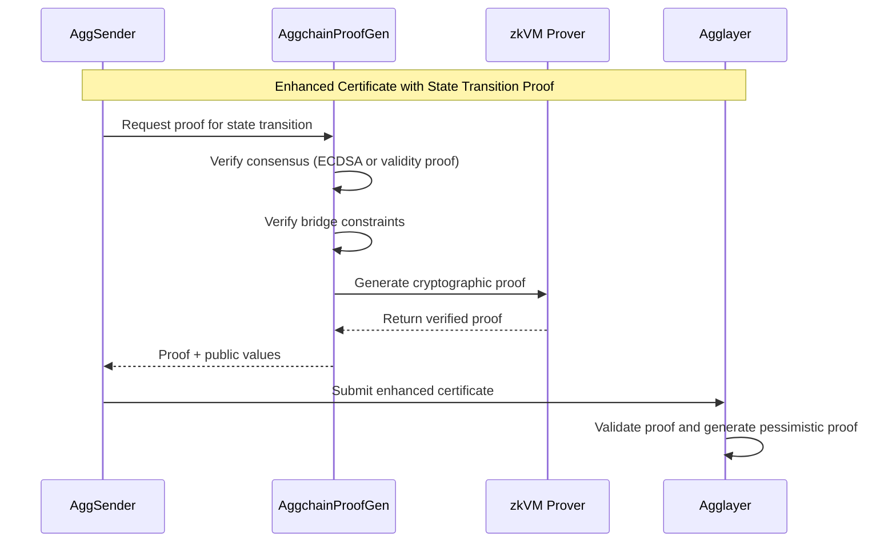
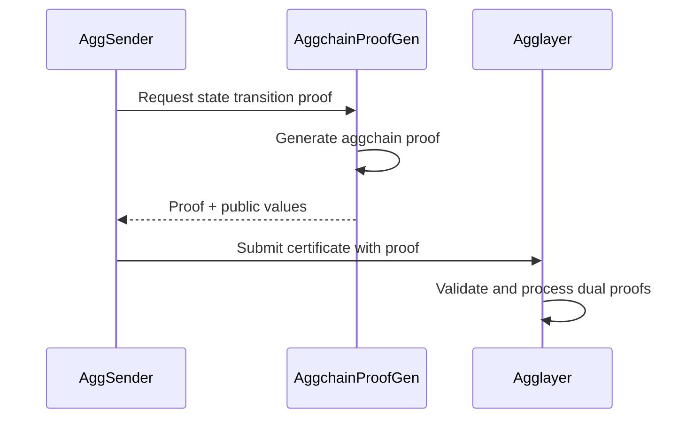

<!-- Page Header Component -->
<h1 style="text-align: left; font-size: 38px; font-weight: 700; font-family: 'Inter Tight', sans-serif;">
  AggchainProofGen
</h1>

  

    Advanced proof generation service for aggregated chain operations and state transition verification
  

## Meet AggchainProofGen: The Security Expert

AggchainProofGen is the **advanced security component** for chains that need mathematical proof of their operations' validity. While basic chains can use simple signature-based verification, some chains require comprehensive **[state transition proofs](/agglayer/core-concepts/state-transition-proof/)** that verify both internal chain operations and cross-chain bridge activities.

**Core Function**: AggchainProofGen generates sophisticated cryptographic proofs that demonstrate a chain's operations are mathematically valid and comply with all bridge security constraints. These proofs enable Agglayer's advanced dual proof system introduced in v0.3.

## When You Need the Security Expert

AggchainProofGen is **essential for chains requiring maximum security**:

### **High-Value Environments**
If your chain handles significant value, operates in regulatory environments, or requires mathematical certainty about operations, AggchainProofGen provides the advanced cryptographic proofs that basic signature verification cannot offer.

### **Custom Consensus Chains**
Chains with unique consensus mechanisms that need to prove their internal operations are valid use AggchainProofGen to generate comprehensive verification proofs that Agglayer can validate.

### **Enterprise Deployments**
Organizations requiring audit trails, compliance documentation, and mathematical proof of system correctness use AggchainProofGen to meet strict security and regulatory requirements.

## How AggchainProofGen Works

AggchainProofGen implements a **dual verification system** that validates both internal chain operations and cross-chain bridge activities:

**The dual verification**: AggchainProofGen first verifies your chain's consensus mechanism, then verifies that all bridge operations comply with security constraints, finally generating a cryptographic proof of both validations.

## The Two Types of Proof Generation

### **ECDSA Mode**: Fast and Simple
For chains with trusted sequencer models, AggchainProofGen can verify operations using **ECDSA signature validation**. This provides fast verification while maintaining compatibility with existing chain architectures.

### **Validity Proof Mode**: Mathematical Certainty
For chains requiring maximum security, AggchainProofGen generates **comprehensive mathematical proofs** using zero-knowledge virtual machines. This provides cryptographic certainty about the correctness of both internal operations and bridge activities.

## Integration with AggSender

When chains use AggchainProofGen, AggSender operates in **AggchainProver mode**:

This integration enables the **advanced security model** where both internal chain operations and cross-chain bridge activities are mathematically verified before acceptance by Agglayer.

AggchainProofGen represents the **cutting-edge security option** for chains that require mathematical certainty about their operations. It enables the most advanced security model available in the Agglayer ecosystem, making it suitable for high-value deployments and enterprise environments that demand comprehensive verification.
