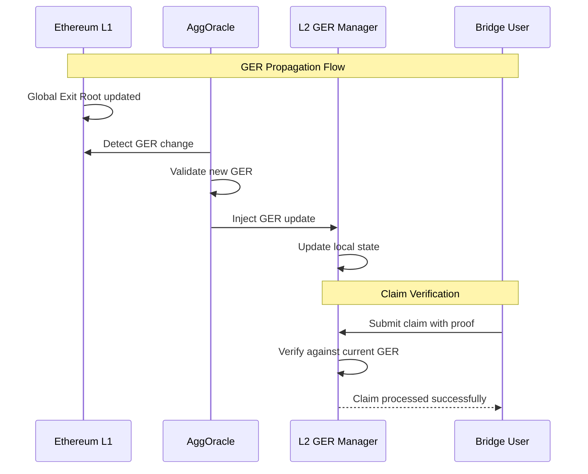
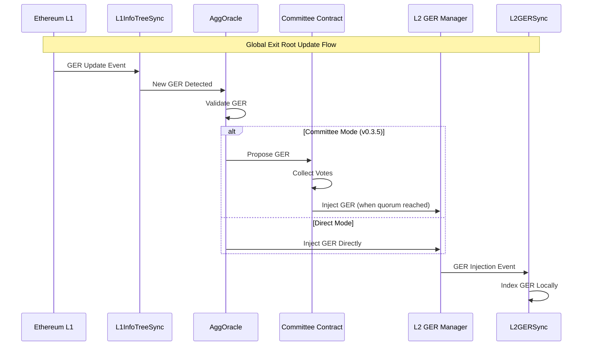

<!-- Page Header Component -->
<h1 style="text-align: left; font-size: 38px; font-weight: 700; font-family: 'Inter Tight', sans-serif;">
  AggOracle
</h1>

<div style="text-align: left; margin: 0.5rem 0;">
  <p style="font-size: 18px; color: #666; max-width: 600px; margin: 0;">
    Global Exit Root propagation system with enhanced v0.3.5 multi-party security
  </p>
</div>

## Meet AggOracle: Global State Synchronization Service

AggOracle is the component responsible for **propagating Global Exit Root (GER) updates** from Ethereum L1 to your L2 chain's Global Exit Root Manager contract. This synchronization is critical for enabling cross-chain claim verification and maintaining consistent global state across the Agglayer ecosystem.

**Core Function**: AggOracle monitors the Global Exit Root contract on Ethereum L1, detects when new GERs are published, and injects these updates into your L2 chain's Global Exit Root Manager contract. This ensures your chain always has the current global state needed to verify incoming cross-chain claims.

**Why this matters**: Without current GER data, your chain cannot verify that incoming bridge claims are legitimate, causing user frustration and broken bridge functionality.

## The Global State Synchronization Problem

### The Challenge

Cross-chain claim verification requires your L2 chain to have **current Global Exit Root (GER) data** from Ethereum L1. When users bridge assets from other chains to your chain, they present cryptographic proofs that must be verified against the latest global state.

**The technical problem**: Your L2 chain needs to know the current state of the Global Exit Root contract on Ethereum L1, but these two chains operate independently with different block times and finality requirements.

**Without AggOracle**: Your chain would need to continuously query Ethereum L1 directly, which is inefficient, unreliable, and creates dependencies on external RPC providers.

**With AggOracle**: Your chain maintains a local copy of the latest GER data, updated automatically whenever the global state changes on L1.

### The Synchronization Solution

AggOracle implements a **pull-based synchronization mechanism**:



**Result**: Your chain maintains synchronized global state without direct L1 dependencies, enabling fast and reliable cross-chain claim processing.

## How AggOracle Works

### **GER Propagation Workflow**



*Figure 2: Complete GER propagation workflow*

## The Two Operating Modes

### Direct Injection Mode (Pre-v0.3.5)

In the original design, AggOracle used **single-address authorization** for GER injection. One designated address had the authority to call `insertGlobalExitRoot()` on your chain's Global Exit Root Manager contract.

**How it works**: AggOracle detects GER updates on L1, validates them, and directly injects them into your L2 contract using a single private key.

**Vulnerability**: If the single private key is compromised, malicious actors could inject invalid GERs, potentially causing your chain to accept fraudulent bridge claims.

### Committee Mode (v0.3.5)

v0.3.5 introduces **multi-party consensus** where multiple independent AggOracle instances must agree before any GER injection occurs.

**How it works**:

1. Multiple AggOracle committee members independently monitor L1 for GER updates
2. When a new GER is detected, one member proposes it to the committee contract
3. Other members validate and vote by proposing the same GER
4. The committee contract automatically injects the GER when the threshold quorum is reached

**Security improvement**: Even if some committee members are compromised, the system remains secure because multiple independent parties must reach consensus before any state update occurs.

## Understanding Global Exit Roots

### What is a Global Exit Root?

A [Global Exit Root (GER)](../../unified-bridge/data-structures.md#global-exit-root) is a **cryptographic hash** that represents the current state of all cross-chain bridge activities across the entire Agglayer ecosystem. It's computed as:

```
GER = hash(RollupExitRoot, MainnetExitRoot)
```

Where:

- **RollupExitRoot**: Aggregated root of all L2 chains' Local Exit Roots
- **MainnetExitRoot**: Root of all Ethereum L1 bridge transactions

### Why GER Synchronization is Critical

Cross-chain claims require **cryptographic proof verification** against the current Global Exit Root. When users submit bridge claims to your chain, the claim proofs must reference a GER that your chain recognizes as valid.

**Impact**: Without current GER data, legitimate bridge claims fail verification, breaking the user experience and preventing cross-chain interoperability.
