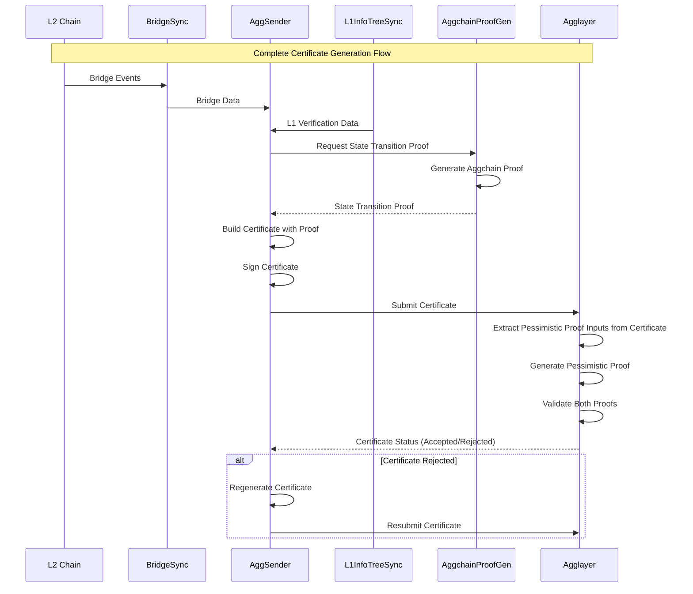
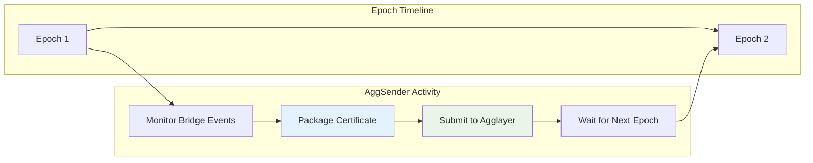
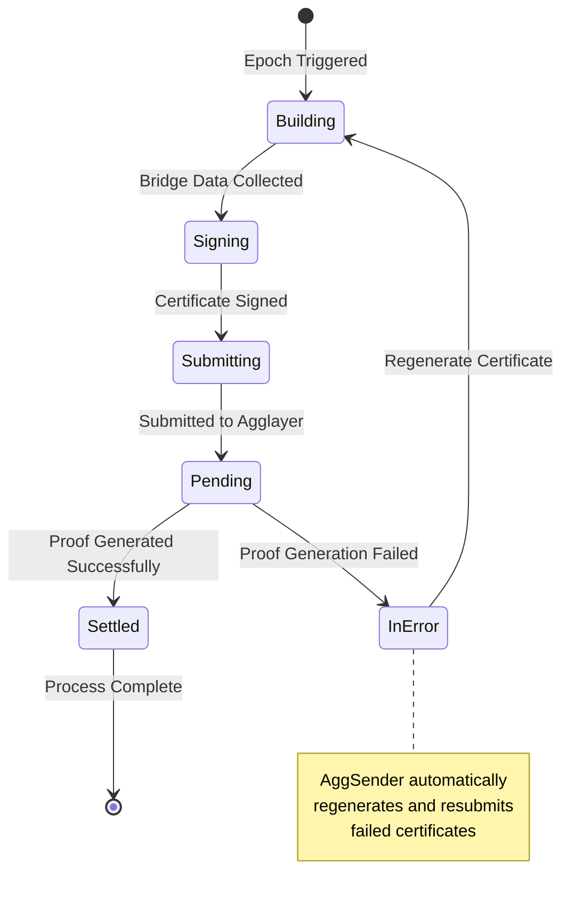

<!-- Page Header Component -->
<h1 style="text-align: left; font-size: 38px; font-weight: 700; font-family: 'Inter Tight', sans-serif;">
  AggSender
</h1>

<div style="text-align: left; margin: 0.5rem 0;">
  <p style="font-size: 18px; color: #666; max-width: 600px; margin: 0;">
    Your chain's official spokesperson to the Agglayer ecosystem – transforming bridge activities into cryptographically verifiable certificates
  </p>
</div>

## Meet AggSender: Your Chain's Digital Ambassador

Think of AggSender as your chain's **most important employee** – the one responsible for representing your chain to the entire Agglayer ecosystem. Every time something significant happens on your chain, AggSender steps in to create an official, cryptographically verifiable record and present it to Agglayer.

But this isn't just about communication. AggSender is essentially creating **digital certificates of authenticity** that prove your chain is operating legitimately and not trying to game the system. It's like having a trusted notary public whose job is to certify that your chain's activities are genuine and mathematically sound.

### The Trust Challenge That AggSender Solves

Here's the fundamental problem: Agglayer connects multiple independent blockchains, and **any of them could theoretically be compromised**. What prevents a malicious chain from claiming it has bridge transactions it doesn't actually have? What stops a compromised chain from trying to drain more funds than it legitimately deposited?

This is where AggSender becomes crucial. It doesn't just report what happened – it creates **cryptographic proof** that what happened is mathematically valid and secure.

## The Certificate Story: What AggSender Actually Does

Let's walk through what happens when a user bridges assets from your chain to another chain in the Agglayer ecosystem. This story will help you understand why AggSender is absolutely essential and how it protects the entire ecosystem.

### The User's Journey

Sarah wants to bridge 100 USDC from your L2 chain to Katana Network to use in a DeFi protocol. She initiates the bridge transaction on your chain. Your bridge contract locks/burns her USDC and emits a bridge event. Simple enough, right?

But here's what needs to happen behind the scenes for Sarah's assets to be safely claimable on Katana Network:

**The Challenge**: Agglayer needs to know that Sarah's bridge transaction actually happened, that your chain actually has the 100 USDC to back it, and that this isn't some kind of attack where your chain is trying to create fake bridge transactions.

**AggSender's Solution**: This is where AggSender steps in as your chain's digital notary. It doesn't just say "hey, Sarah bridged 100 USDC." Instead, it creates a comprehensive **certificate** that includes:

- Cryptographic proof that the bridge transaction actually occurred
- Evidence that your chain has sufficient funds to back the bridge
- Mathematical verification that your chain's state transitions are valid
- A digital signature that proves the certificate came from your authorized sequencer

### The Certificate Generation Process

AggSender operates on **Agglayer epochs** – think of these as scheduled reporting periods. Rather than sending individual notifications for every bridge transaction, AggSender waits for the appropriate moment in each epoch, then creates a comprehensive certificate that covers all bridge activities during that period.

Here's how the magic happens:



*Figure 1: AggSender's role in the certificate submission process*

## How AggSender Works

### Epoch-Based Operation

Think of AggSender as working to a **steady heartbeat** called "epochs." Instead of frantically sending a notification every time a single bridge transaction happens, AggSender waits for the right moment in each epoch, then creates a comprehensive report that covers everything that happened during that period.

This is like a daily newspaper that covers all the day's events in one organized edition, rather than printing a separate page for every single story.



**Why epochs matter**: This approach is much more efficient than individual notifications, reduces network overhead, and allows AggSender to provide comprehensive context about your chain's activities rather than fragmented individual reports.

### **Certificate Lifecycle**

Each certificate goes through several states:



*Figure 3: Certificate lifecycle states and transitions*

### **Certificate Structure**

AggSender builds certificates containing all necessary data for pessimistic proof generation:

```go
type Certificate struct {
    NetworkID              uint32                // L2 network identifier
    Height                 uint64                // Certificate sequence number
    PrevLocalExitRoot      common.Hash           // Previous Local Exit Root
    NewLocalExitRoot       common.Hash           // New Local Exit Root
    BridgeExits            []BridgeExit          // Outgoing bridge transactions
    ImportedBridgeExits    []ImportedBridgeExit  // Incoming bridge claims
    Signature              []byte                // Cryptographic signature
    Metadata               []byte                // Additional chain-specific data
}
```

AggSender is the **critical component** that enables your L2 chain to participate in Agglayer's security guarantees. By properly packaging and submitting state transitions, it ensures that your chain benefits from pessimistic proof protection while maintaining seamless cross-chain interoperability.
