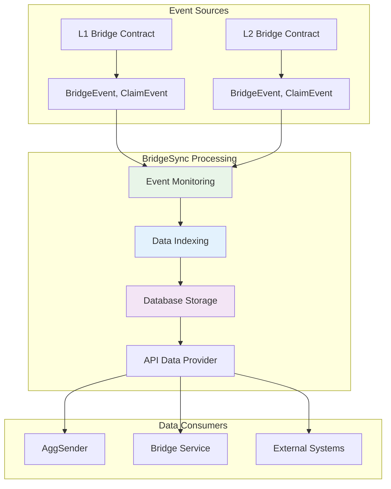
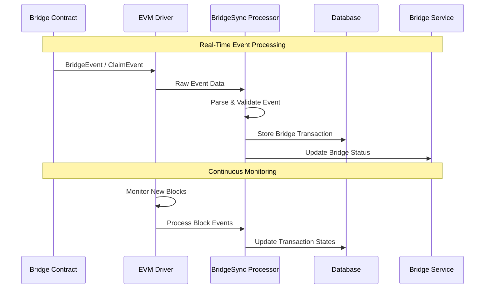
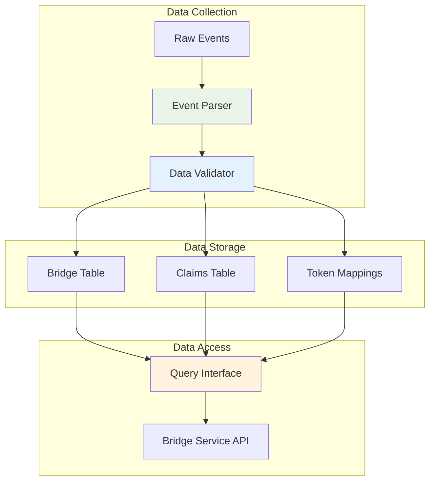
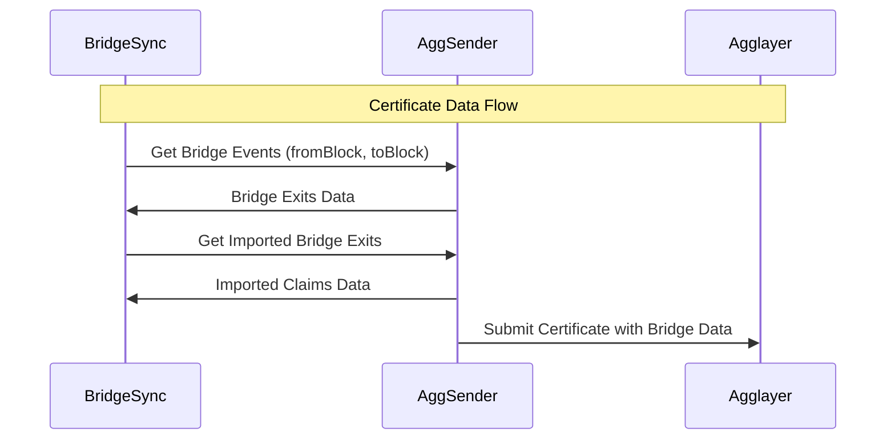
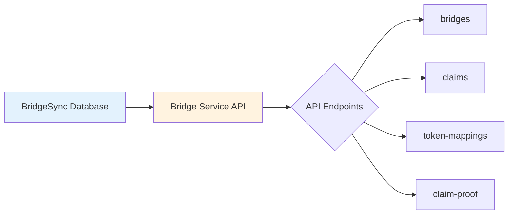

<!-- Page Header Component -->
<h1 style="text-align: left; font-size: 38px; font-weight: 700; font-family: 'Inter Tight', sans-serif;">
  BridgeSync
</h1>

<div style="text-align: left; margin: 0.5rem 0;">
  <p style="font-size: 18px; color: #666; max-width: 600px; margin: 0;">
    Bridge event synchronization system that monitors and indexes bridge transactions across L1 and L2 networks
  </p>
</div>

## Meet BridgeSync: The Event Collector

Think of BridgeSync as your **dedicated news reporter** whose beat is bridge transactions. While other components handle communication and state management, BridgeSync has one crucial job: **capturing every single bridge-related event** that happens across the networks and organizing it into a comprehensive, searchable database.

**BridgeSync** is the component responsible for **monitoring and indexing bridge events** from both L1 and L2 networks. It provides the data foundation that enables other AggKit components to track bridge transactions, generate certificates, and provide comprehensive bridge information through APIs.

**Key Responsibilities:**

- **Event Monitoring**: Real-time monitoring of bridge contract events
- **Data Indexing**: Comprehensive indexing of bridge and claim transactions
- **State Management**: Maintains bridge transaction history and status
- **Reorg Handling**: Manages blockchain reorganizations gracefully
- **API Support**: Provides data foundation for Bridge Service APIs

## Why BridgeSync is Important

### Why Every Bridge Event Matters

Here's a real-world scenario that shows why BridgeSync is absolutely essential: Maria bridges 200 USDC from Ethereum to your chain at 2:15 PM. At 2:45 PM, she wants to check the status of her bridge transaction. At 3:30 PM, she wants to claim her USDC on your chain.

**Without BridgeSync**: Each of these requests would require expensive, slow queries to blockchain nodes, external APIs, or complex contract calls. The user experience would be terrible – slow responses, incomplete information, frustrated users.

**With BridgeSync**: The moment Maria's bridge transaction happened, BridgeSync captured it, organized all the details, and made them instantly queryable. When she checks the status, the response is immediate. When she claims her USDC, all the necessary data is ready and waiting.

### **BridgeSync's Solution**

BridgeSync provides **comprehensive bridge data management**:



*Figure 1: BridgeSync's role in bridge data management*

## How BridgeSync Works

### **Event Processing Workflow**



*Figure 2: Real-time event processing workflow*

### **Bridge Event Types**

BridgeSync monitors several types of events:

#### **1. BridgeEvent**
Emitted when assets or messages are bridged **from** a network:

```solidity
event BridgeEvent(
    uint8 leafType,              // 0 = asset, 1 = message
    uint32 originNetwork,        // Source network ID
    address originAddress,       // Sender address
    uint32 destinationNetwork,   // Destination network ID
    address destinationAddress,  // Recipient address
    uint256 amount,              // Amount (for assets)
    bytes metadata,              // Additional data
    uint32 depositCount          // Index in Local Exit Tree
);
```

#### **2. ClaimEvent**
Emitted when assets or messages are claimed **on** a network:

```solidity
event ClaimEvent(
    uint256 globalIndex,         // Global transaction index
    uint32 originNetwork,        // Source network ID
    address originAddress,       // Original sender
    address destinationAddress,  // Claim recipient
    uint256 amount               // Claimed amount
);
```

### **Data Processing Pipeline**



*Figure 3: Data processing pipeline from events to API*

## Integration with Other Components

### **AggSender Integration**

BridgeSync provides **essential data** for certificate generation:



**Data Provided**:

- Bridge exits (outbound transactions from your L2)
- Imported bridge exits (inbound claims to your L2)
- Transaction proofs and metadata
- Block range information for certificate scope

### **Bridge Service Integration**

BridgeSync is the **primary data source** for Bridge Service APIs:



All Bridge Service endpoints query BridgeSync databases for transaction data.
