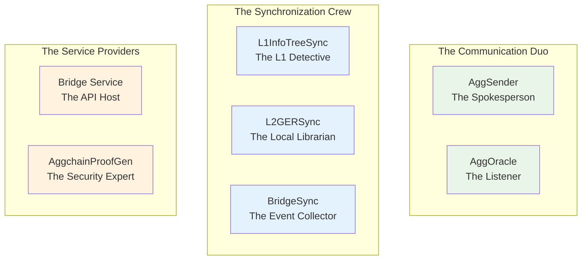
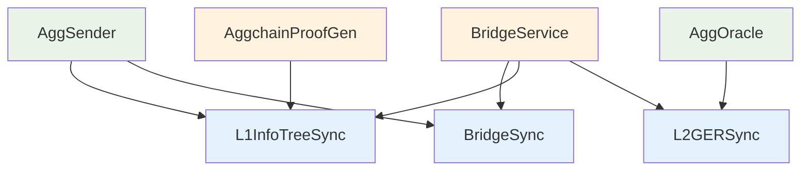

<!-- Page Header Component -->
<h1 style="text-align: left; font-size: 38px; font-weight: 700; font-family: 'Inter Tight', sans-serif;">
  Components Overview
</h1>

  

    Meet the 7 specialized components that make cross-chain synchronization feel effortless
  

## The Art of Modular Synchronization

Imagine trying to keep a busy restaurant running smoothly. You need someone taking orders, someone cooking, someone managing inventory, someone handling payments, and someone coordinating everything. Each person has a specialized role, but they all need to work together seamlessly.

AggKit works the same way. Instead of one massive system trying to do everything, it consists of **7 specialized components** that each excel at their specific job while working together harmoniously. The result is a synchronization system that feels effortless to operate and robust enough for production deployments.

### Why Modularity Matters

Here's the genius of AggKit's design: **you only run what you actually need**. 

Running a simple chain that just wants basic Agglayer connectivity? Use 2 components. Building a full bridge infrastructure? Use 5 components. Running a service business that provides bridge APIs to other applications? Use 4 different components.

This isn't just about efficiency – it's about **giving you control**. You're not forced to deploy infrastructure you don't need, pay for resources you won't use, or maintain complexity that doesn't add value to your specific situation.

## Meet the AggKit Team

Think of these 7 components as **specialized team members**, each with their own expertise, working together to keep your chain connected to Agglayer:

*Figure 1: The AggKit team – each component has a specialized role*

## The Essential Duo: Every Chain's Foundation

### AggSender: Your Chain's Spokesperson

**What AggSender does**: Think of AggSender as your chain's **official spokesperson** to the Agglayer ecosystem. Every time something important happens on your chain – a bridge transaction, a state change – AggSender packages up all the details into a formal "certificate" and presents it to Agglayer.

But this isn't just notification. AggSender is creating **cryptographically signed evidence** that proves your chain is operating legitimately. It's like having a notary public who can certify that your chain's activities are genuine and haven't been tampered with.

**Why you always need it**: Without AggSender, your chain can't participate in Agglayer's security guarantees. You'd be isolated from the ecosystem's pessimistic proof protection and cross-chain coordination.

**The magic moment**: When users bridge assets from your chain to another chain, AggSender ensures that Agglayer knows about it and can generate the cryptographic proofs that prevent your chain from being exploited by malicious actors.

### AggOracle: Your Chain's Information Network

**What AggOracle does**: If AggSender is your spokesperson, AggOracle is your **information gatherer**. It constantly monitors the global state of all cross-chain activities and brings critical updates back to your chain.

Here's why this matters: When a user wants to claim assets that were bridged from another chain to your chain, your chain needs to verify that the original bridge transaction actually happened and was properly settled. AggOracle ensures your chain always has the latest global state information to perform this verification.

**The Agglayer v0.3.5 security revolution**: Previously, AggOracle relied on a single address, which created a massive security vulnerability. v0.3.5 introduces **committee-based consensus**, where multiple independent parties must agree before any global state update is accepted by your chain. This transforms AggOracle from a potential security risk into a robust, production-ready system.

**Why you always need it**: Without AggOracle, your chain would be blind to cross-chain activities. Users wouldn't be able to claim assets bridged from other chains because your chain wouldn't have the global state information needed for verification.

## The Synchronization Crew: Keeping Everything in Perfect Harmony

Once you decide to support bridge operations, you'll need the **synchronization crew** – three components that work together to ensure your chain has all the data it needs for seamless cross-chain operations.

### L1InfoTreeSync: The L1 Detective

**What it really does**: Think of L1InfoTreeSync as your **dedicated detective** whose only job is to watch Ethereum L1 and keep track of everything important that happens there. 

Every time someone bridges assets on L1, every time an L2 submits its state to L1, every time the global state changes – L1InfoTreeSync is there, watching, recording, and organizing this information so other components can use it.

**Why it's crucial**: Here's the thing about cross-chain operations – they need **proof**. When your AggSender wants to submit a certificate to Agglayer, it needs to include cryptographic proofs that reference L1 state. L1InfoTreeSync is the component that maintains the L1 data needed to generate these proofs.

**The behind-the-scenes magic**: L1InfoTreeSync doesn't just download L1 data – it organizes it into sophisticated Merkle tree structures that make proof generation fast and efficient. It's like having a librarian who doesn't just store books, but organizes them in a way that makes finding exactly what you need instantaneous.

### L2GERSync: The Local Librarian

**What it really does**: While AggOracle brings global state updates to your chain, L2GERSync is the **librarian** who carefully catalogs and organizes all this information locally. 

When AggOracle says "Hey, there's a new global state update," L2GERSync responds with "Got it, filed away, and now available for instant lookup whenever anyone needs it."

**Why local storage matters**: Bridge operations happen fast, and users expect quick responses. If your chain had to query L1 or external services every time someone wanted to make a claim, the user experience would be terrible. L2GERSync ensures that all the global state information is **immediately available**.

### BridgeSync: The Event Collector

**What it really does**: BridgeSync is like having a **dedicated news reporter** whose beat is bridge transactions. It monitors bridge contracts on both L1 and L2, captures every bridge and claim event, and organizes them into a comprehensive database.

But it's not just passively recording events. BridgeSync **connects the dots** – it links bridge transactions with their corresponding claims, tracks the lifecycle of cross-chain operations, and provides the complete picture of bridge activity that other components need.

**The data foundation**: Everything else in AggKit relies on BridgeSync's data. AggSender needs bridge event data to build certificates. Bridge Service APIs need transaction data to respond to queries. BridgeSync is the **foundation that makes everything else possible**.

## The Service Providers: Extending AggKit's Reach

These two components extend AggKit's capabilities beyond basic synchronization, enabling external integrations and advanced security features.

### Bridge Service: The API Host

**What it really does**: Bridge Service is like having a **dedicated concierge** for your bridge data. While the synchronization components are busy collecting and organizing data, Bridge Service provides a friendly, well-documented REST API that external applications can use to access all that information.

**Why this matters**: Imagine you're building a wallet, a DeFi protocol, or an analytics dashboard. You need bridge data, but you don't want to run the entire AggKit infrastructure just to get it. Bridge Service gives you **clean, simple APIs** that provide everything you need.

**The developer experience**: Bridge Service isn't just about exposing data – it's about making that data **easy and pleasant to work with**. It provides proper pagination, filtering, error handling, and response formatting so developers can integrate bridge functionality without fighting with complex infrastructure.

**Who benefits**: Users who want to claim their transactions on the destination chain. Wallet developers who want to show users their bridge transaction history. DeFi protocols that need to verify cross-chain asset provenance. Block explorers that want to display bridge activity. Analytics platforms tracking cross-chain flows.

### AggchainProofGen: The Security Expert

**What it really does**: AggchainProofGen is the **security expert** of the AggKit team. While basic chains can use simple signature-based verification, some chains need [**state transition proof**](../../state-transition-proof/index.md) that their operations are valid. AggchainProofGen generates these advanced cryptographic proofs.

**When you need the expert**: If your chain handles high-value transactions, operates in a regulatory environment, or wants the highest possible security guarantees, you'll want AggchainProofGen. It's like having a security specialist who can provide mathematical certainty about your chain's operations.

**The technical magic**: AggchainProofGen doesn't just generate proofs – it generates **sophisticated multi-staged proofs** that verify both your chain's internal operations and its cross-chain bridge activities. It's the component that enables Agglayer's advanced state transition proof system.

## How the Team Works Together

Understanding how these components depend on each other helps you plan your deployment and understand why certain combinations work better than others.

### The Dependency Chain

Here's the thing about teamwork: some team members need others to do their job effectively. In AggKit, these dependencies are carefully designed to make sense:

**AggSender needs helpers**: To build certificates, AggSender needs the L1 Detective (L1InfoTreeSync) to provide L1 verification data, and the Event Collector (BridgeSync) to provide bridge transaction data.

**AggOracle needs a librarian**: To efficiently serve global state information, AggOracle works with the Local Librarian (L2GERSync) to maintain organized, queryable GER state.

**Bridge Service needs the data crew**: To provide comprehensive APIs, Bridge Service relies on all the synchronization components to maintain current, organized data.

## Ready to Meet Each Team Member?

Now that you understand the overall team structure, let's get to know each component individually. Each has their own fascinating story and specific expertise:

  <!-- AggSender Card -->
  

    <h3 style="color: #0071F7; margin: 0 0 0.5rem 0; font-size: 18px; font-weight: 600;">
      AggSender: The Spokesperson
    </h3>
    

      Discover how AggSender transforms your chain's bridge activities into cryptographically verifiable certificates that Agglayer can trust.
    

    <a href="/agglayer/core-concepts/aggkit/components/aggsender/" style="color: #0071F7; text-decoration: none; font-weight: 500; font-size: 14px;">
      Meet AggSender →
    </a>
  

  <!-- AggOracle Card -->
  

    <h3 style="color: #0071F7; margin: 0 0 0.5rem 0; font-size: 18px; font-weight: 600;">
      AggOracle: The Information Network
    </h3>
    

      Learn about the v0.3.5 security revolution and how committee-based consensus transformed AggOracle from a vulnerability into a production-ready system.
    

    <a href="/agglayer/core-concepts/aggkit/components/aggoracle/" style="color: #0071F7; text-decoration: none; font-weight: 500; font-size: 14px;">
      Meet AggOracle →
    </a>
  

  <!-- BridgeSync Card -->
  

    <h3 style="color: #0071F7; margin: 0 0 0.5rem 0; font-size: 18px; font-weight: 600;">
      BridgeSync: The Event Collector
    </h3>
    

      See how BridgeSync captures and organizes every bridge transaction across multiple networks, creating the data foundation that everything else relies on.
    

    <a href="/agglayer/core-concepts/aggkit/components/bridge-sync/" style="color: #0071F7; text-decoration: none; font-weight: 500; font-size: 14px;">
      Meet BridgeSync →
    </a>
  

  <!-- L1InfoTreeSync Card -->
  

    <h3 style="color: #0071F7; margin: 0 0 0.5rem 0; font-size: 18px; font-weight: 600;">
      L1InfoTreeSync: The L1 Detective
    </h3>
    

      Understand how this dedicated L1 watcher maintains the sophisticated data structures that make instant proof generation possible.
    

    <a href="/agglayer/core-concepts/aggkit/components/l1infotree-sync/" style="color: #0071F7; text-decoration: none; font-weight: 500; font-size: 14px;">
      Meet L1InfoTreeSync →
    </a>
  

  <!-- L2GERSync Card -->
  

    <h3 style="color: #0071F7; margin: 0 0 0.5rem 0; font-size: 18px; font-weight: 600;">
      L2GERSync: The Local Librarian
    </h3>
    

      Explore how this meticulous organizer ensures your chain always has instant access to the global state information it needs.
    

    <a href="/agglayer/core-concepts/aggkit/components/l2ger-sync/" style="color: #0071F7; text-decoration: none; font-weight: 500; font-size: 14px;">
      Meet L2GERSync →
    </a>
  

  <!-- AggchainProofGen Card -->
  

    <h3 style="color: #0071F7; margin: 0 0 0.5rem 0; font-size: 18px; font-weight: 600;">
      AggchainProofGen: The Security Expert
    </h3>
    

      Learn about the advanced cryptographic proof generation that enables mathematical certainty for high-security environments.
    

    <a href="/agglayer/core-concepts/aggkit/components/aggchain-proof-gen/" style="color: #0071F7; text-decoration: none; font-weight: 500; font-size: 14px;">
      Meet AggchainProofGen →
    </a>
  

