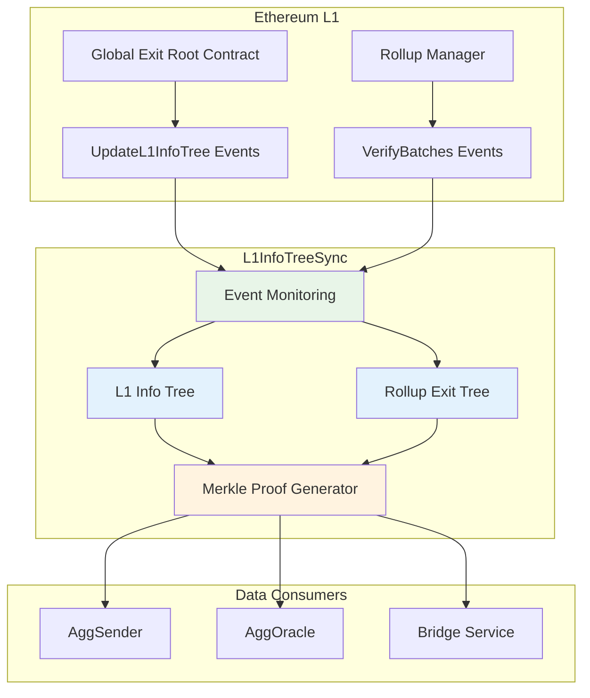
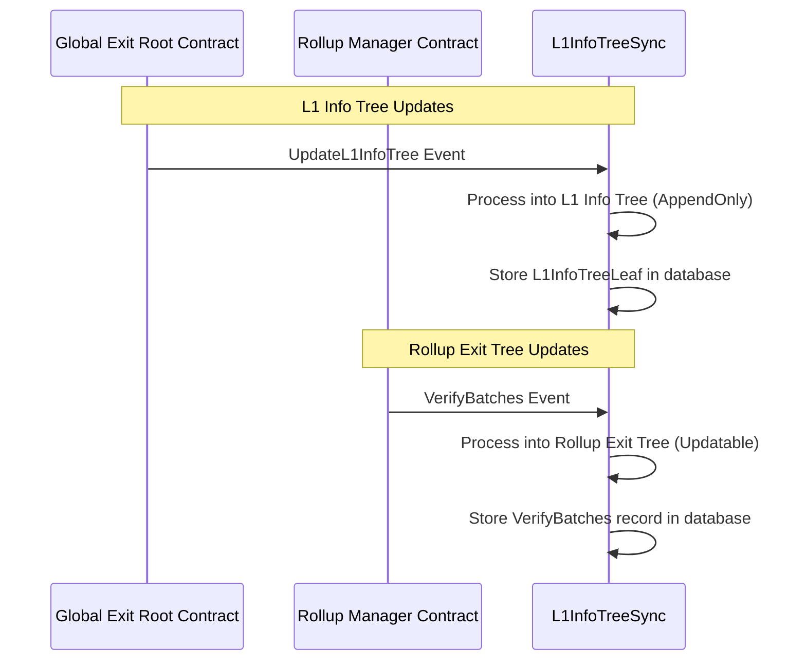
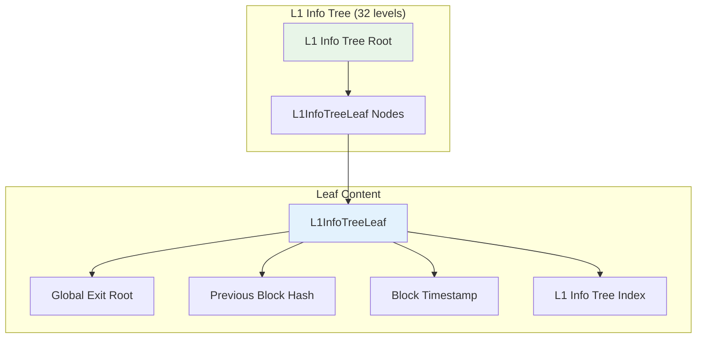
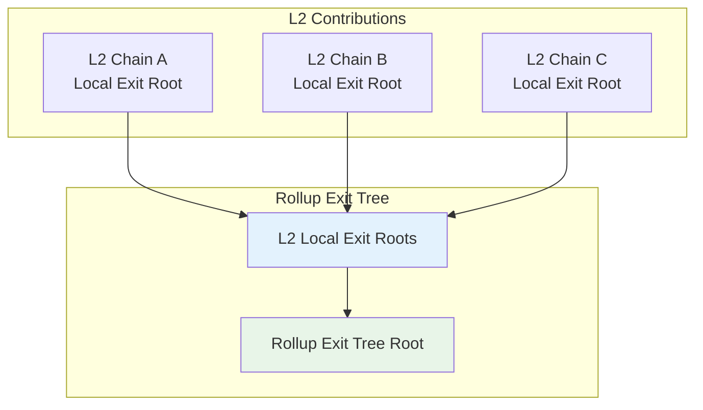
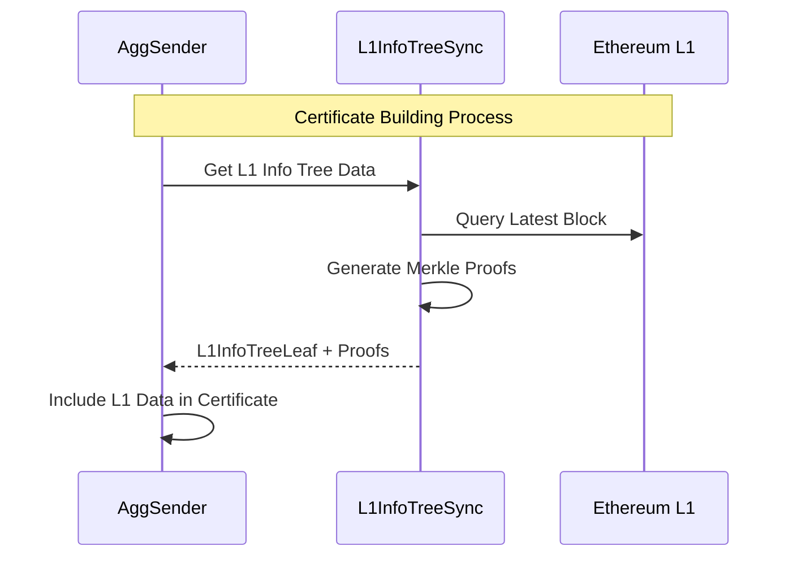
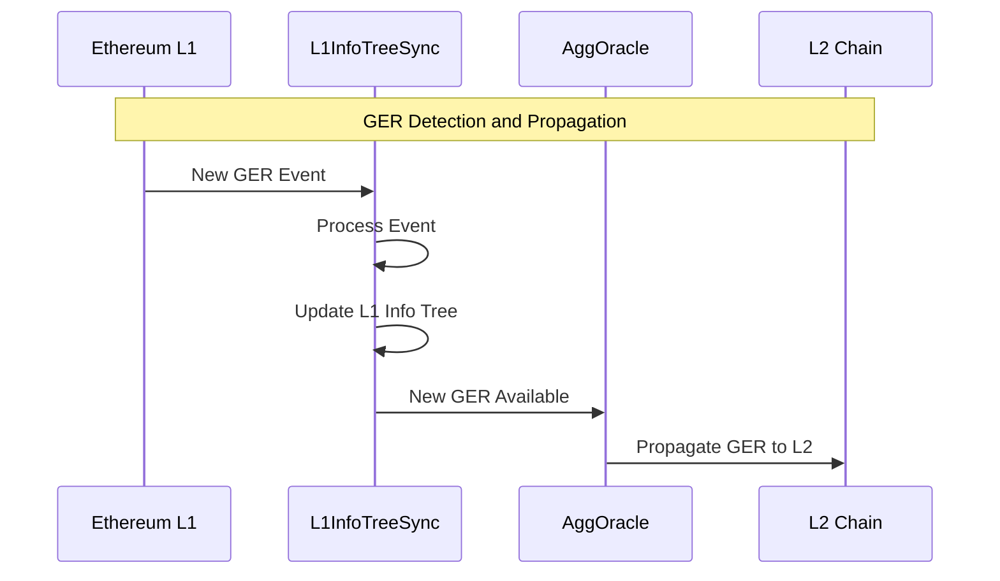

<!-- Page Header Component -->
<h1 style="text-align: left; font-size: 38px; font-weight: 700; font-family: 'Inter Tight', sans-serif;">
  L1InfoTreeSync
</h1>

  

    L1 state synchronization system that maintains real-time sync with Ethereum's L1 Info Tree and rollup exit trees
  

## Meet L1InfoTreeSync: The Dual-Tree Manager

L1InfoTreeSync is the component responsible for **maintaining two critical Merkle trees** that track different aspects of Ethereum L1 state. These trees provide the foundational data that other AggKit components need for proof generation and certificate validation.

**The Two Trees:**

1. **L1 Info Tree**: Tracks historical Global Exit Root updates from the Global Exit Root contract
2. **Rollup Exit Tree**: Tracks rollup state submissions from the Rollup Manager contract

**Why two trees**: Different AggKit operations need different types of L1 data. The L1 Info Tree provides historical GER context for claim verification, while the Rollup Exit Tree provides rollup state data for certificate building.

- **L1 Info Tree Sync**: Maintains the complete L1 Info Tree containing historical Global Exit Roots
- **Rollup Exit Tree Sync**: Tracks rollup exit tree updates from all connected L2s
- **Merkle Proof Generation**: Provides cryptographic proofs for cross-chain verification
- **State Consistency**: Handles blockchain reorganizations and maintains data integrity
- **Finality Management**: Respects different finality requirements (latest, safe, finalized)

## The Detective's Mission: Why Watching L1 is Critical

### The Evidence Collection Challenge

Cross-chain operations require **accurate L1 state information** for several critical functions:

1. **Proof Generation**: Merkle proofs must reference correct historical L1 states
2. **Certificate Validation**: AggSender needs L1 data to build valid certificates
3. **Claim Verification**: Cross-chain claims must be verified against settled L1 state
4. **Reorg Handling**: L1 reorganizations must be detected and handled properly

### **L1InfoTreeSync's Solution**

L1InfoTreeSync provides **comprehensive L1 state management**:

*Figure 1: L1InfoTreeSync's role in L1 state synchronization*

## How L1InfoTreeSync Works

### Event Processing for Two Different Trees

L1InfoTreeSync monitors **two types of events** from Ethereum L1 and processes them into **two separate tree structures**:

### The Two Tree Types Explained

**L1 Info Tree (AppendOnly)**:

- **Source**: `UpdateL1InfoTree` events from Global Exit Root contract
- **Structure**: Append-only tree that grows with each Global Exit Root update
- **Purpose**: Provides historical GER data for claim verification
- **Use case**: When users need to prove their bridge transaction was included in a specific historical state

**Rollup Exit Tree (Updatable)**:

- **Source**: `VerifyBatches` events from Rollup Manager contract  
- **Structure**: Updatable tree where L2 chains can update their submitted state
- **Purpose**: Tracks which L2 chains have submitted state and their current exit roots
- **Use case**: When AggSender needs to build certificates with rollup state context

### **Merkle Tree Management**

L1InfoTreeSync maintains two critical Merkle trees:

#### **1. L1 Info Tree**

*Figure 3: L1 Info Tree structure and leaf content*

#### **2. Rollup Exit Tree**

*Figure 4: Rollup Exit Tree aggregating all L2 states*

## Integration with Other Components

### **AggSender Integration**

L1InfoTreeSync provides **essential data** for certificate generation:

**Data Provided**:

- Current L1 Info Tree root and leaf data
- Merkle proofs for imported bridge exits
- L1 block finality information
- Historical Global Exit Root data

### **AggOracle Integration**

L1InfoTreeSync enables **GER detection** for oracle operations:

