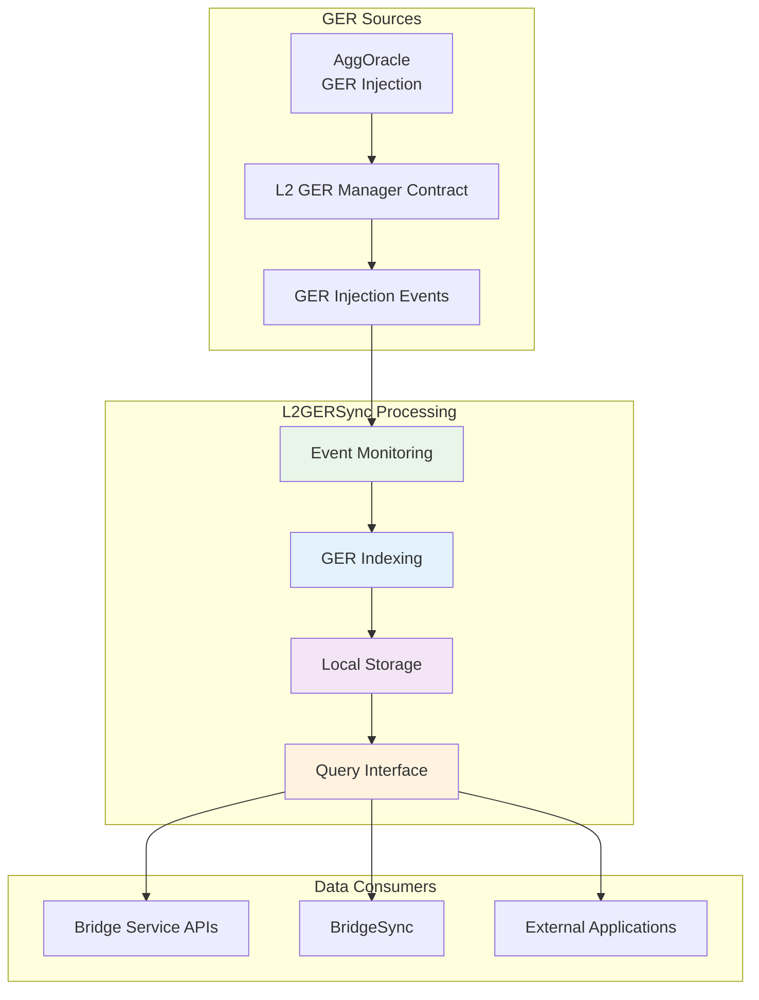
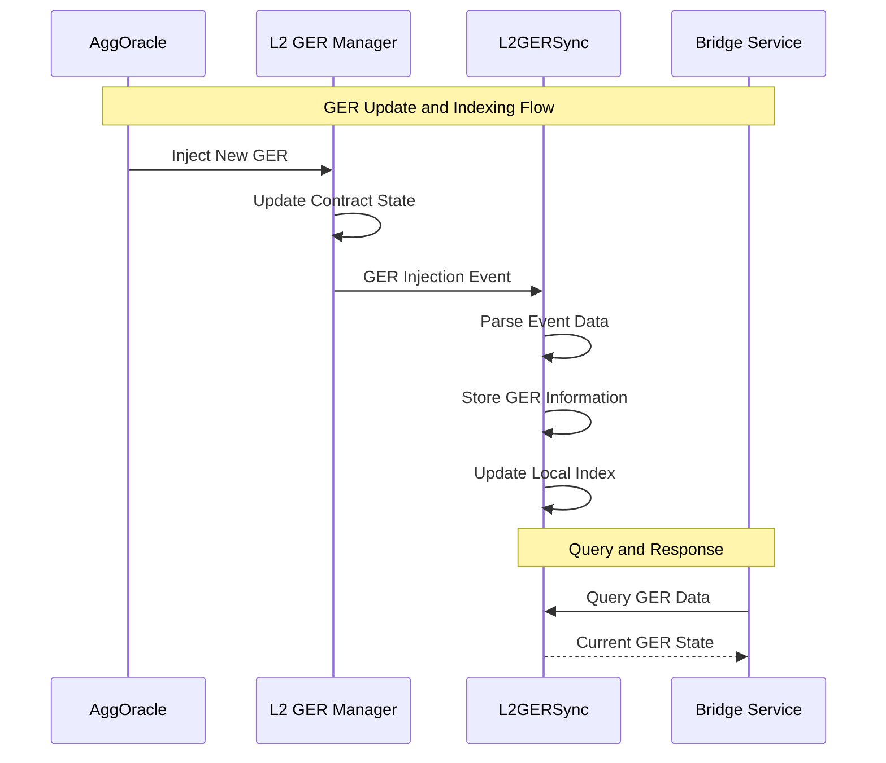

<!-- Page Header Component -->
<h1 style="text-align: left; font-size: 38px; font-weight: 700; font-family: 'Inter Tight', sans-serif;">
  L2GERSync
</h1>

  

    L2 Global Exit Root synchronization system that manages GER state on L2 chains
  

## Meet L2GERSync: The Local Librarian

**L2GERSync** is the component responsible for **managing Global Exit Root synchronization on the L2 side**. It works closely with AggOracle to maintain local GER state, providing efficient access to current and historical Global Exit Root information needed for bridge operations and claim verification.

### The Information Management Challenge

Here's a scenario that illustrates why L2GERSync is crucial: Imagine your chain receives 50 global state updates per day from AggOracle. Each update contains critical information that users need to verify their cross-chain claims. 

**Without L2GERSync**: Every time someone wants to make a claim, your chain would have to dig through contract logs, query external services, or perform expensive on-chain lookups. The user experience would be terrible – claims would take minutes instead of seconds.

**With L2GERSync**: The moment AggOracle updates your chain's global state, L2GERSync immediately catalogs this information in an optimized local database. When someone wants to make a claim, the response is **instant** – all the necessary information is perfectly organized and immediately available.

L2 chains need **efficient access to GER state** for several critical operations:

1. **Claim Verification**: Bridge claims must be verified against current Global Exit Root
2. **Proof Generation**: Merkle proofs require accurate GER state information
3. **API Responses**: Bridge Service APIs need fast GER data access
4. **Historical Queries**: Applications need access to historical GER transitions

### **L2GERSync's Solution**

L2GERSync provides **optimized local GER state management**:

*Figure 1: L2GERSync's role in L2 GER state management*

## How L2GERSync Works

### **GER Synchronization Workflow**

*Figure 2: GER synchronization and query workflow*

**The beauty**: This happens **automatically**. You don't need to configure which mode to use – L2GERSync examines your contract when it starts up and automatically configures itself for perfect compatibility.
