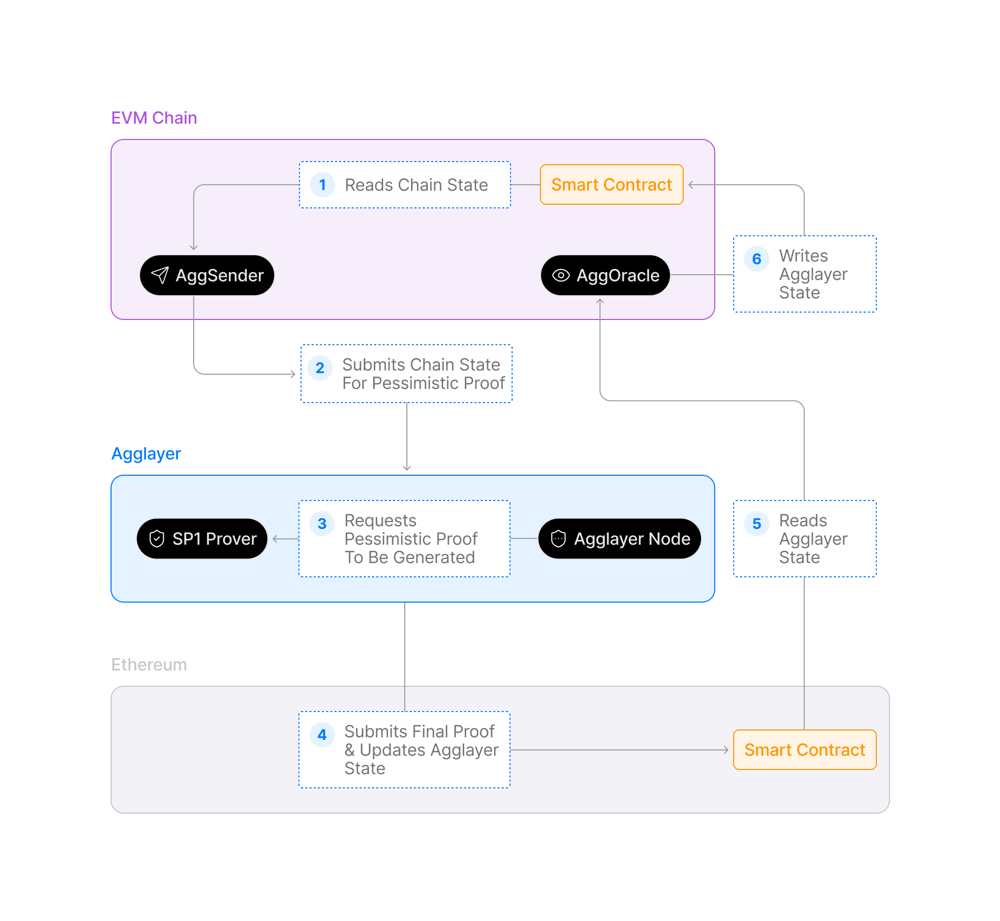
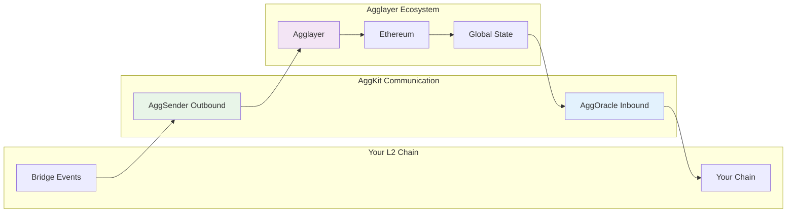

<!-- Page Header Component -->
<h1 style="text-align: left; font-size: 38px; font-weight: 700; font-family: 'Inter Tight', sans-serif;">
  AggKit
</h1>

  

    The essential synchronization toolkit that connects Aggchains to the unified Agglayer ecosystem
  

## Overview

AggKit is the modular synchronization toolkit that connects Aggchains to the unified Agglayer ecosystem. It provides the essential infrastructure components that L2 chains need to maintain seamless communication with Agglayer and participate in cross-chain operations.

**Key Benefits:**

- **Universal Compatibility**: Works with L2 chain architecture without requiring infrastructure changes
- **Modular Design**: Deploy only the components your chain actually needs
- **Enhanced Security**: v0.3.5 introduces multi-party committee systems for production-ready deployments
- **Standardized Integration**: Provides a "rinse and repeat" process for connecting chains to Agglayer

## What You Can Do

- **Connect Any Chain**: Transform existing blockchains into Agglayer participants  
- **Maintain Sovereignty**: Keep your chain's architecture, economics, and control
- **Access Unified Liquidity**: Enable users to access assets across the entire Agglayer ecosystem
- **Build Infrastructure Services**: Provide bridge APIs and services to other applications

## How It Works

AggKit operates through **bidirectional communication** between your chain and the Agglayer ecosystem:

**Security Model:**

- Your chain maintains full sovereignty and control
- Cryptographic certificates prove transaction legitimacy  
- Multi-party committee systems prevent single points of failure (v0.3.5)

## What's New in v0.3.5

### Enhanced Security Through Committee Systems

v0.3.5 eliminates the single-address vulnerability that prevented production deployments. The new **multi-party committee system** ensures that no single party can compromise bridge operations or manipulate global state updates.

**Before v0.3.5**: Single address controlled critical operations  
**After v0.3.5**: Multiple independent parties must reach consensus

This makes AggKit suitable for high-value deployments and enterprise environments requiring distributed trust.

## Core Concepts

Understand the fundamental architecture and components:

  <!-- Architecture Card -->
  

    <h3 style="color: #0071F7; margin: 0 0 0.5rem 0; font-size: 18px; font-weight: 600;">
      Architecture
    </h3>
    

      Explore the complete system architecture and different deployment patterns.
    

    <a href="/agglayer/core-concepts/aggkit/architecture/" style="color: #0071F7; text-decoration: none; font-weight: 500; font-size: 14px;">
      Learn more →
    </a>
  

  <!-- Components Overview Card -->
  

    <h3 style="color: #0071F7; margin: 0 0 0.5rem 0; font-size: 18px; font-weight: 600;">
      Components
    </h3>
    

      Understand the 7 modular components and learn how to choose the right combination for your chain.
    

    <a href="/agglayer/core-concepts/aggkit/components/" style="color: #0071F7; text-decoration: none; font-weight: 500; font-size: 14px;">
      Learn more →
    </a>
  

  <!-- Security Card -->
  

    <h3 style="color: #0071F7; margin: 0 0 0.5rem 0; font-size: 18px; font-weight: 600;">
      Security Improvements
    </h3>
    

      Learn about v0.3.5's multi-party committee system and enhanced security features.
    

    <a href="/agglayer/core-concepts/aggkit/security/" style="color: #0071F7; text-decoration: none; font-weight: 500; font-size: 14px;">
      Learn more →
    </a>
  

