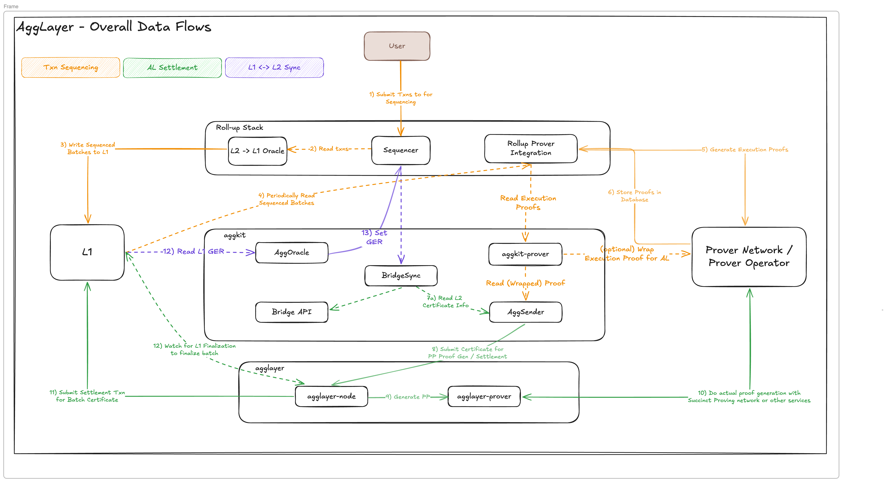

<!-- Page Header Component -->
<h1 style="text-align: left; font-size: 38px; font-weight: 700; font-family: 'Inter Tight', sans-serif;">
  Architecture
</h1>

  

    Understanding Agglayer's technical architecture and how its components work together
  

## Overview

The Agglayer is designed to provide an interoperability framework for cross-chain communication and state verification that is robust, scalable, and flexible enough to support these features between unalike blockchain networks. The key components of the Agglayer include the Agglayer node, the pessimistic proof, and the unified bridge. They are designed to enable lightweight, secure, and verifiable cross-chain transactions.

## High-Level Architecture

*Figure 1: Agglayer Overall Data Flows - showing transaction sequencing, settlement, and L1-L2 synchronization processes*

## Core Components

### 1. Agglayer Node

The Agglayer Node is a Rust-based service responsible for processing and verifying zero-knowledge (ZK) proofs from chains connected to the Agglayer.

**Key Functions:**

- **Zero-knowledge proof verification**: The node receives and verifies cryptographic proofs from connected chains before sending them to L1
- **Certificate management**: Handles certificates that attest to the state transitions of connected chains
- **Orchestration of epochs**: Manages state updates in a structured manner through epochs

### 2. Pessimistic Proof

The pessimistic proof mechanism ensures that any withdrawal claims made to the Agglayer are backed by legitimate deposits in the Unified Bridge. It uses a novel zero-knowledge proof system implemented in Rust, leveraging the SP1 zkVM and the Plonky3 proving system.

**Key Functions:**

- **Security validation**: Ensures that each chain connected to the Agglayer remains as secure as if it were operating independently
- **State consistency**: Provides a complete view of all token and message transfers occurring across the Agglayer
- **Fraud prevention**: Prevents chains from withdrawing more assets than they have legitimately received

### 3. Unified Bridge

The unified bridge is responsible for maintaining the data structures related to chain states, cross-chain transactions, and the Agglayer's Global Exit Root, ensuring cross-chain transactions are indeed finalized on the L1 before they can be claimed.

**Key Functions:**

- **Cross-chain asset transfers**: Allows users to bridge assets between different chains
- **Message passing**: Enables contract-to-contract interactions across chains
- **State management and accounting**: Maintains Merkle proofs that ensure transactions are finalized before being processed on the destination chain

### 4. State Transition Proof

State transition proof is trust validation process of local chain in Agglayer that ensures the security and validity of cross-chain operations. Think of it as a comprehensive verification system that works in two layers:

**How it works:**

**State transition Proof (Validity Proof)**: This layer verifies that each chain's internal state transitions are valid. It's like checking that all transactions within a chain are properly executed and the chain's state is consistent. This is done via Validity Proof: A detailed verification of every operation in the chain, and other verification type can be added in the future.

**Cross-Chain Verification (Aggchain Proof & Pessimistic Proof)**: This layer verifies that cross-chain operations (like asset transfers between chains) are valid. It ensures that when assets move between chains, the operations are atomic and secure.

**Key Functions:**

- **End-to-end security**: A transaction is finalized only when both its internal validity proof and its cross-chain proof are accepted
- **Atomic cross-chain execution**: Guarantees that assets and messages move between chains in a single, indivisible step
- **Modular extensibility**: New proof mechanisms (optimistic, fraud, etc.) can be integrated without altering Agglayer's external interface

<!-- CTA Button Component -->

  <a href="/agglayer/get-started/quickstart/" style="background: #0071F7; color: white; padding: 12px 24px; border-radius: 8px; text-decoration: none; font-weight: 600; display: inline-block;">
    Start Building →
  </a>

