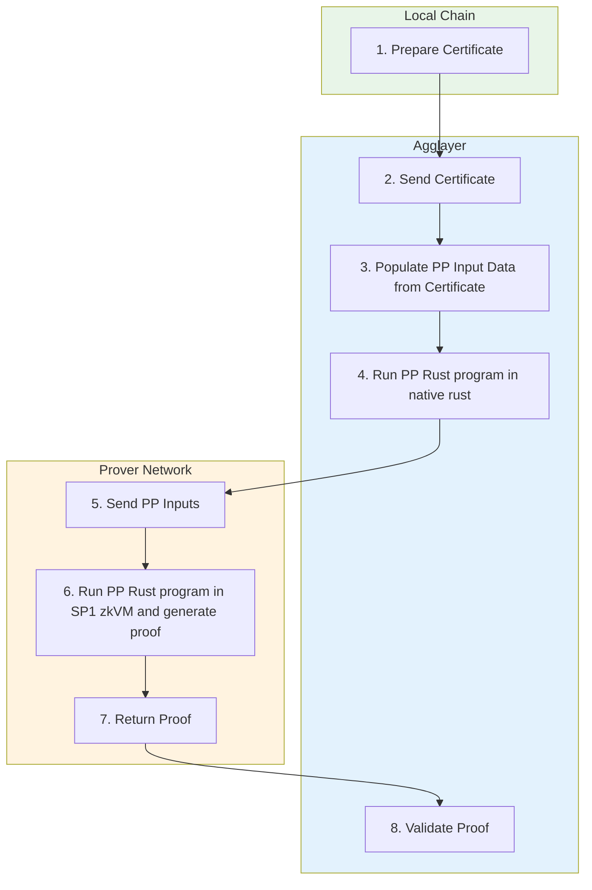
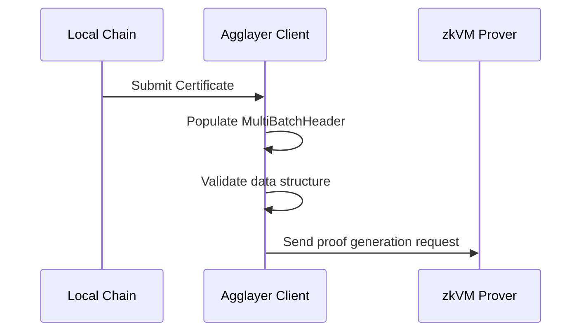
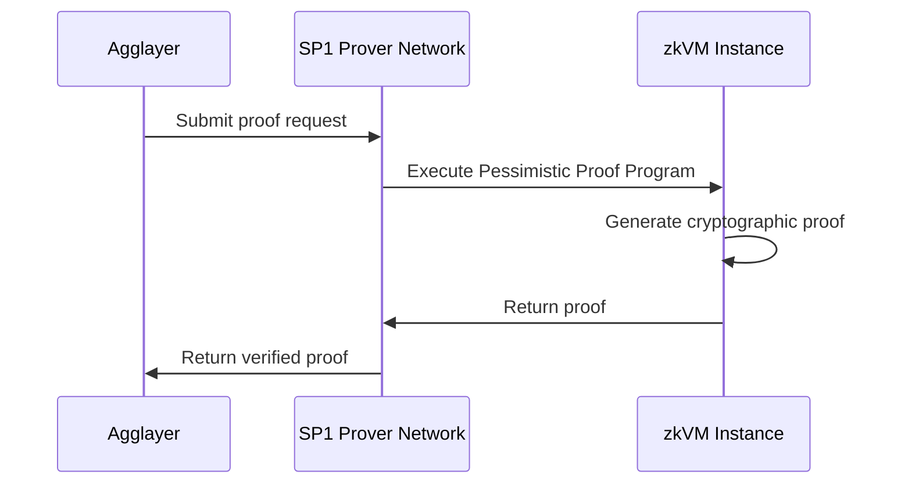

<!-- Page Header Component -->
<h1 style="text-align: left; font-size: 38px; font-weight: 700; font-family: 'Inter Tight', sans-serif;">
  Architecture Overview
</h1>

<div style="text-align: left; margin: 0.5rem 0;">
  <p style="font-size: 18px; color: #666; max-width: 600px; margin: 0;">
    Understanding how Pessimistic Proofs work and their role in Agglayer's security model
  </p>
</div>

## Overview

Pessimistic Proofs are a critical security mechanism in Agglayer that prevents compromised chains from draining funds beyond their deposits. They implement a "firewall" between chains, ensuring that security issues cannot spread across the broader network.



*Figure 1: Complete Pessimistic Proof generation and validation flow*

## How Pessimistic Proofs Work

### Step 0: Local Chain Preparation

The local chain prepares data and sends it to Agglayer:

- **Initial Network State**: The state of the local chain before state transition (LET, LBT, NT)
- **Bridge Exits**: Assets being sent to other chains from the local chain
- **Imported Bridge Exits**: Assets being claimed to the local chain from other chains

### Step 1: Agglayer Client Data Population



Agglayer Client populates the `MultiBatchHeader` using the `Certificate` data:

- **Target**: Expected transitioned local chain state (`StateCommitment`)
- **Batch Header**: Packaged data with authentication information

### Step 2: Native Rust Execution

Before running expensive zkVM computation, Agglayer runs the Pessimistic Proof Program in native Rust:

```rust
// Compute new transitioned state
let new_state = compute_state_transition(initial_network_state, batch_header);

// Compare with expected state
if new_state == batch_header.target {
    return Ok(PessimisticProofOutput);
} else {
    return Err(InvalidStateTransition);
}
```

**Process:**

1. Compute new transitioned state using initial state and batch header
2. Compare computed state with expected state in `batch_header.target`
3. If equal, data is valid and state transition is correct
4. Return `PessimisticProofOutput` or error code

### Step 3: zkVM Proof Generation



If native execution passes, run the same program in zkVM:

- **SP1 Prover Network**: Agglayer uses Succinct's SP1 Prover Network for faster proof generation
- **Same Inputs**: Identical program and inputs as native execution
- **Proof Generation**: Creates cryptographic proof of correct execution

### Step 4: Proof Validation

Agglayer validates the zk proof returned from the Prover Network:

- **Proof Verification**: Verify the cryptographic proof locally
- **Result Acceptance**: Accept pessimistic proof result if verification passes
- **State Commitment**: Update network state based on verified proof

## Security Guarantees

### Financial Isolation

Each chain effectively has a financial "blast radius" limited to its own deposits:

- **Deposit Limit**: Compromised chains cannot drain more than their deposits
- **Containment**: Security issues cannot spread to other chains
- **Risk Isolation**: Each chain's risk is isolated from the broader ecosystem

### State Transition Verification

- **Mathematical Verification**: All state transitions are cryptographically verified
- **Proof Requirements**: State changes require valid pessimistic proofs
- **Consensus Protection**: Invalid proofs are rejected, maintaining system integrity

### Network Protection

- **Ecosystem Safety**: Broader network remains secure even with individual chain compromises
- **Continued Operation**: Other chains continue operating normally
- **Trust Boundaries**: Clear trust boundaries between different chains

## Performance Characteristics

Pessimistic Proof computation is primarily focused on state transition verification:

- **75%+ Keccak Operations**: Most computation involves Keccak hash functions
- **Merkle Tree Updates**: Efficient updates to Local Balance and Nullifier trees
- **zkVM Optimization**: Performance varies significantly across different zkVM implementations


*Figure 2: Execution profile showing Keccak hash dominance in computation*

<!-- CTA Button Component -->
<div style="text-align: center; margin: 3rem 0;">
  <a href="/agglayer/core-concepts/pessimistic-proof/data-structures/" style="background: #0071F7; color: white; padding: 12px 24px; border-radius: 8px; text-decoration: none; font-weight: 600; display: inline-block;">
    Learn About Data Structures →
  </a>
</div>
