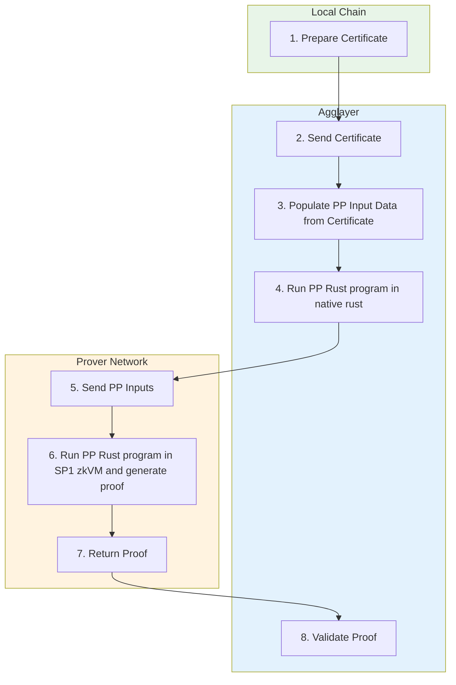
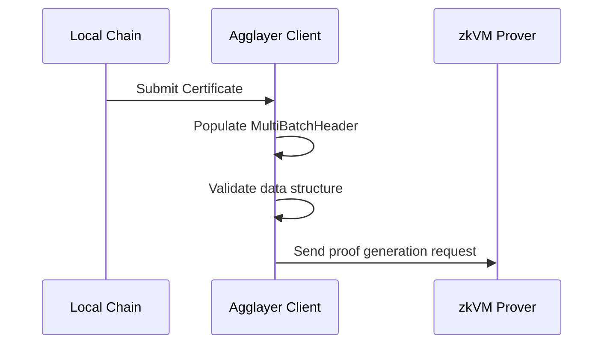
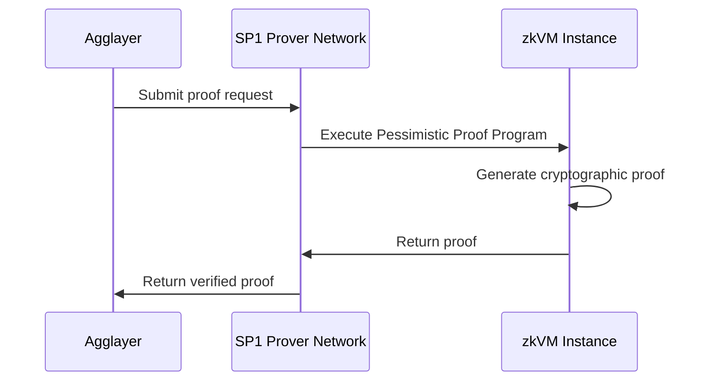
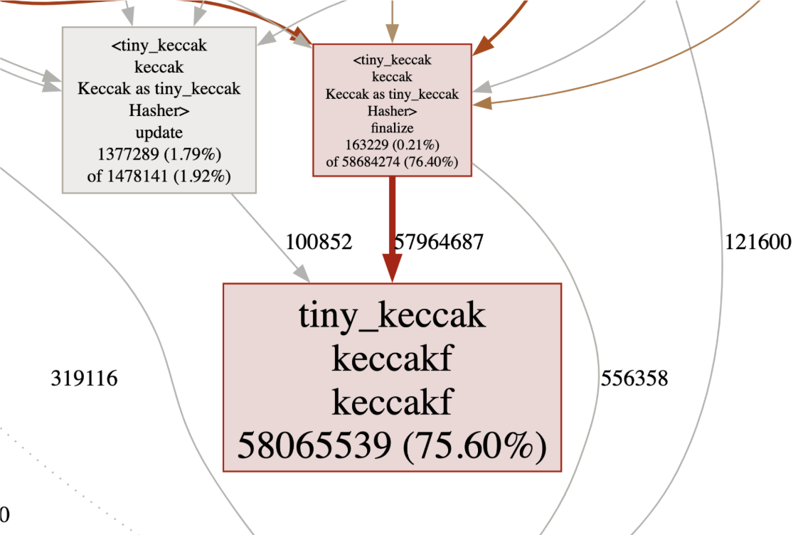

<!-- Page Header Component -->
<h1 style="text-align: left; font-size: 38px; font-weight: 700; font-family: 'Inter Tight', sans-serif;">
  Architecture Overview
</h1>

<div style="text-align: left; margin: 0.5rem 0;">
  <p style="font-size: 18px; color: #666; max-width: 600px; margin: 0;">
    Understanding how Pessimistic Proofs work and their role in Agglayer's security model
  </p>
</div>

## Overview

Pessimistic Proofs are a critical security mechanism in Agglayer that prevents compromised chains from draining funds beyond their deposits. They implement a "firewall" between chains, ensuring that security issues cannot spread across the broader network.



*Figure 1: Complete Pessimistic Proof generation and validation flow*

## How Pessimistic Proofs Work

### Step 0: Local Chain Preparation

The local chain prepares data and sends it to Agglayer:

- **Initial Network State**: The complete state of the local chain before any state transition occurs, including the Local Exit Tree (recording outbound transactions), Local Balance Tree (tracking token balances), and Nullifier Tree (tracking claimed inbound transactions). This represents the baseline state that will be modified.

- **Bridge Exits**: Assets and messages being sent to other chains from the local chain, represented as a vector of BridgeExit structures containing destination information, token details, amounts, and metadata. These represent the outbound state changes that will update the Local Exit Tree and decrease Local Balance Tree balances.

- **Imported Bridge Exits**: Assets and messages being claimed to the local chain from other chains, represented as ImportedBridgeExit structures with cryptographic proofs demonstrating their validity. These represent inbound state changes that will update the Nullifier Tree and increase Local Balance Tree balances.

### Step 1: Agglayer Client Data Population



Agglayer Client populates the `MultiBatchHeader` using the `Certificate` data:

- **Target**: Expected transitioned local chain state (`StateCommitment`) that represents what the new state should look like after applying all the bridge exits and imported bridge exits. This serves as the verification target that the computed state must match.

- **Batch Header**: Packaged data with authentication information including previous state roots, all state transition data, balance proofs for affected tokens, cryptographic signatures, and the target state commitment. This comprehensive package contains everything needed for proof generation.

### Step 2: Native Rust Execution

Before running expensive zkVM computation, Agglayer runs the Pessimistic Proof Program in native Rust:

```rust
// Compute new transitioned state
let new_state = compute_state_transition(initial_network_state, batch_header);

// Compare with expected state
if new_state == batch_header.target {
    return Ok(PessimisticProofOutput);
} else {
    return Err(InvalidStateTransition);
}
```

**Process:**

1. Compute new transitioned state using initial state and batch header by applying all bridge exits (reducing balances, updating exit tree) and imported bridge exits (increasing balances, updating nullifier tree) to generate the new Local Balance Tree, Nullifier Tree, and Local Exit Tree roots.

2. Compare computed state with expected state in `batch_header.target` to ensure that the chain's proposed state transition matches the mathematically computed result, validating that the chain is not attempting invalid operations like spending more than available balances.

3. If equal, data is valid and state transition is correct, meaning the chain has provided legitimate state transition data that respects balance constraints and doesn't attempt double-spending or other invalid operations.

4. Return `PessimisticProofOutput` containing the verified state transition data, or error code if validation fails, ensuring that only mathematically valid state transitions can proceed to zkVM proof generation.

### Step 3: zkVM Proof Generation



If native execution passes, run the same program in zkVM:

- **SP1 Prover Network**: Agglayer uses Succinct's SP1 Prover Network for faster, distributed proof generation that leverages GPU acceleration and optimized precompiles to efficiently handle the Keccak-heavy computation profile of Pessimistic Proof programs.

- **Same Inputs**: Identical program and inputs as native execution to ensure that the zkVM proof verifies exactly the same computation that was validated in native Rust, maintaining consistency between validation and proof generation phases.

- **Proof Generation**: Creates cryptographic proof of correct execution that can be verified by anyone without re-executing the program, providing mathematical certainty that the state transition was computed correctly according to the Pessimistic Proof rules.

### Step 4: Proof Validation

Agglayer validates the zk proof returned from the Prover Network:

- **Proof Verification**: Verify the cryptographic proof locally using the SP1 verifier to ensure that the proof is mathematically valid and that it corresponds to the expected program execution with the correct inputs and outputs.

- **Result Acceptance**: Accept pessimistic proof result if verification passes, confirming that the chain's proposed state transition is mathematically valid and respects all balance and security constraints enforced by the Pessimistic Proof program.

- **State Commitment**: Update network state based on verified proof by accepting the new state roots and allowing the chain to proceed with its state transition, enabling subsequent bridge operations to build on the verified state.

## Security Guarantees

### Financial Isolation

Each chain effectively has a financial "blast radius" limited to its own deposits:

- **Deposit Limit**: Compromised chains cannot drain more than their current deposits because the Pessimistic Proof program mathematically enforces that outbound bridge exits cannot exceed the available token balances in the Local Balance Tree, creating a hard mathematical constraint on fund drainage.

- **Containment**: Security issues cannot spread to other chains because each chain's state is validated independently through its own Pessimistic Proof, and the proof verification ensures that compromised chains cannot affect the balance trees or state transitions of other chains in the network.

- **Risk Isolation**: Each chain's risk is isolated from the broader ecosystem through the financial "blast radius" concept, where the maximum possible loss from any single chain compromise is limited to the assets currently deposited on that specific chain, protecting the overall network.

### State Transition Verification

- **Mathematical Verification**: All state transitions are cryptographically verified through zkVM proof generation that creates mathematical certainty about the correctness of balance updates, nullifier tree modifications, and exit tree changes, preventing any invalid state modifications.

- **Proof Requirements**: State changes require valid pessimistic proofs generated through the complete validation pipeline (native execution + zkVM proof generation + verification), ensuring that only mathematically sound state transitions are accepted by the network.

- **Consensus Protection**: Invalid proofs are rejected at multiple stages (native execution failure, zkVM proof generation failure, or proof verification failure), maintaining system integrity by preventing any invalid state transitions from being accepted into the network state.

### Network Protection

- **Ecosystem Safety**: Broader network remains secure even with individual chain compromises because the Pessimistic Proof system isolates each chain's financial impact and prevents compromised chains from affecting the balance trees, state transitions, or security of other chains in the network.

- **Continued Operation**: Other chains continue operating normally during individual chain compromises because each chain's Pessimistic Proof validation is independent, and the failure or compromise of one chain doesn't block or affect the proof generation and validation processes of other chains.

- **Trust Boundaries**: Clear trust boundaries between different chains are established through separate Local Balance Trees, independent proof generation, and isolated state validation, ensuring that trust assumptions about one chain don't extend to or affect other chains in the network.

## Performance Characteristics

Pessimistic Proof computation is primarily focused on state transition verification:

- **75%+ Keccak Operations**: Most computation involves Keccak hash functions used for Merkle tree operations, making Keccak optimization through precompiles and hardware acceleration critical for overall performance of the Pessimistic Proof generation process.

- **Merkle Tree Updates**: Efficient updates to Local Balance and Nullifier trees using Sparse Merkle Tree algorithms that only modify affected branches, significantly reducing computation compared to full tree reconstruction while maintaining cryptographic integrity.

- **zkVM Optimization**: Performance varies significantly across different zkVM implementations based on their Keccak precompile efficiency, GPU acceleration support, and CPU vectorization capabilities, with SP1 chosen for production due to optimal GPU performance and prover network infrastructure.



*Figure 2: Execution profile showing Keccak hash dominance in computation*

<!-- CTA Button Component -->
<div style="text-align: center; margin: 3rem 0;">
  <a href="/agglayer/core-concepts/pessimistic-proof/data-structures/" style="background: #0071F7; color: white; padding: 12px 24px; border-radius: 8px; text-decoration: none; font-weight: 600; display: inline-block;">
    Learn About Data Structures →
  </a>
</div>
