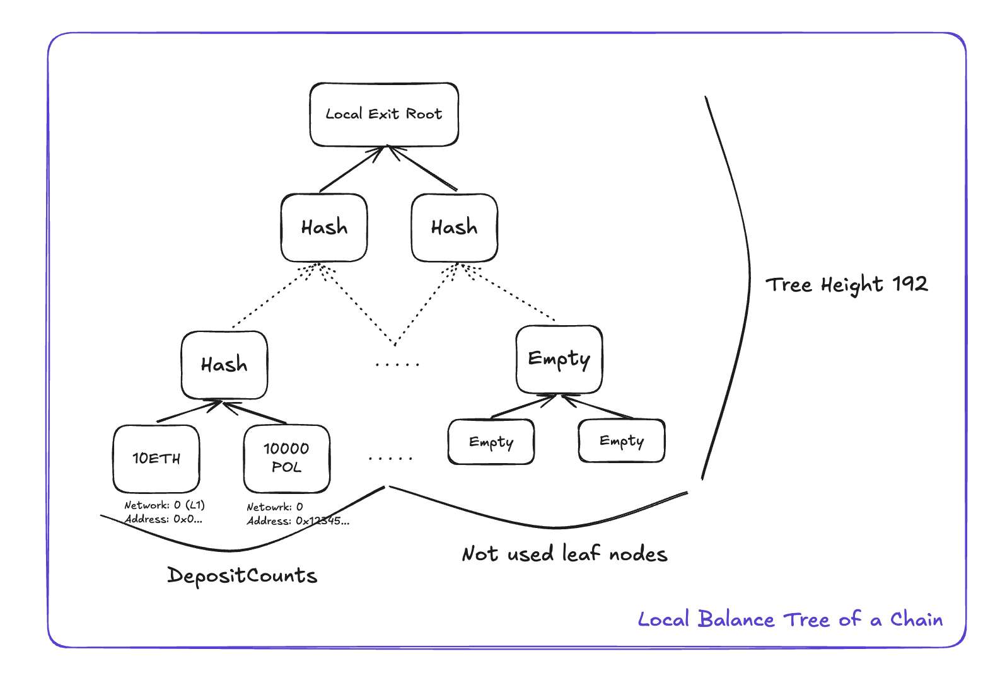

<!-- Page Header Component -->
<h1 style="text-align: left; font-size: 38px; font-weight: 700; font-family: 'Inter Tight', sans-serif;">
  Data Structures
</h1>

<div style="text-align: left; margin: 0.5rem 0;">
  <p style="font-size: 18px; color: #666; max-width: 600px; margin: 0;">
    Explore the Sparse Merkle Trees and data structures that power Pessimistic Proof state verification
  </p>
</div>

## Overview

Pessimistic Proof uses sophisticated data structures to compute state transitions between bridging events. The system relies on three main Sparse Merkle Trees and several supporting data structures to track and verify all state changes.

**Core Components:**

- **Sparse Merkle Trees**: Local Exit Tree, Nullifier Tree, Local Balance Tree
- **State Transitions**: Bridge Exits, Imported Bridge Exits
- **State Representations**: Local State, Multi Batch Header, Proof Output

## Unified Bridge Foundation

Pessimistic Proof builds on top of the Unified Bridge data structure. For complete understanding, refer to the [Unified Bridge Data Structures](/agglayer/core-concepts/unified-bridge/data-structures/).

**Key Unified Bridge Components:**

- **Local Exit Tree**: Records outgoing cross-chain transactions as cryptographic commitments in a 32-level Sparse Merkle Tree, with each leaf representing a hash of bridge transaction details including destination, amount, and metadata.

- **Global Exit Root**: Combines all chain states for verification by computing `hash(RollupExitRoot, MainnetExitRoot)`, providing a single unified root that represents the complete state of cross-chain activities across the entire network.

- **Global Index**: Unique 256-bit reference for transactions within Global Exit Root, encoding the source network type (mainnet flag), rollup identifier, and local transaction index to enable precise transaction location across the hierarchical tree structure.


*Figure 1: Unified Bridge data structure foundation*

## Local Balance Tree & TokenInfo

The Local Balance Tree tracks all token balances on a chain using a 192-bit depth Sparse Merkle Tree.

### TokenInfo Structure

```rust
pub struct TokenInfo {
    /// Network which the token originates from
    pub origin_network: NetworkId,
    /// The address of the token on the origin network
    pub origin_token_address: Address,
}
```

### Key Layout

The `TokenInfo` key uses a clever bit layout for efficient storage and lookup:

- **First 32 bits**: Origin network ID where the token originally exists, enabling the system to track tokens across multiple chains while maintaining their original identity and preventing confusion between tokens with the same address on different chains.

- **Next 160 bits**: Token address on the origin chain (standard Ethereum address size), ensuring that each token can be uniquely identified by combining its origin network and original contract address, even when wrapped versions exist on other chains.

### Balance Updates

When assets are bridged out or claimed, the token balance in the Local Balance Tree is updated accordingly through atomic operations that ensure balance conservation and prevent overdraft conditions. Outbound bridging decreases the balance while inbound claiming increases it, with all changes verified through Merkle proof validation.



*Figure 2: Local Balance Tree structure showing token balance tracking*

## Nullifier Tree

The Nullifier Tree prevents double-spending and ensures transaction uniqueness across the network. Each chain maintains its own 64-bit depth Sparse Merkle Tree.

### Key Structure

The Nullifier Tree key is constructed using a 64-bit identifier that uniquely identifies each claimable transaction:

- **First 32 bits**: Network ID of the chain where the transaction originated, enabling the system to track which source chain a claimed transaction came from and prevent confusion between transactions from different networks.

- **Last 32 bits**: Index of the bridge exit within the Local Exit Tree of the source chain (also called Local Index or depositCount), providing the exact position of the transaction within the source chain's bridge transaction history.

### Double-Spending Prevention


*Figure 3: Nullifier Tree structure preventing double-spending*

## Bridge Exits

Bridge Exits represent outbound transactions from a chain.

### Structure

```rust
pub struct BridgeExit {
    /// Enum, 0 is asset, 1 is message
    pub leaf_type: LeafType,
    /// Unique ID for the token being transferred
    pub token_info: TokenInfo,
    /// Network which the token is transferred to
    pub dest_network: NetworkId,
    /// Address which will own the received token
    pub dest_address: Address,
    /// Token amount sent
    pub amount: U256,
    /// PermitData, CallData, etc.
    pub metadata: Vec<u8>,
}
```

### Usage

All outbound transactions from a chain are represented in a `BridgeExit` vector during pessimistic proof generation. Each `BridgeExit` contains complete transaction information needed to validate that the chain has sufficient balance for the outbound transfer and to update the Local Exit Tree with the new transaction commitment.

## Imported Bridge Exits

Imported Bridge Exits represent inbound transactions to a chain.

### Structure

```rust
pub struct ImportedBridgeExit {
    /// The bridge exit from the source network
    pub bridge_exit: BridgeExit,
    /// The claim data
    pub claim_data: Claim,
    /// The global index of the imported bridge exit
    pub global_index: GlobalIndex,
}
```

### Claim Data Types

```rust
pub enum Claim {
    Mainnet(Box<ClaimFromMainnet>),
    Rollup(Box<ClaimFromRollup>),
}
```

**Separation Reason**: L1 and Rollup claims require different proof paths due to their different positions in the hierarchical tree structure:

- **Mainnet**: Requires direct proof from Mainnet Exit Root to L1 Info Root since L1 transactions are recorded directly in the Mainnet Exit Tree and don't need to go through the Rollup Exit Tree aggregation layer.

- **Rollup**: Requires a two-step proof path from Local Exit Root → Rollup Exit Root → L1 Info Root because L2 transactions must first prove inclusion in the L2's Local Exit Tree, then prove that the L2's Local Exit Root was properly submitted to the Rollup Exit Tree on L1.

## Local State

Local State represents the complete state of a local chain.

### Structure

```rust
pub struct LocalNetworkState {
    /// Commitment to the BridgeExit
    pub exit_tree: LocalExitTree<Keccak256Hasher>,
    /// Commitment to the balance for each token
    pub balance_tree: LocalBalanceTree<Keccak256Hasher>,
    /// Commitment to claimed assets on foreign networks
    pub nullifier_tree: NullifierTree<Keccak256Hasher>,
}
```

### Components

- **Exit Tree**: Records all outgoing bridge transactions as a 32-level Sparse Merkle Tree, storing cryptographic commitments of `bridgeAsset` and `bridgeMessage` operations that represent assets and messages being sent to other chains.

- **Balance Tree**: Tracks token balances for all assets on the chain using a 192-bit depth Sparse Merkle Tree, with TokenInfo keys enabling precise tracking of token origins and current balances for every asset type on the chain.

- **Nullifier Tree**: Prevents double-spending of claimed assets by maintaining a 64-bit depth Sparse Merkle Tree that marks imported bridge exits as claimed, ensuring that each cross-chain transaction can only be processed once on the destination chain.

## Multi Batch Header

The comprehensive state transition record for pessimistic proof generation.

### Structure

```rust
pub struct MultiBatchHeader<H> {
    /// Network that emitted this MultiBatchHeader
    pub origin_network: NetworkId,
    /// Previous local exit root
    pub prev_local_exit_root: H::Digest,
    /// Previous local balance root
    pub prev_balance_root: H::Digest,
    /// Previous nullifier tree root
    pub prev_nullifier_root: H::Digest,
    /// List of bridge exits created in this batch
    pub bridge_exits: Vec<BridgeExit>,
    /// List of imported bridge exits claimed in this batch
    pub imported_bridge_exits: Vec<(ImportedBridgeExit, NullifierPath<H>)>,
    /// Commitment to the imported bridge exits
    pub imported_exits_root: Option<H::Digest>,
    /// L1 info root used to import bridge exits
    pub l1_info_root: H::Digest,
    /// Token balances with Merkle proofs
    pub balances_proofs: BTreeMap<TokenInfo, (U256, LocalBalancePath<H>)>,
    /// Signer committing to the state transition
    pub signer: Address,
    /// Signature committing to the state transition
    pub signature: Signature,
    /// State commitment target hashes
    pub target: StateCommitment,
}
```

### Purpose

Serves as the master input capturing the complete set of changes between old and new local states, containing all data required for pessimistic proof generation. This structure packages together the previous state roots, all state transition data (bridge exits and imported bridge exits), balance proofs, and target state commitments needed to mathematically verify that the proposed state transition is valid and secure.

## Pessimistic Proof Output

The final result of Pessimistic Proof computation.

### Structure

```rust
pub struct PessimisticProofOutput {
    /// The previous local exit root
    pub prev_local_exit_root: Digest,
    /// The previous pessimistic root
    pub prev_pessimistic_root: Digest,
    /// The l1 info root for proving imported bridge exits
    pub l1_info_root: Digest,
    /// The origin network of the pessimistic proof
    pub origin_network: NetworkId,
    /// The consensus hash
    pub consensus_hash: Digest,
    /// The new local exit root
    pub new_local_exit_root: Digest,
    /// The new pessimistic root (balance + nullifier tree)
    pub new_pessimistic_root: Digest,
}
```

### Pessimistic Root Formula

```
prev_pessimistic_root = hash(prev_local_balance_root, prev_nullifier_root)
new_pessimistic_root = hash(new_local_balance_root, new_nullifier_root)
```

## Certificate

A Certificate represents a state transition of a chain that gets submitted to Agglayer.

### Structure

```rust
pub struct Certificate {
    /// NetworkID of the origin network
    pub network_id: NetworkId,
    /// Simple increment to count the Certificate per network
    pub height: Height,
    /// Previous local exit root
    pub prev_local_exit_root: Digest,
    /// New local exit root
    pub new_local_exit_root: Digest,
    /// List of bridge exits included in this state transition
    pub bridge_exits: Vec<BridgeExit>,
    /// List of imported bridge exits included in this state transition
    pub imported_bridge_exits: Vec<ImportedBridgeExit>,
    /// Signature committed to the bridge exits and imported bridge exits
    pub signature: Signature,
    /// Fixed size field of arbitrary data for the chain needs
    pub metadata: Metadata,
}
```

### Validation

If a certificate is invalid, any state transitions in the current epoch will be reverted, protecting the network from invalid state changes. The validation process ensures that all bridge exits have sufficient balances, all imported bridge exits have valid proofs and haven't been double-claimed, and that the cryptographic signature properly commits to all the state transition data. This atomic validation prevents partial state updates that could compromise network security.
