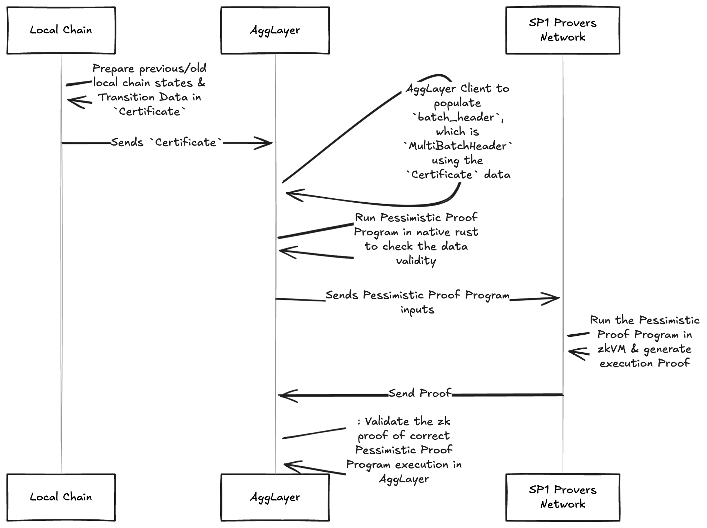

<!-- Page Header Component -->
<h1 style="text-align: left; font-size: 38px; font-weight: 700; font-family: 'Inter Tight', sans-serif;">
  Pessimistic Proof
</h1>

  

    Advanced security mechanism that prevents compromised chains from draining funds beyond their deposits
  

## Background

### Chains Connected to Agglayer

Agglayer creates a seamless network that bridges independent blockchain ecosystems into one cohesive experience. By connecting sovereign chains, it enables:

- **Unified liquidity pools** across chains
- **Seamless user experience** as if operating on a single chain
- **Shared state and network effects** between different blockchains
- **Enhanced security** through its interconnected design

This architecture delivers the best of both worlds - chains maintain their sovereignty while users benefit from a smooth, integrated multi-chain experience with improved capital efficiency and stronger network effects.

### Security Challenge

While the Unified Bridge provides robust security for cross-chain transactions, Agglayer implements additional protective measures to handle a critical scenario: **what happens if a connected L2 becomes compromised?**

This multi-layered security approach addresses two key aspects:

1. The bridge ensures safe cross-chain transaction flows
2. Protection mechanisms safeguard funds on Agglayer even if connected L2s become compromised

The second aspect is secured via **Pessimistic Proof**.

## Overview

Agglayer assumes every prover can be unsound. The pessimistic proof guarantees that even if a prover for a chain is unsound, that prover cannot drain more funds than are currently deposited on that chain. In this way, the soundness issue cannot infect the rest of the ecosystem.

**Key Benefits:**
- **Containment**: Limits damage to individual chain deposits
- **Ecosystem Protection**: Prevents security issues from spreading
- **Financial Isolation**: Creates a "firewall" between chains

## What You Can Do

- **Secure Multi-Chain Assets**: Protect funds across interconnected chains
- **Isolate Risk**: Contain potential security breaches to individual chains
- **Enable Safe Interoperability**: Allow chains to interact without systemic risk

## How It Works

The pessimistic proof mechanism implements a safety boundary between chains - it ensures that even if a chain's prover becomes compromised or unsound, the damage is strictly limited to the funds currently deposited on that specific chain.

**Security Model:**

- Each chain has a financial "blast radius" limited to its own deposits
- State transitions are cryptographically verified before acceptance
- Mathematical constraints prevent unauthorized fund drainage

## Core Concepts

Understand the fundamental architecture and security mechanisms:

  <!-- Architecture Card -->
  

    <h3 style="color: #0071F7; margin: 0 0 0.5rem 0; font-size: 18px; font-weight: 600;">
      Architecture
    </h3>
    

      Understand how Pessimistic Proof works and its role in Agglayer security.
    

    <a href="/agglayer/core-concepts/pessimistic-proof/architecture/" style="color: #0071F7; text-decoration: none; font-weight: 500; font-size: 14px;">
      Learn more →
    </a>
  

  <!-- Data Structures Card -->
  

    <h3 style="color: #0071F7; margin: 0 0 0.5rem 0; font-size: 18px; font-weight: 600;">
      Data Structures
    </h3>
    

      Explore Local Balance Trees, Nullifier Trees, and other core data structures.
    

    <a href="/agglayer/core-concepts/pessimistic-proof/data-structures/" style="color: #0071F7; text-decoration: none; font-weight: 500; font-size: 14px;">
      Learn more →
    </a>
  

  <!-- Proof Generation Card -->
  

    <h3 style="color: #0071F7; margin: 0 0 0.5rem 0; font-size: 18px; font-weight: 600;">
      Proof Generation
    </h3>
    

      Learn how pessimistic proof is generated and validated in zkVMs.
    

    <a href="/agglayer/core-concepts/pessimistic-proof/proof-generation/" style="color: #0071F7; text-decoration: none; font-weight: 500; font-size: 14px;">
      Learn more →
    </a>
  

## Reference

  <!-- Benchmarks Card -->
  

    <h3 style="color: #0071F7; margin: 0 0 0.5rem 0; font-size: 18px; font-weight: 600;">
      Benchmarks
    </h3>
    

      Experimental performance analysis across different zkVM implementations.
    

    <a href="/agglayer/core-concepts/pessimistic-proof/benchmarks/" style="color: #0071F7; text-decoration: none; font-weight: 500; font-size: 14px;">
      Learn more →
    </a>
  

