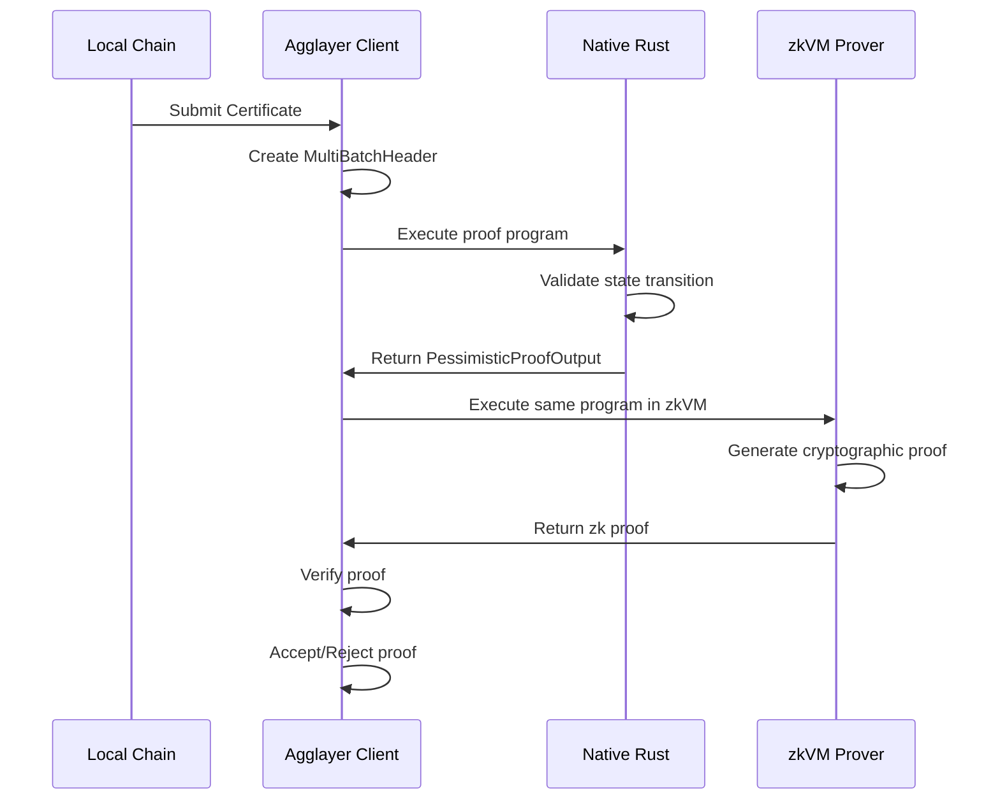
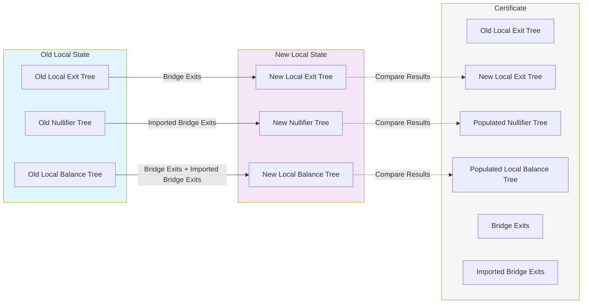

<!-- Page Header Component -->
<h1 style="text-align: left; font-size: 38px; font-weight: 700; font-family: 'Inter Tight', sans-serif;">
  Proof Generation
</h1>

<div style="text-align: left; margin: 0.5rem 0;">
  <p style="font-size: 18px; color: #666; max-width: 600px; margin: 0;">
    Learn how pessimistic proofs are generated, validated, and executed in zkVMs
  </p>
</div>

## Overview

Pessimistic Proof generation is a multi-step process that ensures state transitions are mathematically verified before being accepted by Agglayer. The process involves native execution validation followed by cryptographic proof generation in zkVMs.

## Proof Generation Flow

### Complete Flow



### Step 1: Certificate Submission

Local chains submit a `Certificate` containing:

- Previous and new local exit roots
- Bridge exits (outbound transactions)
- Imported bridge exits (inbound transactions)
- Cryptographic signature

### Step 2: Data Population

Agglayer Client creates a `MultiBatchHeader` from the Certificate:

- Adds previous state roots (balance, nullifier, exit)
- Includes balance proofs for affected tokens
- Sets target state commitment
- Adds authentication data

### Step 3: Native Execution

Before expensive zkVM computation, run in native Rust:

```rust
pub fn generate_pessimistic_proof(
    initial_state: &LocalNetworkState,
    batch_header: &MultiBatchHeader,
) -> Result<PessimisticProofOutput, ProofError> {
    // Compute new state based on transitions
    let new_state = apply_state_transitions(initial_state, batch_header)?;
    
    // Verify against expected target
    if new_state.commitment() != batch_header.target {
        return Err(ProofError::InvalidStateTransition);
    }
    
    // Return proof output
    Ok(PessimisticProofOutput {
        prev_local_exit_root: batch_header.prev_local_exit_root,
        prev_pessimistic_root: compute_pessimistic_root(
            batch_header.prev_balance_root,
            batch_header.prev_nullifier_root
        ),
        new_local_exit_root: new_state.exit_tree.root(),
        new_pessimistic_root: compute_pessimistic_root(
            new_state.balance_tree.root(),
            new_state.nullifier_tree.root()
        ),
        // ... other fields
    })
}
```

### Step 4: zkVM Execution

If native execution succeeds, run the identical program in zkVM:

- **Same Program**: Exact same proof generation function
- **Same Inputs**: Identical initial state and batch header
- **Cryptographic Proof**: Generates verifiable proof of correct execution

### Step 5: Proof Validation

Agglayer validates the returned zk proof:

- **Proof Verification**: Cryptographic verification of the proof
- **Output Validation**: Ensure proof output matches expected results
- **State Acceptance**: Update network state if proof is valid

## State Transition Logic

The state transition mechanism validates and applies changes from the old local state to the new local state using bridge exits and imported bridge exits, then compares the computed results with the expected certificate data.



## Proof Verification

### Mathematical Constraints

The proof generation enforces several mathematical constraints:

1. **Balance Conservation**: Total outbound amounts ≤ available balances
2. **Nullifier Uniqueness**: No double-claiming of imported exits
3. **Root Consistency**: All tree roots must be computed correctly
4. **Signature Validity**: State transitions must be properly signed

### Security Guarantees

- **No Overdraft**: Chains cannot spend more than they have
- **No Double-Spending**: Each transaction can only be claimed once
- **Cryptographic Integrity**: All state changes are cryptographically verified
- **Atomic Updates**: All changes succeed or fail together

<!-- CTA Button Component -->
<div style="text-align: center; margin: 3rem 0;">
  <a href="/agglayer/core-concepts/pessimistic-proof/zkvm-integration/" style="background: #0071F7; color: white; padding: 12px 24px; border-radius: 8px; text-decoration: none; font-weight: 600; display: inline-block;">
    Learn About zkVM Integration →
  </a>
</div>
