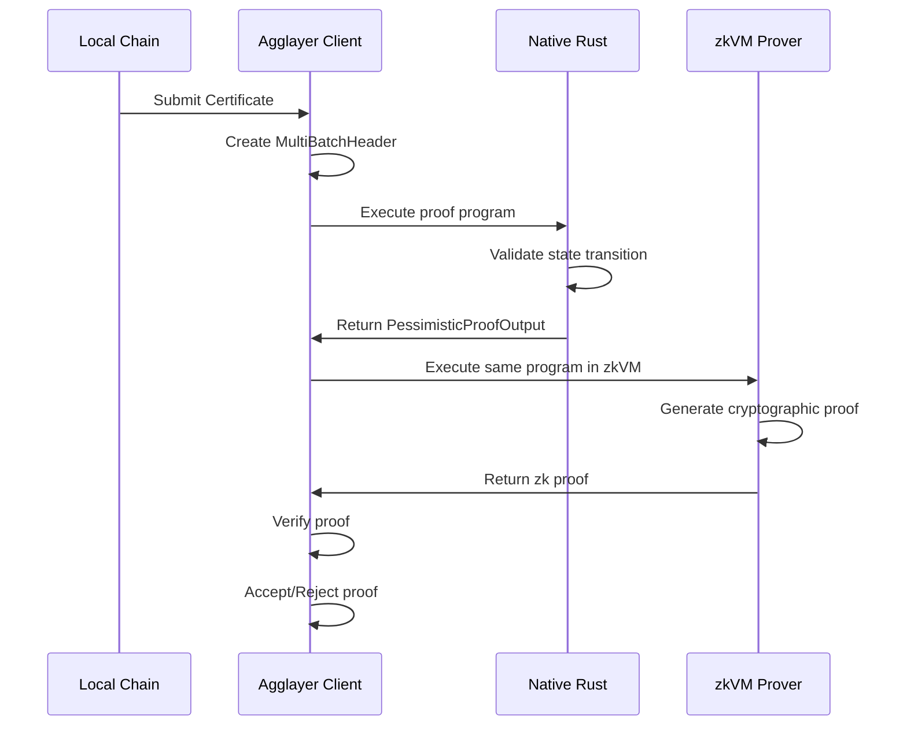
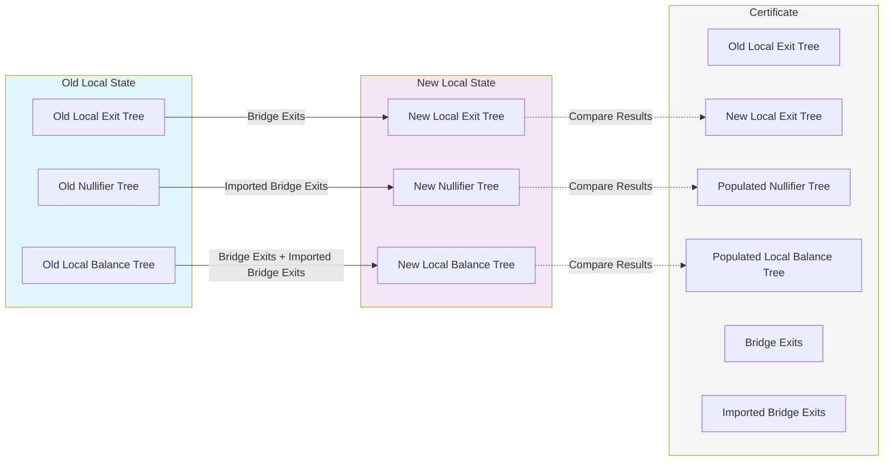

<!-- Page Header Component -->
<h1 style="text-align: left; font-size: 38px; font-weight: 700; font-family: 'Inter Tight', sans-serif;">
  Proof Generation
</h1>

<div style="text-align: left; margin: 0.5rem 0;">
  <p style="font-size: 18px; color: #666; max-width: 600px; margin: 0;">
    Learn how pessimistic proofs are generated, validated, and executed in zkVMs
  </p>
</div>

## Overview

Pessimistic Proof generation is a multi-step process that ensures state transitions are mathematically verified before being accepted by Agglayer. The process involves native execution validation followed by cryptographic proof generation in zkVMs.

## Proof Generation Flow

### Complete Flow



### Step 1: Certificate Submission

Local chains submit a **`Certificate`** containing comprehensive state transition data:

- **Previous and new local exit roots** that define the starting and ending states of the chain's **Local Exit Tree**, providing the boundary conditions for validating the proposed state transition.

- **Bridge exits** (outbound transactions) representing all assets and messages being sent from this chain to other chains, with complete destination information, token details, and amounts that will reduce the chain's **Local Balance Tree**.

- **Imported bridge exits** (inbound transactions) representing all assets and messages being claimed on this chain from other chains, with **cryptographic proofs** demonstrating their validity and **Global Index** information for verification.

- **Cryptographic signature** from the chain's authorized signer that commits to all the state transition data, ensuring that the certificate represents an authorized state transition approved by the chain's governance or operator.

### Step 2: Data Population

Agglayer Client creates a **`MultiBatchHeader`** from the Certificate:

- Adds **previous state roots** (balance, nullifier, exit) from the initial network state to establish the baseline from which state transitions will be computed and validated.

- Includes **balance proofs** for affected tokens by providing **Merkle proofs** demonstrating the current balances in the **Local Balance Tree** for all tokens involved in bridge exits, ensuring that sufficient funds exist for outbound transfers.

- Sets **target state commitment** representing the expected final state after applying all bridge exits and imported bridge exits, serving as the verification target that the computed state transition must match.

- Adds **authentication data** including **cryptographic signatures**, signer addresses, and **L1 Info Root** references needed to validate the legitimacy and timing of the state transition request.

### Step 3: Native Execution

Before expensive zkVM computation, Agglayer runs the Pessimistic Proof program in native Rust to validate the state transition:

**The Process:**

1. **Apply State Transitions**: The program takes the **initial network state** and applies all the changes specified in the **batch header**. For **bridge exits**, it reduces token balances and adds new leaves to the **Local Exit Tree**. For **imported bridge exits**, it checks **nullifier uniqueness**, increases token balances, and marks transactions as claimed in the **Nullifier Tree**.

2. **Compute New State**: After applying all transitions, the program computes the new roots for all three **Merkle trees** (**Exit Tree**, **Balance Tree**, **Nullifier Tree**) and creates a new **state commitment** that represents the final state after all changes.

3. **Validate Against Target**: The computed new state is compared against the **target state** provided in the certificate. If they match, it proves that the chain's proposed state transition is **mathematically correct** and respects all balance and security constraints.

4. **Generate Output**: If validation succeeds, the program generates a **`PessimisticProofOutput`** containing both the previous and new state roots, which serves as the verified result of the state transition computation.

```rust
pub fn generate_pessimistic_proof(
    initial_state: &LocalNetworkState,
    batch_header: &MultiBatchHeader,
) -> Result<PessimisticProofOutput, ProofError> {
    // Compute new state based on transitions
    let new_state = apply_state_transitions(initial_state, batch_header)?;
    
    // Verify against expected target
    if new_state.commitment() != batch_header.target {
        return Err(ProofError::InvalidStateTransition);
    }
    
    // Return proof output
    Ok(PessimisticProofOutput {
        prev_local_exit_root: batch_header.prev_local_exit_root,
        prev_pessimistic_root: compute_pessimistic_root(
            batch_header.prev_balance_root,
            batch_header.prev_nullifier_root
        ),
        new_local_exit_root: new_state.exit_tree.root(),
        new_pessimistic_root: compute_pessimistic_root(
            new_state.balance_tree.root(),
            new_state.nullifier_tree.root()
        ),
        // ... other fields
    })
}
```

### Step 4: zkVM Execution

If native execution succeeds, run the identical program in zkVM:

- **Same Program**: Exact same proof generation function executed in the zkVM environment to ensure that the cryptographic proof verifies the identical computation that was validated in native Rust, maintaining consistency between validation and proof phases.

- **Same Inputs**: Identical initial state and batch header data fed to the zkVM to guarantee that the proof generation uses exactly the same parameters that were validated in native execution, preventing any discrepancies between validation and proving.

- **Cryptographic Proof**: Generates verifiable proof of correct execution that can be validated by anyone without re-executing the program, providing mathematical certainty that the state transition computation was performed correctly according to Pessimistic Proof rules.

### Step 5: Proof Validation

Agglayer validates the returned zk proof:

- **Proof Verification**: Cryptographic verification of the proof using the SP1 verifier to ensure mathematical validity and confirm that the proof corresponds to the expected program execution with correct inputs and outputs.

- **Output Validation**: Ensure proof output matches expected results by comparing the PessimisticProofOutput from the zkVM execution with the results from native execution, validating consistency between both execution environments.

- **State Acceptance**: Update network state if proof is valid by accepting the new state roots and allowing the chain to proceed with its state transition, enabling subsequent operations to build on the verified state.

## State Transition Logic

The state transition mechanism validates and applies changes from the old local state to the new local state using bridge exits and imported bridge exits, then compares the computed results with the expected certificate data.



## Proof Verification

### Mathematical Constraints

The proof generation enforces several mathematical constraints:

1. **Balance Conservation**: Total outbound amounts ≤ available balances, mathematically enforced by verifying that the sum of all bridge exit amounts for each token does not exceed the current balance stored in the Local Balance Tree, preventing overdraft conditions.

2. **Nullifier Uniqueness**: No double-claiming of imported exits, enforced by checking that each imported bridge exit's nullifier key is not already marked as claimed in the Nullifier Tree, preventing replay attacks and duplicate processing.

3. **Root Consistency**: All tree roots must be computed correctly using the standard Keccak256 hashing algorithm and Sparse Merkle Tree algorithms, ensuring that state transitions produce mathematically valid tree structures.

4. **Signature Validity**: State transitions must be properly signed by the chain's authorized signer using valid cryptographic signatures that commit to all the state transition data, ensuring that only authorized parties can propose state changes.

### Security Guarantees

- **No Overdraft**: Chains cannot spend more than they have because the Pessimistic Proof program mathematically enforces balance conservation by verifying that outbound bridge exit amounts do not exceed available token balances in the Local Balance Tree, creating a hard constraint against fund drainage.

- **No Double-Spending**: Each transaction can only be claimed once due to the Nullifier Tree mechanism that marks imported bridge exits as claimed and prevents re-processing, ensuring that the same cross-chain transaction cannot be used multiple times to inflate balances.

- **Cryptographic Integrity**: All state changes are cryptographically verified through Merkle tree operations using Keccak256 hashing, zkVM proof generation, and signature validation, ensuring that no invalid state modifications can be accepted by the system.

- **Atomic Updates**: All changes succeed or fail together through the comprehensive validation process where any failure in balance verification, nullifier checking, or signature validation causes the entire state transition to be rejected, preventing partial updates that could compromise system integrity.
