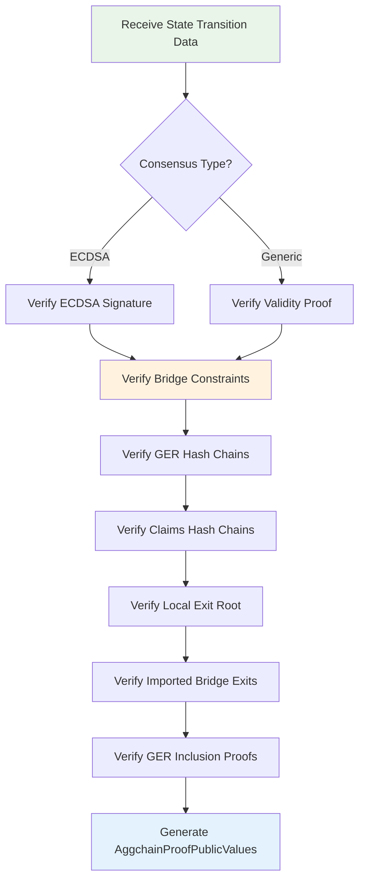

<!-- Page Header Component -->
<h1 style="text-align: left; font-size: 38px; font-weight: 700; font-family: 'Inter Tight', sans-serif;">
  Aggchain Proof
</h1>

<div style="text-align: left; margin: 0.5rem 0;">
  <p style="font-size: 18px; color: #666; max-width: 600px; margin: 0;">
    Flexible verification system that supports different consensus mechanisms while ensuring bridge security
  </p>
</div>

## Overview

Aggchain Proof is a flexible verification system in Agglayer that supports different types of consensus mechanisms for proving chain state transitions. It acts as a universal adapter that can work with various types of chains, whether they use simple signature-based verification or more complex proof systems.

**Key Innovation**: The ability to combine different proof types with bridge verification, ensuring that both the chain's internal operations and cross-chain transfers are secure.

## Supported Consensus Types

### ECDSA Signature (CONSENSUS_TYPE = 0)

The original consensus mechanism used in Agglayer where a **trusted sequencer** acts as a security authority, signing off on state changes to ensure they are valid and authorized.

**Characteristics:**

- **Trusted Sequencer Model**: A designated address signs off on state changes, acting as the primary security authority for the chain
- **Simple Verification**: Like having a security guard verify and approve changes - fast and straightforward
- **Fast Processing**: Minimal computational overhead with efficient signature verification
- **Trust Assumption**: Relies on sequencer integrity and key security

**How ECDSA Verification Works:**

1. **Message Construction**: Create standardized message combining **SHA256** of public values, **new local exit root**, and **commitment to imported bridge exits**
2. **Signature Recovery**: Use elliptic curve cryptography to recover the signer's address from the signature
3. **Authority Validation**: Compare recovered address with configured **trusted sequencer** address

```rust
// ECDSA Verification Implementation
pub fn verify(&self) -> Result<(), ProofError> {
    let signature_commitment = keccak256_combine([
        self.sha256_public_values(),
        new_local_exit_root.0,
        commit_imported_bridge_exits.0,
    ]);

    let recovered_signer = signature
        .recover_address_from_prehash(&B256::new(signature_commitment.0))?;

    if recovered_signer != self.trusted_sequencer {
        return Err(ProofError::InvalidSigner);
    }
    Ok(())
}
```

### Generic Proof / Validity Proof (CONSENSUS_TYPE = 1)

Advanced consensus mechanism providing comprehensive verification of chain operations through mathematical proofs rather than trusted parties.

**Characteristics:**

- **Flexible Proof System**: Can work with any type of chain-specific proof system
- **Mathematical Verification**: Provides comprehensive state transition validation with cryptographic certainty
- **Universal Compatibility**: Like having a universal translator for different security protocols
- **Enhanced Security**: Mathematical certainty about state correctness without trust assumptions

**How Validity Proof Works:**

1. **State Transition Verification**: Mathematically verify every operation within the chain, including transaction processing, smart contract execution, and state machine transitions
2. **Bridge Constraint Verification**: Verify that cross-chain transfers are valid and properly integrated with internal state changes
3. **SP1 zkVM Verification**: Use **SP1 zkVM** to cryptographically verify the validity proof with mathematical certainty

```rust
// Validity Proof Verification Implementation
pub fn verify(&self) -> Result<(), ProofError> {
    // Verify L1 head for synchronization
    self.verify_l1_head(l1_info_root)?;

    // Verify the validity proof using SP1 zkVM
    sp1_zkvm::lib::verify::verify_sp1_proof(
        &self.aggregation_vkey_hash.to_hash_u32(),
        &self.sha256_public_values().into(),
    );

    Ok(())
}
```

**Use Cases:**

- **Zero-Knowledge Rollups**: Chains generating **zk-SNARKs** or **zk-STARKs** for state transitions
- **Custom Consensus**: Chains with unique consensus algorithms and specialized verification requirements

## Aggchain Proof Data Structure

### Witness Structure

```rust
pub struct AggchainProofWitness {
    /// Previous local exit root
    pub prev_local_exit_root: Digest,
    /// New local exit root
    pub new_local_exit_root: Digest,
    /// L1 info root used to import bridge exits
    pub l1_info_root: Digest,
    /// Origin network for which the proof was generated
    pub origin_network: u32,
    /// Full execution proof with its metadata
    pub fep: FepInputs,
    /// Commitment on the imported bridge exits minus the unset ones
    pub commit_imported_bridge_exits: Digest,
    /// Bridge witness related data
    pub bridge_witness: BridgeWitness,
}
```

### Bridge Witness

```rust
pub struct BridgeWitness {
    /// List of inserted GER minus the removed ones
    pub inserted_gers: Vec<InsertedGER>,
    /// Raw list of inserted GERs which includes also the ones which get removed
    pub raw_inserted_gers: Vec<Digest>,
    /// List of removed GER
    pub removed_gers: Vec<Digest>,
    /// List of each imported bridge exit containing global index and leaf hash
    pub bridge_exits_claimed: Vec<GlobalIndexWithLeafHash>,
    /// List of global index of each unset bridge exit
    pub global_indices_unset: Vec<U256>,
    /// State sketch for the prev L2 block
    pub prev_l2_block_sketch: EvmSketchInput,
    /// State sketch for the new L2 block
    pub new_l2_block_sketch: EvmSketchInput,
}
```

### Public Values Output

```rust
pub struct AggchainProofPublicValues {
    /// Previous local exit root
    pub prev_local_exit_root: Digest,
    /// New local exit root
    pub new_local_exit_root: Digest,
    /// L1 info root used to import bridge exits
    pub l1_info_root: Digest,
    /// Origin network for which the proof was generated
    pub origin_network: NetworkId,
    /// Commitment to the imported bridge exits indexes
    pub commit_imported_bridge_exits: Digest,
    /// Chain-specific commitment forwarded by the PP
    pub aggchain_params: Digest,
}
```

## Verification Process

### Step 1: Consensus Verification

The system first verifies the chain's consensus proof:

```rust
// Verify the FEP proof or ECDSA signature
self.fep.verify(
    self.l1_info_root,
    self.new_local_exit_root,
    self.commit_imported_bridge_exits,
)?;
```

**For ECDSA**: Verifies signature from trusted sequencer
**For Generic**: Verifies validity proof using chain-specific verification logic

### Step 2: Bridge Constraints Verification

Then verifies bridge-related constraints:

```rust
// Verify the bridge constraints
self.bridge_constraints_input().verify()?;
```

**Bridge Verification Components:**

1. **GER Hash Chains**: Verifies **Global Exit Root** insert/remove sequences recorded in hash chains that act as a stack using LIFO rules
2. **Claims Hash Chains**: Verifies claimed and unset claims hash chains where valid claims are added to claimed chain and invalid ones to unset chain
3. **Local Exit Root**: Verifies the **Local Exit Root** is computed correctly
4. **Imported Bridge Exits**: Verifies **`commit_imported_bridge_exits`** is constructed correctly from claimed and unset bridge events
5. **GER Inclusion**: Verifies each inserted **Global Exit Root** has valid **Merkle proof** inclusion in the **L1 Info Root**

## Execution Flow

### Complete Aggchain Proof Process



## Bridge Constraint Details

### GER Stack Management

**Global Exit Root** updates are managed as a sophisticated stack structure that ensures proper sequencing and validation:

- **Insertion Process**: New **Global Exit Roots** are added when bridge operations occur on any connected chain. Each insertion represents a state change in the **Unified Bridge** system and must be properly validated and sequenced to maintain network consistency.

- **Removal Mechanism**: Faulty **Global Exit Roots** can be removed from the stack in rare cases where invalid state updates are detected. This removal process ensures that incorrect state updates don't propagate through the network and compromise security.

- **LIFO Order**: Last-in-first-out ordering ensures proper sequence validation where the most recent **GER** updates are processed first. This ordering is critical for maintaining temporal consistency and ensuring that state updates are applied in the correct chronological order.

- **Hash Chain Tracking**: All **GER** operations (both insertions and removals) are recorded in cryptographically linked hash chains that provide an immutable audit trail. These hash chains enable verification that the **GER** stack operations were performed correctly and in the proper sequence.

### Claims Processing

**Bridge Exit Claims** are processed with comprehensive dual tracking that ensures security and prevents double-spending:

- **Claimed Hash Chain**: Valid claims that successfully increase balances on destination chains are recorded in a cryptographically linked hash chain. Each entry in this chain represents a legitimate cross-chain transfer that has been properly verified and processed, creating an immutable record of successful bridge operations.

- **Unset Hash Chain**: Invalid claims that are rejected due to insufficient proofs, double-spending attempts, or other validation failures are recorded in a separate hash chain. This tracking ensures that invalid operations are properly documented and cannot be reprocessed, maintaining system integrity.

- **Atomic Processing**: All claims in a batch succeed or fail together through comprehensive validation where any single claim failure causes the entire batch to be rejected. This atomic processing prevents partial state updates that could compromise balance consistency across chains.

- **Double-Spend Prevention**: Ensures each bridge exit can only be claimed once by tracking all processed claims in the **Nullifier Tree** and validating that imported bridge exits haven't been previously processed. This mechanism prevents replay attacks and maintains economic security.

### Inclusion Proof Verification

**L1 Info Root Inclusion** provides cryptographic proof that **Global Exit Root** updates are legitimate:

- **Merkle Proof Validation**: Each inserted **Global Exit Root** must have a valid **Merkle proof** demonstrating inclusion in the **L1 Info Tree**. These proofs use **Keccak256** hashing to create cryptographic certainty that the **GER** was properly recorded on L1.

- **L1 Settlement Verification**: Proofs demonstrate that **Global Exit Root** updates were properly recorded on L1 and achieved finality, ensuring that cross-chain operations are backed by Ethereum's security guarantees and cannot be reverted.

- **Leaf Index Validation**: Ensures correct positioning in the **L1 Info Tree** by validating that the **Merkle proof** corresponds to the expected leaf index. This prevents manipulation of proof paths and ensures that proofs reference the correct historical state.

- **Root Verification**: Confirms that **Merkle proofs** lead to the correct **L1 Info Root** by reconstructing the proof path and validating that it produces the expected root hash. This verification ensures that proofs are based on legitimate L1 state and haven't been tampered with.

<!-- CTA Button Component -->
<div style="text-align: center; margin: 3rem 0;">
  <a href="/agglayer/core-concepts/aggkit" style="background: #0071F7; color: white; padding: 12px 24px; border-radius: 8px; text-decoration: none; font-weight: 600; display: inline-block;">
    Learn About Aggkit →
  </a>
</div>
