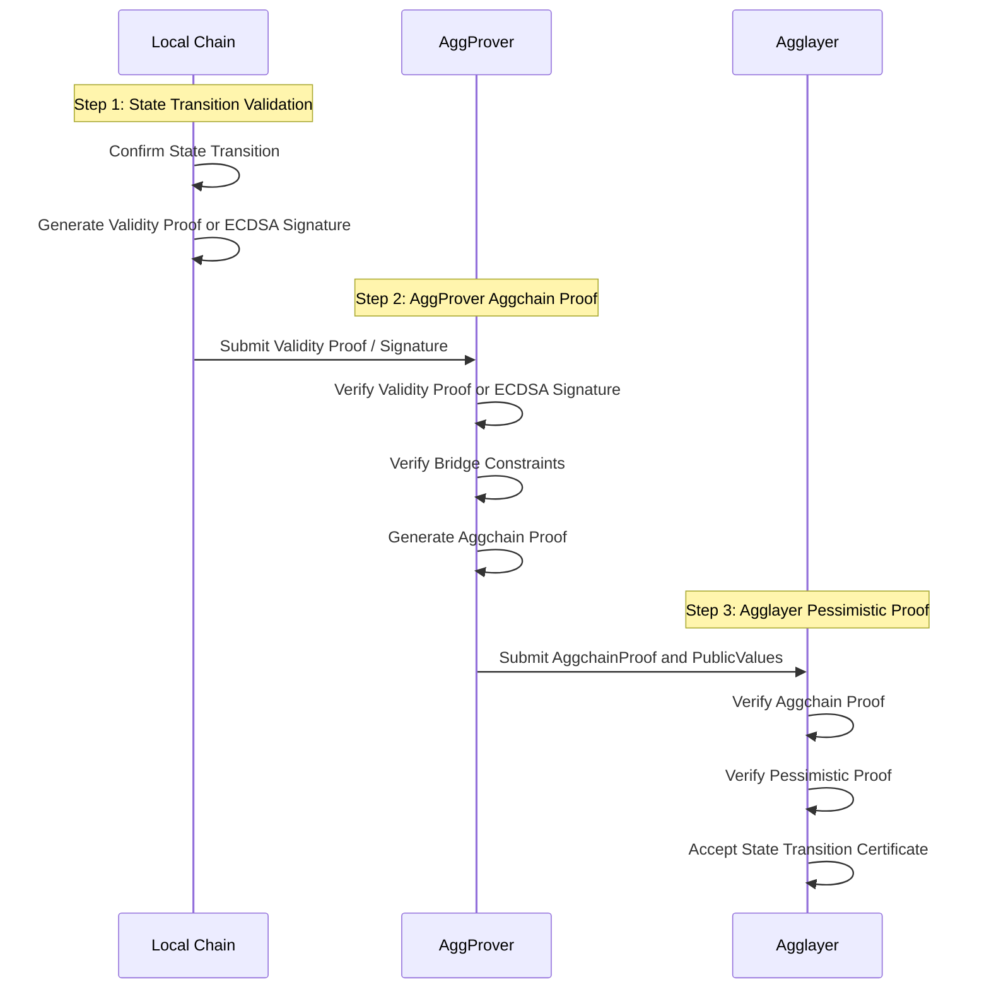

<!-- Page Header Component -->
<h1 style="text-align: left; font-size: 38px; font-weight: 700; font-family: 'Inter Tight', sans-serif;">
  Architecture Overview
</h1>

  

    Understanding the dual proof system and component interactions in State Transition Proof
  

## Overview

State Transition Proof implements a comprehensive dual proof system that ensures both internal chain operations and cross-chain transfers are mathematically verified. This architecture provides enhanced security while supporting different types of chains with varying consensus mechanisms.

## Dual Proof Architecture

### Complete Verification Flow

## System Components

### Local Chain

**Purpose**: Chains connected to Agglayer (Katana, X Layer, and others) that generate state transition proofs.

**Key Responsibilities:**

- **State Transition Confirmation**: Validates that internal state changes are mathematically correct and follow the chain's consensus rules
- **Proof Generation**: Creates either **Validity Proofs** (comprehensive state verification) or **ECDSA Signatures** (trusted sequencer authorization) depending on the chain's security model
- **Certificate Submission**: Packages state transition data into certificates for Agglayer verification

### AggProver

**Purpose**: Critical component that generates cryptographic proofs for state transitions and bridge operations.

**Key Responsibilities:**

- **Consensus Verification**: Validates either **Validity Proofs** or **ECDSA Signatures** from local chains to ensure state transitions are authorized and mathematically correct
- **Bridge Constraint Validation**: Verifies **Global Exit Root** sequences, claimed/unset bridge events, **Local Exit Root** correctness, and **L1 Info Root** inclusion proofs
- **Aggchain Proof Generation**: Creates comprehensive proofs that combine consensus verification with bridge validation, ensuring both internal and cross-chain operations are secure

<!-- ### AggSender

**Purpose**: Bridge infrastructure component that builds and packages bridge state information.

**Key Responsibilities:**

- **Certificate Building**: Constructs certificates containing all necessary data for **Pessimistic Proof** generation, including bridge exits, imported bridge exits, and state roots
- **Periodic Submission**: Regularly sends certificates to Agglayer for verification, optimizing for both security and efficiency
- **State Packaging**: Ensures all bridge-related state changes are properly documented and verifiable

### AggOracle

**Purpose**: Data propagation service ensuring on-chain data availability for proof verification.

**Key Responsibilities:**

- **GER Propagation**: Ensures **Global Exit Root** updates are properly propagated from L1 to L2 sovereign chains, enabling cross-chain claim verification
- **Data Synchronization**: Maintains consistency between L1 and L2 states by providing timely updates of critical verification data
- **Bridge Support**: Enables secure asset and message bridging by ensuring all chains have access to the latest global state information -->

## Verification Systems

### Internal Chain Validation

**State Transition Verification:**

- Validates that each chain's internal state transitions are mathematically correct through comprehensive verification of all operations within the chain
- Ensures all operations follow proper execution rules and that new states are properly derived from previous states through valid state transition logic
- Provides the foundation for secure cross-chain operations by ensuring individual chains are operating correctly before allowing bridge operations

**Consensus Mechanisms:**

- **Validity Proof**: Comprehensive verification of every operation in the chain using mathematical proofs, providing cryptographic certainty about state correctness without requiring trusted parties
- **ECDSA Signature**: Trusted sequencer authorization where designated addresses validate and sign off on state changes, providing fast verification with trusted party assumptions

### Cross-Chain Validation

**Aggchain Proof:**

- Combines consensus verification with bridge constraint validation to ensure both internal operations and cross-chain transfers are secure and mathematically correct
- Supports flexible consensus mechanisms while maintaining strict bridge security requirements, enabling different chain types to participate safely
- Acts as the bridge between internal chain validation and cross-chain operation validation

**Pessimistic Proof:**

- Validates cross-chain asset transfers and balance conservation by ensuring chains cannot drain more funds than currently deposited, creating financial isolation between chains
- Prevents compromised chains from affecting other chains in the network through mathematical constraints on fund movement
- Ensures atomic cross-chain operations where all components succeed or fail together

## Consensus Flexibility

### ECDSA Consensus (CONSENSUS_TYPE = 0)

**Characteristics:**

- **Trusted Sequencer**: Designated address signs state transitions
- **Simple Verification**: Signature validation using elliptic curve cryptography
- **Fast Processing**: Minimal computational overhead
- **Trust Model**: Relies on sequencer integrity

### Generic Consensus (CONSENSUS_TYPE = 1)

**Characteristics:**

- **Validity Proofs**: Comprehensive mathematical verification of state transitions
- **Flexible Integration**: Supports various proof systems and zkVMs
- **Enhanced Security**: Mathematical certainty about state correctness
- **Modular Design**: Can integrate with different chain architectures

## Security Guarantees

### Comprehensive Validation

- **Internal Security**: Every chain's internal operations are verified through either **Validity Proofs** or **ECDSA signatures** before any cross-chain operations are allowed, ensuring that only properly functioning chains can participate in bridge operations
- **Cross-Chain Security**: Bridge operations are validated through multiple proof systems (**Aggchain Proof** + **Pessimistic Proof**) that ensure mathematical correctness and balance conservation across all connected chains
- **Mathematical Certainty**: All verifications use cryptographic proofs and mathematical constraints to provide certainty about operation validity, eliminating reliance on trust assumptions where possible

### Isolation and Containment

- **Chain Independence**: Issues in one chain cannot affect others due to isolated verification processes where each chain's state transitions are validated independently through separate proof generation and verification
- **Atomic Operations**: All operations succeed or fail completely through the comprehensive validation pipeline where any failure in consensus verification, bridge constraints, or pessimistic proof validation causes the entire state transition to be rejected
- **Proof Requirements**: Invalid operations cannot proceed without proper verification because the system requires valid cryptographic proofs at multiple stages (consensus + bridge + balance conservation) before accepting any state changes

<!-- CTA Button Component -->

  <a href="/agglayer/core-concepts/state-transition-proof/aggchain-proof/" style="background: #0071F7; color: white; padding: 12px 24px; border-radius: 8px; text-decoration: none; font-weight: 600; display: inline-block;">
    Learn about Aggchain Proof →
  </a>

