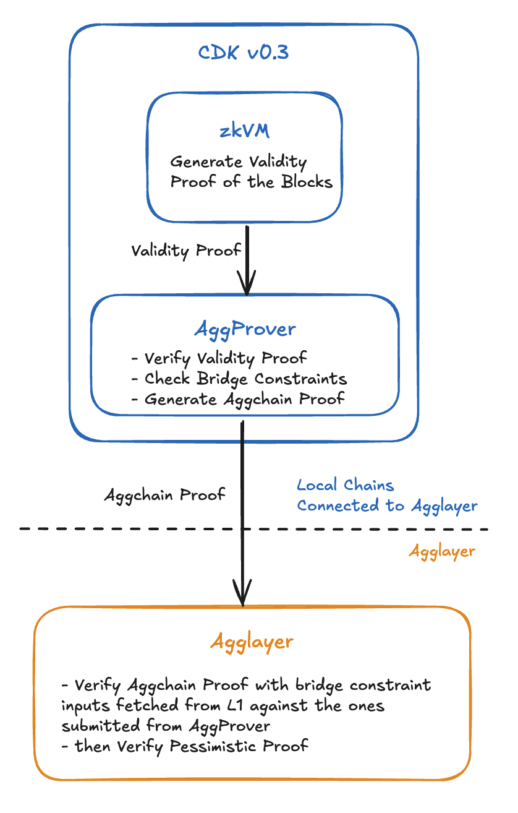
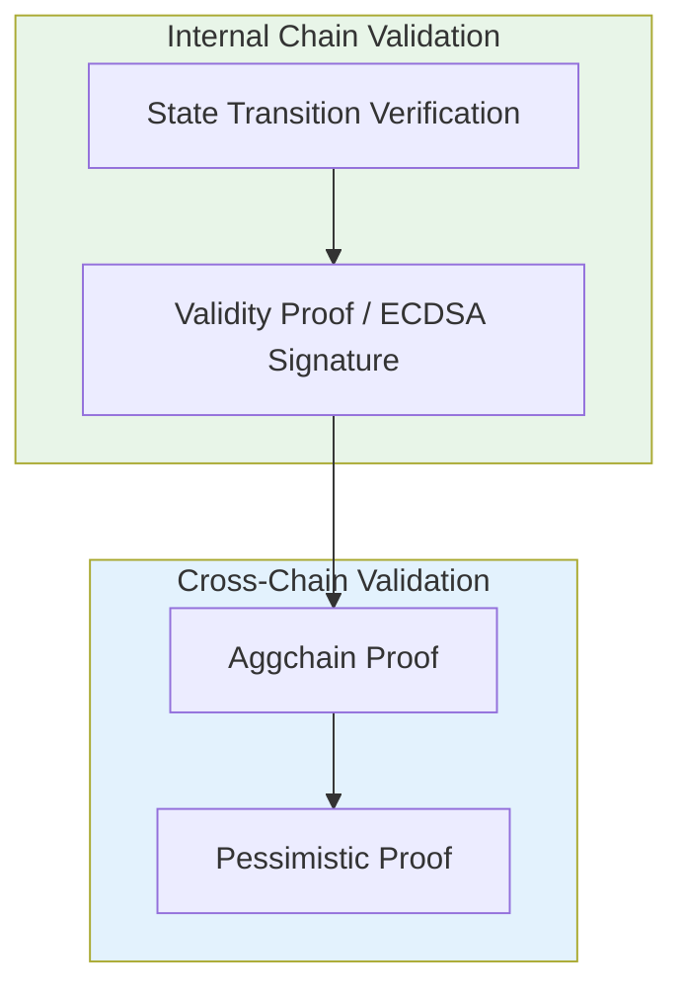

<!-- Page Header Component -->
<h1 style="text-align: left; font-size: 38px; font-weight: 700; font-family: 'Inter Tight', sans-serif;">
  State Transition Proof
</h1>

  

    Comprehensive dual proof system ensuring both internal chain operations and cross-chain transfers are valid
  

## Background

### Evolution of Security

In early versions of Agglayer, the system focused on securing cross-chain transactions through a single verification method. While this worked for basic operations, it didn't verify whether individual chains themselves were operating correctly.

**The Challenge**: Like having a security guard only checking IDs at a building entrance, but not verifying if the building's internal systems are functioning properly.

**The Solution**: Agglayer v0.3 introduces a comprehensive dual proof system - like having both a building security system and a security guard working together.

## Overview

State Transition Proof is a comprehensive trust validation process that ensures the security and validity of all operations in Agglayer through two distinct verification systems:

**Dual Proof System:**

- **Internal Chain Validation**: State transition verification within individual chains
- **Cross-Chain Validation**: Bridge operation verification between chains (Aggchain Proof + Pessimistic Proof)

*Figure 1: High-level overview of the v0.3 dual proof system*

## What You Can Do

- **Verify Chain Operations**: Ensure internal chain state transitions are mathematically correct
- **Validate Cross-Chain Transfers**: Verify that asset transfers between chains are secure and atomic
- **Support Multiple Chain Types**: Enable different consensus mechanisms while maintaining security
- **Flexible Integration**: Choose between ECDSA signatures or advanced validity proofs

## How It Works

The State Transition Proof system implements a two-step verification process that validates both internal chain operations and cross-chain transfers:

**Security Model:**

- **Internal validation** verifies that chains are operating correctly internally
- **Cross-chain validation** verifies that bridge operations are secure and atomic
- **Dual proof system** ensures comprehensive security coverage

## Core Concepts

Understand the dual proof system architecture:

  <!-- Architecture Card -->
  

    <h3 style="color: #0071F7; margin: 0 0 0.5rem 0; font-size: 18px; font-weight: 600;">
      Architecture
    </h3>
    

      Understand the dual proof system and component interactions.
    

    <a href="/agglayer/core-concepts/state-transition-proof/architecture/" style="color: #0071F7; text-decoration: none; font-weight: 500; font-size: 14px;">
      Learn more →
    </a>
  

  <!-- Aggchain Proof Card -->
  

    <h3 style="color: #0071F7; margin: 0 0 0.5rem 0; font-size: 18px; font-weight: 600;">
      Aggchain Proof
    </h3>
    

      Flexible verification system supporting ECDSA signatures and validity proofs with bridge constraints.
    

    <a href="/agglayer/core-concepts/state-transition-proof/aggchain-proof/" style="color: #0071F7; text-decoration: none; font-weight: 500; font-size: 14px;">
      Learn more →
    </a>
  

