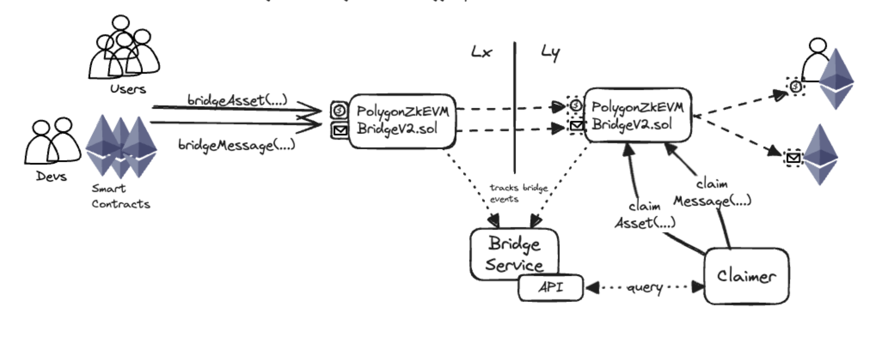
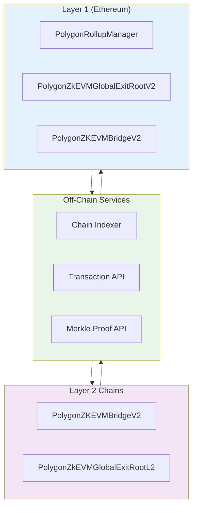
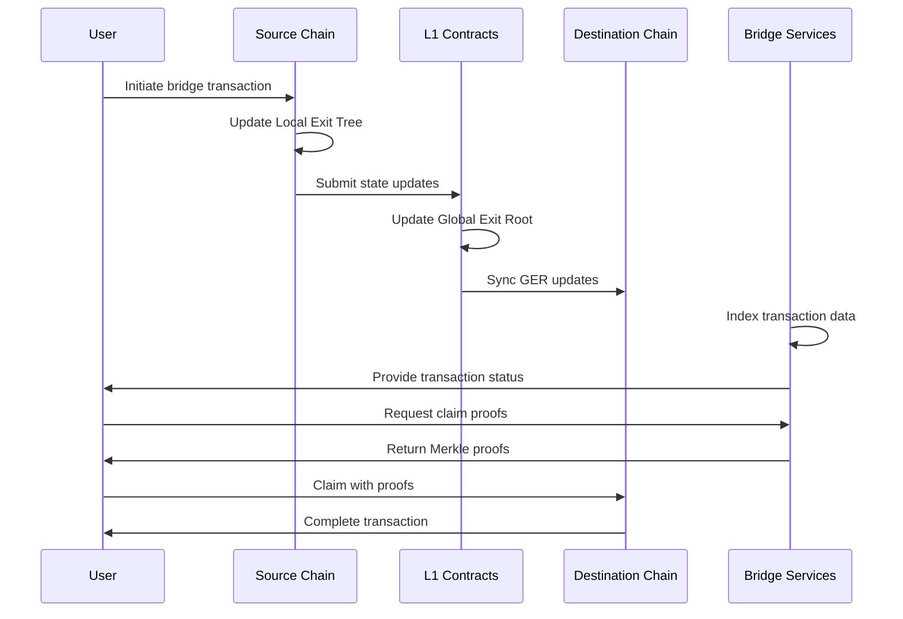
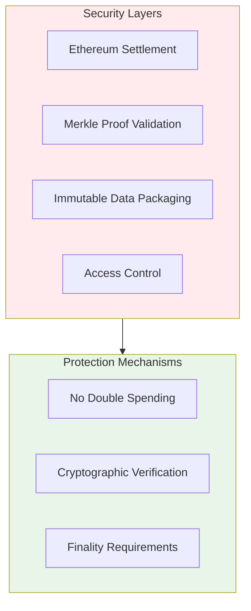
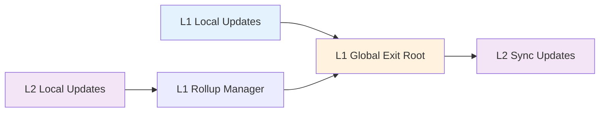

<!-- Page Header Component -->
<h1 style="text-align: left; font-size: 38px; font-weight: 700; font-family: 'Inter Tight', sans-serif;">
  Architecture Overview
</h1>

  

    Understanding the complete Unified Bridge architecture and how all components work together
  

## Overview

The Unified Bridge implements a sophisticated architecture that enables secure cross-chain communication across Agglayer connected chains. The system combines on-chain smart contracts, off-chain services, and cryptographic verification to ensure trustless interoperability.

*Figure 1: Complete Unified Bridge architecture showing all components and interactions*

## System Architecture

## Data Flow Architecture

### Cross-Chain Transaction Flow

## Component Interactions

### Smart Contract Layer

**L1 Contracts (Ethereum):**

- **RollupManager**: Coordinates L2 state submissions and manages the Rollup Exit Tree. When L2s submit their Local Exit Roots, this contract updates the aggregated rollup state and triggers Global Exit Root updates.

- **GlobalExitRoot**: Maintains the unified Global Exit Root by combining Rollup Exit Root and Mainnet Exit Root. Also manages the L1 Info Tree that stores historical Global Exit Roots for L2 synchronization.

- **Bridge**: Handles L1 ↔ L2 transactions and maintains the Mainnet Exit Tree. Processes asset and message bridging from L1 to connected L2s, and validates claims from L2s to L1.

**L2 Contracts (Connected Chains):**

- **Bridge**: Handles all cross-chain transactions for the L2, including bridging to other L2s and L1. Maintains the chain's Local Exit Tree and processes both outbound bridging and inbound claims.

- **GlobalExitRootL2**: Syncs with L1 Global Exit Root updates to enable claim verification. Fetches the latest Global Exit Root from L1 to validate cross-chain transaction proofs.

### Service Layer

**Bridge Services:**

- **Chain Indexer**: Monitors blockchain events in real-time, parsing and organizing bridge transaction data. Each connected chain has its own indexer instance that processes `BridgeEvent` and `ClaimEvent` logs.

- **Transaction API**: Provides real-time bridge transaction status and details for user interfaces. Returns transaction status, token information, source/destination chains, and deposit counts needed for proof generation.

- **Proof API**: Generates Merkle proofs required for claiming bridged assets and messages. Creates `smtProofLocalExitRoot` and `smtProofRollupExitRoot` along with other verification data needed for claims.

### Security Architecture

## Bridge Operation Types

### Asset Bridging Architecture

**Source Chain Process:**

1. Lock/burn tokens based on token type
2. Record transaction in Local Exit Tree
3. Emit bridge event for indexing

**Destination Chain Process:**

1. Verify Merkle proofs against Global Exit Root
2. Transfer/mint tokens based on token type
3. Mark transaction as claimed

### Message Bridging Architecture

**Source Chain Process:**

1. Package message data and ETH value
2. Record message in Local Exit Tree
3. Emit bridge event for indexing

**Destination Chain Process:**

1. Verify Merkle proofs against Global Exit Root
2. Execute message on target contract
3. Handle ETH/WETH value transfer

### Bridge-and-Call Architecture

**Enhanced Flow:**

1. Combines asset and message bridging
2. Uses BridgeExtension contracts
3. Deploys temporary JumpPoint contracts
4. Enables calls to any destination contract

## State Synchronization

### Global Exit Root Updates

### Merkle Tree Hierarchy

The architecture maintains a sophisticated hierarchical Merkle tree structure that enables secure cross-chain verification:

- **Local Exit Trees**: Each connected chain maintains its own 32-level Sparse Merkle Tree that records all outgoing bridge transactions. Every time a user initiates a `bridgeAsset` or `bridgeMessage` call, a new leaf is added to this tree and the root is updated.

- **Rollup Exit Tree**: L1's RollupManager maintains a Sparse Merkle Tree where each leaf represents a Local Exit Root from a connected L2. When L2s submit their updated Local Exit Roots to L1, this tree is updated, creating a unified view of all L2 bridge activities.

- **Mainnet Exit Tree**: L1 maintains its own Local Exit Tree (called Mainnet Exit Tree) that records all bridge transactions originating from L1 to connected L2s. This operates similarly to L2 Local Exit Trees but specifically for L1 activities.

- **Global Exit Root**: A single root hash computed as `hash(RollupExitRoot, MainnetExitRoot)` that represents the complete state of all cross-chain activities across the entire network. This root is updated whenever either the Rollup Exit Root or Mainnet Exit Root changes.

- **L1 Info Tree**: A historical ledger that stores every Global Exit Root update as leaves in a 32-level Sparse Merkle Tree. This enables L2s to sync with specific historical states and provides the foundation for Merkle proof verification during claims.

## Scalability Design

### Horizontal Scaling

- **Multiple L2s**: The architecture supports unlimited connected chains without performance degradation. Each new L2 simply adds another leaf to the Rollup Exit Tree, and the system scales linearly with the number of connected chains.

- **Parallel Processing**: Connected chains operate independently and can process bridge transactions simultaneously. There's no coordination required between chains for individual transactions, enabling true parallel execution across the network.

- **Load Distribution**: Proof generation and transaction indexing are distributed across multiple service instances. Each chain can have its own indexer, and proof generation can be handled by distributed prover networks.

### Vertical Scaling

- **Batch Submissions**: L2s have flexibility in how frequently they submit their Local Exit Roots to L1. They can submit immediately for each transaction or batch multiple transactions together before submitting, optimizing for gas costs and throughput.

- **Efficient Proofs**: Merkle proof generation is optimized using Sparse Merkle Trees that only store non-zero values, significantly reducing storage and computation requirements. Proofs are generated on-demand and cached for frequently accessed transactions.

- **State Compression**: The hierarchical tree structure provides natural compression where multiple L2 states are represented by a single Rollup Exit Root, and the entire network state is compressed into a single Global Exit Root.

## Security Properties

### Trust Model

- **L1 Security**: The system inherits Ethereum's security guarantees because all cross-chain transactions must be settled and finalized on Ethereum before they can be claimed on destination chains. This means the security of cross-chain operations is backed by Ethereum's consensus mechanism and economic security.

- **Cryptographic Proofs**: Every claim requires valid Merkle proofs that mathematically demonstrate the transaction was properly recorded and settled. The verification process uses cryptographic hash functions to ensure that no invalid or fraudulent claims can be processed.

- **No Trusted Parties**: The system operates without requiring trust in any centralized entity. Users, claimers, and even the bridge operators cannot manipulate the system because all operations are governed by smart contract logic and cryptographic verification.

### Failure Isolation

- **Chain Independence**: If one connected chain experiences issues or becomes compromised, it cannot affect the security or operation of other chains. Each chain's bridge transactions are isolated in separate Local Exit Trees, preventing cross-contamination of security issues.

- **Atomic Operations**: Bridge transactions either succeed completely or fail completely - there are no partial states. If any part of a cross-chain transaction fails (such as insufficient balance or invalid proofs), the entire operation is reverted without affecting the system state.

- **Proof Requirements**: Invalid operations cannot be executed because the system requires valid Merkle proofs for all claims. Without proper cryptographic proof that a transaction was settled on L1, no assets can be claimed or messages executed on destination chains.

