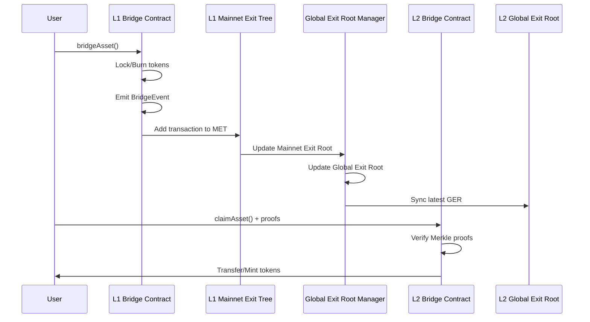
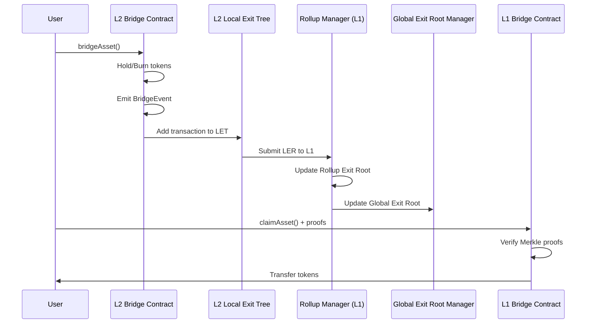
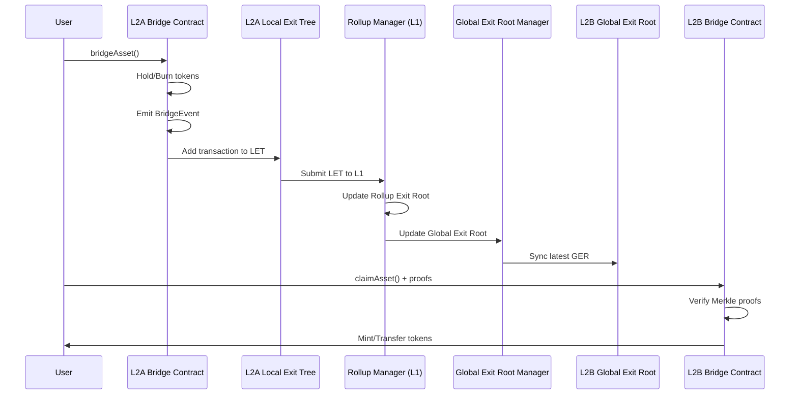

<!-- Page Header Component -->
<h1 style="text-align: left; font-size: 38px; font-weight: 700; font-family: 'Inter Tight', sans-serif;">
  Asset Bridging
</h1>

<div style="text-align: left; margin: 0.5rem 0;">
  <p style="font-size: 18px; color: #666; max-width: 600px; margin: 0;">
    Learn how to bridge tokens and native assets between different chains using the Unified Bridge
  </p>
</div>

## Overview

Asset bridging enables the transfer of tokens and native assets between Agglayer connected chains. The Unified Bridge supports various token types and provides a secure, trustless mechanism for cross-chain asset transfers.


*Figure 1: Complete asset bridging flow from L1 to L2*

## Supported Token Types

The Unified Bridge handles different token types with specific mechanisms:

| Token Type | Source Chain Action | Destination Chain Action |
|------------|-------------------|------------------------|
| **Native Gas Token** (ETH, Custom Gas Token) | Bridge contract holds tokens | Bridge contract transfers tokens |
| **WETH** | Burn WETH tokens from user | Mint WETH tokens to user |
| **Foreign ERC20** (Not native to source) | Burn ERC20 tokens from user | Mint wrapped tokens to user |
| **Native ERC20** (Native to source) | Transfer ERC20 to bridge contract | Transfer from bridge contract to user |

## Bridge Asset Function

The `bridgeAsset` function initiates asset transfers between chains.

### Function Signature

```solidity
function bridgeAsset(
    uint32 destinationNetwork,
    address destinationAddress,
    uint256 amount,
    address token,
    bool forceUpdateGlobalExitRoot,
    bytes calldata permitData
) external payable
```

### Parameters

- **`destinationNetwork`**: Network ID of the destination chain
- **`destinationAddress`**: Address to receive assets on destination chain
- **`amount`**: Amount of tokens to bridge
- **`token`**: Token contract address (0x0 for native gas token)
- **`forceUpdateGlobalExitRoot`**: Whether to update GER immediately
- **`permitData`**: Raw permit data for ERC20 tokens (optional)

### Process Steps

1. **Validation**: Check destination network is not the source network
2. **Token Preparation**: Handle token based on type (lock, burn, or transfer)
3. **Event Emission**: Emit `BridgeEvent` with transaction details
4. **Tree Update**: Add transaction to Local Exit Tree as leaf node

### Token Preparation Logic

The bridge handles different token types with specific mechanisms based on their origin and nature:

> Note that in case `ETH` is the native token, WETHToken will be at `0x0` address.

#### Native Gas Token (ETH, Custom Gas Token)
```solidity
// Bridge contract holds the tokens
// The native gas token is already transferred via msg.value
// No additional token transfer required
```

#### WETH Token
```solidity
// Burn WETH tokens from user's address
IWETH(token).burnFrom(msg.sender, amount);
```

#### Foreign ERC20 Token (Not native to source chain)
```solidity
// If the token contract is not originally from the source network, 
// burn the ERC20 token from user's address
IERC20(token).burnFrom(msg.sender, amount);
```

#### Native ERC20 Token (Native to source chain)
```solidity
// If the token contract is originally from the source network:
// 1. Execute permit if provided
if (permitData.length > 0) {
    IERC20Permit(token).permit(...);
}
// 2. Transfer tokens from user to bridge contract
IERC20(token).transferFrom(msg.sender, address(this), amount);
```

## Claim Asset Function

The `claimAsset` function claims bridged assets on the destination chain.

### Function Signature

```solidity
function claimAsset(
    bytes32[_DEPOSIT_CONTRACT_TREE_DEPTH] calldata smtProofLocalExitRoot,
    bytes32[_DEPOSIT_CONTRACT_TREE_DEPTH] calldata smtProofRollupExitRoot,
    uint256 globalIndex,
    bytes32 mainnetExitRoot,
    bytes32 rollupExitRoot,
    uint32 originNetwork,
    address originTokenAddress,
    uint32 destinationNetwork,
    address destinationAddress,
    uint256 amount,
    bytes calldata metadata
) external
```

### Parameters

- **`smtProofLocalExitRoot`**: Merkle proof for Local Exit Root
- **`smtProofRollupExitRoot`**: Merkle proof for Rollup Exit Root
- **`globalIndex`**: Global index identifying the transaction
- **`mainnetExitRoot`**: Mainnet Exit Root at time of transaction
- **`rollupExitRoot`**: Rollup Exit Root at time of transaction
- **`originNetwork`**: Network ID of source chain
- **`originTokenAddress`**: Token address on source chain
- **`destinationNetwork`**: Network ID of destination chain
- **`destinationAddress`**: Address to receive assets
- **`amount`**: Amount of tokens to claim
- **`metadata`**: Additional metadata (if any)

### Process Steps

1. **Validation**: Verify destination network matches current chain
2. **Proof Verification**: Verify Merkle proofs against Global Exit Root
3. **Duplicate Check**: Ensure transaction hasn't been claimed before
4. **Token Transfer**: Transfer tokens based on token type (see Token Transfer Logic below)
5. **Claim Record**: Mark transaction as claimed

### Token Transfer Logic

Once the proof verification passes, the bridge claims tokens using different mechanisms based on the token type:

| Token type | Action |
| --- | --- |
| **ETH is gas token** | Bridge contract transfers the amount from itself to the destination address |
| **WETH where ETH is not gas token** | Mint new WETH tokens to the destination address |
| **Custom gas token** | Bridge contract transfers the amount from itself to the destination address |
| **Native ERC20 Token** | If the token contract is originally from this destination network, transfer the ERC20 token from bridge contract to destination address |
| **Foreign ERC20 Token, First time bridging** | Deploy a new ERC20 Token contract to host this new Foreign ERC20 Token, and mint the transfer amount to destination address |
| **Foreign ERC20 Token, Contract exists** | Mint the transfer amount to destination address |

### Proof Verification Logic

```solidity
// Construct Global Exit Root
bytes32 globalExitRoot = keccak256(abi.encodePacked(mainnetExitRoot, rollupExitRoot));

// Verify against synchronized GER
require(globalExitRoot == getGlobalExitRoot(), "Invalid global exit root");

// Verify Merkle proofs based on origin
if (originNetwork == 0) {
    // L1 to L2: Verify against mainnet exit root
    verifyMerkleProof(smtProofLocalExitRoot, mainnetExitRoot, globalIndex);
} else {
    // L2 to L2: Verify against rollup exit root
    verifyMerkleProof(smtProofLocalExitRoot, rollupExitRoot, globalIndex);
    verifyMerkleProof(smtProofRollupExitRoot, rollupExitRoot, globalIndex);
}
```

## Bridging Flows

### L1 to L2 Bridging



### L2 to L1 Bridging



### L2 to L2 Bridging



