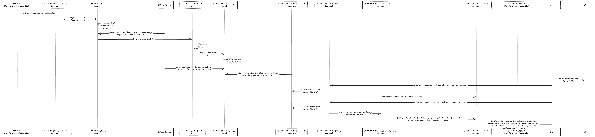

<!-- Page Header Component -->
<h1 style="text-align: left; font-size: 38px; font-weight: 700; font-family: 'Inter Tight', sans-serif;">
  Bridge-and-Call
</h1>

<div style="text-align: left; margin: 0.5rem 0;">
  <p style="font-size: 18px; color: #666; max-width: 600px; margin: 0;">
    Advanced cross-chain functionality that enables direct contract calls on destination chains with asset transfers
  </p>
</div>

## Overview

Bridge-and-Call is an advanced feature of the Unified Bridge that allows developers to initiate cross-chain transactions that both transfer assets and execute smart contract functions on the destination chain in a single operation. This enables more complex cross-chain workflows and reduces the number of transactions required for sophisticated cross-chain applications.

It is different from **Bridge Message**, where Bridge Message requires the destination address to be a smart contract that implemented the `IBridgeMessageReceiver.sol` interface. Whereas for **Bridge-and-Call**, it itself is the contract that has implemented the interface, and it will be able to execute any functions on any smart contract in the destination network.



*Figure 1: Complete Bridge-and-Call flow showing asset transfer and contract execution*

## Key Differences from Bridge Message

| Feature | Bridge Message | Bridge-and-Call |
|---------|----------------|-----------------|
| **Destination Contract** | Must implement `IBridgeMessageReceiver` | Can call any contract |
| **Execution** | Contract handles message reception | JumpPoint contract executes calls |
| **Flexibility** | Limited to specific interface | Full contract call flexibility |
| **Use Case** | Simple message passing | Complex cross-chain operations |

## Core Components

### BridgeExtension.sol

The main contract that handles Bridge-and-Call operations on both source and destination chains.

**Key Functions**:

- `bridgeAndCall()`: Initiates asset transfer with contract call
- `onMessageReceived()`: Handles incoming Bridge-and-Call messages

**Deployment**: Deployed on both L1 and all connected L2s

### JumpPoint.sol

A temporary contract that executes the actual function calls on the destination chain.

**Key Features**:

- **Temporary Contract**: Created for each Bridge-and-Call operation
- **Asset Handling**: Receives and manages transferred assets
- **Function Execution**: Executes calls on target contracts
- **Fallback Handling**: Manages failed executions

## Bridge-and-Call Function

The `bridgeAndCall` function initiates both asset transfer and contract execution.

### Function Signature

```solidity
function bridgeAndCall(
    address token,
    uint256 amount,
    uint32 destinationNetwork,
    address callAddress,
    address fallbackAddress,
    bytes calldata callData,
    bool forceUpdateGlobalExitRoot
) external payable
```

### Parameters

- **`token`**: Token contract address to transfer (0x0 for native gas token)
- **`amount`**: Amount of tokens to transfer
- **`destinationNetwork`**: Network ID of the destination chain
- **`callAddress`**: Contract address to call on destination chain
- **`fallbackAddress`**: Address to receive assets if execution fails
- **`callData`**: Encoded function call data
- **`forceUpdateGlobalExitRoot`**: Whether to update GER immediately

### Process Steps

1. **Token Preparation**: Handle different token types (native, WETH, ERC20)
2. **Asset Bridging**: Call `bridgeAsset` to transfer tokens
3. **Message Bridging**: Call `bridgeMessage` with encoded call data
4. **Event Emission**: Emit events for both operations

### Token Preparation Logic

#### Native Gas Token
```solidity
// Gas token already transferred to contract via msg.value
// No additional preparation needed
```

#### WETH
```solidity
// Transfer WETH from sender to contract
IWETH(token).transferFrom(msg.sender, address(this), amount);
```

#### ERC20 Tokens
```solidity
// Transfer ERC20 tokens from sender to contract
IERC20(token).transferFrom(msg.sender, address(this), amount);
```

## Message Reception

The `onMessageReceived` function handles incoming Bridge-and-Call messages on the destination chain.

### Function Signature

```solidity
function onMessageReceived(
    address originAddress,
    uint32 originNetwork,
    bytes calldata data
) external payable
```

### Parameters

- **`originAddress`**: BridgeExtension address on source chain
- **`originNetwork`**: Network ID of source chain
- **`data`**: Encoded call data containing:
    - `dependsOnIndex`: Index of the asset bridge transaction
    - `callAddress`: Contract to call on destination
    - `fallbackAddress`: Fallback address for failed executions
    - `assetOriginalNetwork`: Original network of the asset
    - `assetOriginalAddress`: Original address of the asset
    - `callData`: Function call data

### Process Steps

1. **Access Control**: Verify caller is bridge contract and origin is valid
2. **Data Decoding**: Decode the message data
3. **Asset Verification**: Check if asset bridge transaction is claimed
4. **JumpPoint Creation**: Deploy JumpPoint contract with call parameters
5. **Asset Transfer**: Transfer assets to JumpPoint contract
6. **Function Execution**: Execute the call on target contract

## JumpPoint Contract

The JumpPoint contract is a temporary contract that handles the actual execution on the destination chain.

### Constructor

```solidity
constructor(
    address bridge,
    uint32 assetOriginalNetwork,
    address assetOriginalAddress,
    address callAddress,
    address fallbackAddress,
    bytes memory callData
) payable
```

### Execution Process

1. **Asset Detection**: Identify the type of transferred asset
2. **Asset Transfer**: Transfer asset to target contract
3. **Function Call**: Execute the specified function call
4. **Fallback Handling**: Handle failed executions by transferring to fallback address

## Bridging Flows

### L1 to L2 Bridge-and-Call


### L2 to L2 Bridge-and-Call


