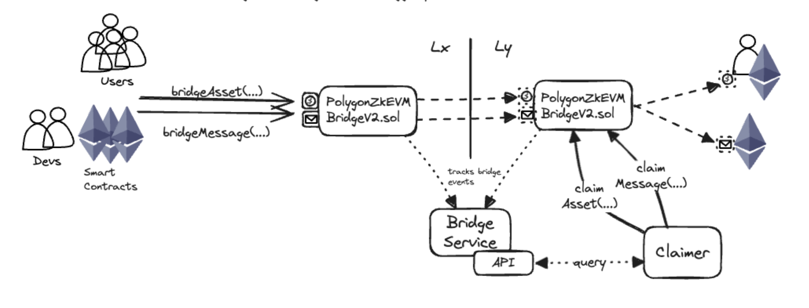

<!-- Page Header Component -->
<h1 style="text-align: left; font-size: 38px; font-weight: 700; font-family: 'Inter Tight', sans-serif;">
  Bridge Components
</h1>

<div style="text-align: left; margin: 0.5rem 0;">
  <p style="font-size: 18px; color: #666; max-width: 600px; margin: 0;">
    The smart contracts, services, and tools that power the Unified Bridge's cross-chain functionality
  </p>
</div>

## Overview

The Unified Bridge consists of three main component categories: on-chain smart contracts, off-chain services, and developer tools. Each component plays a crucial role in enabling secure and efficient cross-chain communication.



*Figure 1: Complete Unified Bridge architecture showing all components and their interactions*

## Smart Contracts

The core on-chain infrastructure deployed on each connected chain.

### PolygonZKEVMBridgeV2.sol

**Purpose**: Main bridge contract that serves as the interface for all cross-chain transactions.

**Key Functions**:

- `bridgeAsset()`: Initiate asset transfers between chains
- `bridgeMessage()`: Initiate message transfers between chains
- `claimAsset()`: Claim bridged assets on destination chain
- `claimMessage()`: Claim bridged messages on destination chain

**Data Management**:

- Maintains Local Exit Tree (LET) for the chain
- Records all outgoing bridge transactions
- Handles token locking/burning and minting/transferring

**Deployment**: Deployed on both L1 and all connected L2s

### PolygonRollupManager.sol

**Purpose**: L1 contract that manages rollup state updates and coordinates L2 submissions.

**Key Functions**:

- `updateRollupExitRoot()`: Updates rollup exit root when L2s submit their LET
- `verifyBatches()`: Verifies L2 batch submissions
- `sequenceBatches()`: Sequences L2 batches on L1

**Data Management**:

- Maintains Rollup Exit Tree (RET)
- Tracks all L2 Local Exit Roots
- Updates Global Exit Root when RET changes

**Deployment**: Deployed only on L1

### PolygonZkEVMGlobalExitRootV2.sol

**Purpose**: L1 contract that maintains the Global Exit Root (GER) and L1 Info Tree.

**Key Functions**:

- `updateGlobalExitRoot()`: Updates GER when RER or MER changes
- `getGlobalExitRoot()`: Returns current GER
- `getL1InfoTreeRoot()`: Returns L1 Info Tree root

**Data Management**:

- Maintains Global Exit Root (hash of RER and MER)
- Maintains L1 Info Tree with historical GERs
- Provides GER synchronization for L2s

**Deployment**: Deployed only on L1

### PolygonZkEVMGlobalExitRootL2.sol

**Purpose**: L2 contract that synchronizes with L1 Global Exit Root updates.

**Key Functions**:

- `updateExitRoot()`: Syncs with latest GER from L1
- `getGlobalExitRoot()`: Returns current synchronized GER
- `getL1InfoTreeRoot()`: Returns synchronized L1 Info Tree root

**Data Management**:

- Maintains synchronized copy of L1 GER
- Maintains synchronized copy of L1 Info Tree root
- Enables L2 to verify cross-chain claims

**Deployment**: Deployed on all connected L2s

## Bridge Service

Off-chain infrastructure that provides indexing, APIs, and proof generation services.

### Chain Indexer Framework

**Purpose**: EVM blockchain data indexer that parses and organizes blockchain data.

**Key Features**:

- **Real-time Indexing**: Continuously monitors blockchain for bridge events
- **Data Parsing**: Extracts and structures bridge transaction data
- **Event Processing**: Processes `BridgeEvent` and `ClaimEvent` logs
- **Database Storage**: Stores indexed data for API access

**Deployment**: One instance per connected chain

**Technology**: Built on Polygon's Chain Indexer Framework

### Transaction API

**Purpose**: Provides real-time bridge transaction status and details for user interfaces.

**Key Endpoints**:

- **Testnet**: `https://api-gateway.polygon.technology/api/v3/transactions/testnet?userAddress={userAddress}`
- **Mainnet**: `https://api-gateway.polygon.technology/api/v3/transactions/mainnet?userAddress={userAddress}`

**Response Data**:
- Transaction status (pending, completed, failed)
- Token details (address, amount, symbol)
- Source and destination chain information
- Timestamps and transaction hashes
- Deposit count for proof generation

**Authentication**: Requires API key in request header

**Example Usage**:
```bash
curl --location 'https://api-gateway.polygon.technology/api/v3/transactions/mainnet?userAddress=0x...' \
--header 'x-api-key: <your-api-key-here>'
```

### Proof Generation API

**Purpose**: Generates Merkle proofs required for claiming bridged assets and messages.

**Key Endpoints**:

- **Testnet**: `https://api-gateway.polygon.technology/api/v3/proof/testnet/merkle-proof?networkId={sourceNetworkId}&depositCount={depositCount}`
- **Mainnet**: `https://api-gateway.polygon.technology/api/v3/proof/mainnet/merkle-proof?networkId={sourceNetworkId}&depositCount={depositCount}`

**Parameters**:

- `networkId`: Network ID registered on Agglayer (0 for Ethereum, 1 for Polygon zkEVM, etc.)
- `depositCount`: Leaf index from Local Exit Tree (obtained from Transaction API)

**Response Data**:

- `smtProofLocalExitRoot`: Merkle proof for Local Exit Root
- `smtProofRollupExitRoot`: Merkle proof for Rollup Exit Root
- `globalIndex`: Global index for the transaction
- `mainnetExitRoot`: Mainnet Exit Root at time of transaction
- `rollupExitRoot`: Rollup Exit Root at time of transaction

**Authentication**: Requires API key in request header

### Auto Claim Service

**Purpose**: Automated service that claims bridged transactions on destination chains.

**Key Features**:

- **Automatic Claiming**: Monitors for claimable transactions and claims them automatically
- **Gas Optimization**: Optimizes gas usage for claim transactions
- **Error Handling**: Handles failed claims and retries
- **Monitoring**: Provides monitoring and alerting for claim operations

**Deployment Options**:

- **DApp Integration**: Deploy as part of your dApp infrastructure
- **Chain Integration**: Deploy as a chain service
- **Standalone Service**: Deploy as independent claiming service

**Configuration**:

- Source and destination chain RPC URLs
- Bridge contract addresses
- Private keys for claiming
- Gas price settings

<!-- CTA Button Component -->
<div style="text-align: center; margin: 3rem 0;">
  <a href="/agglayer/core-concepts/unified-bridge/asset-bridging/" style="background: #0071F7; color: white; padding: 12px 24px; border-radius: 8px; text-decoration: none; font-weight: 600; display: inline-block;">
    Learn About Asset Bridging →
  </a>
</div>
