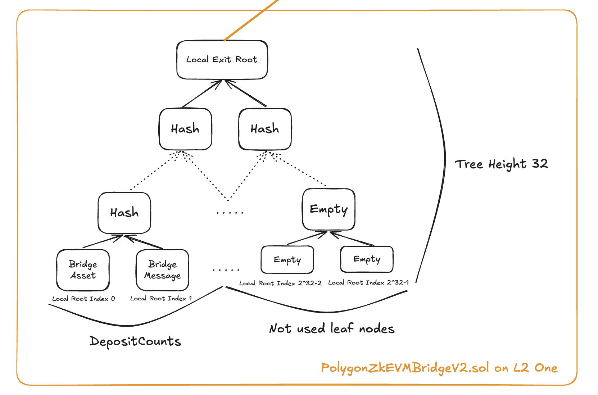
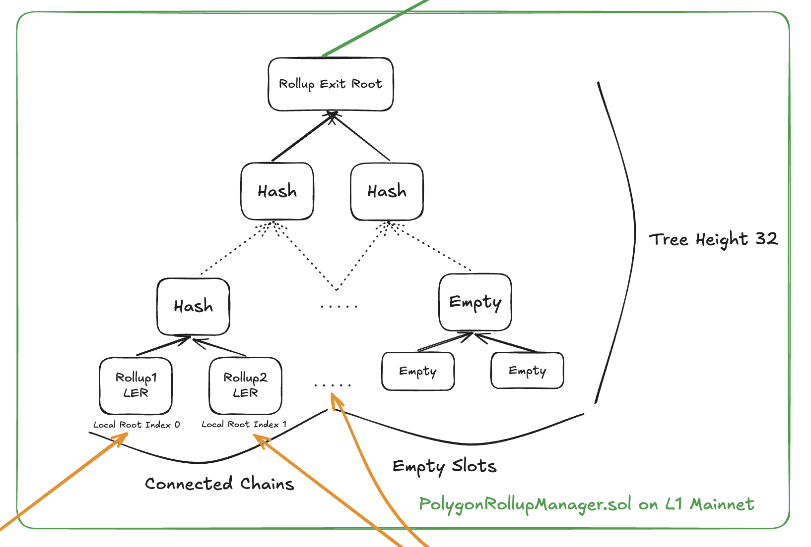
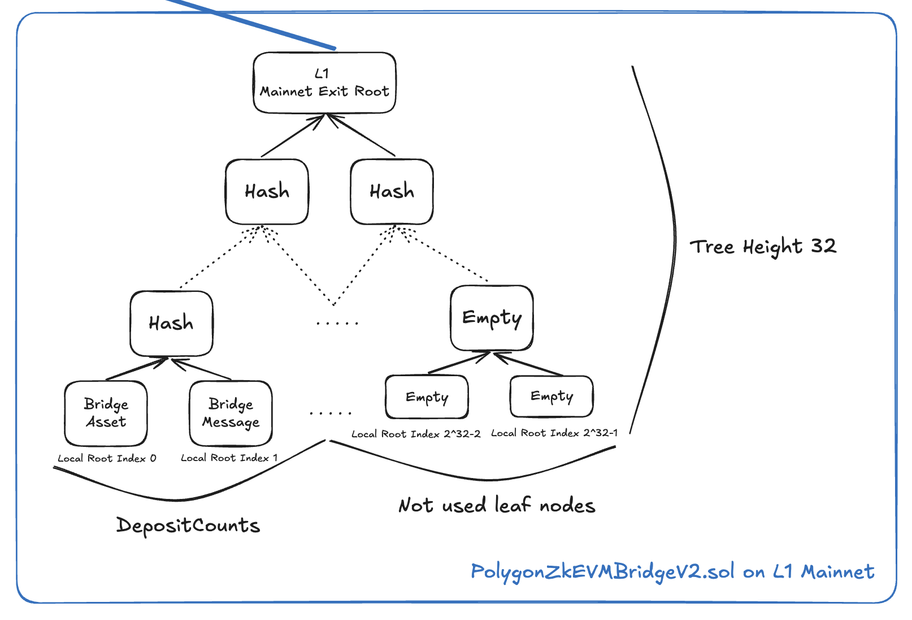
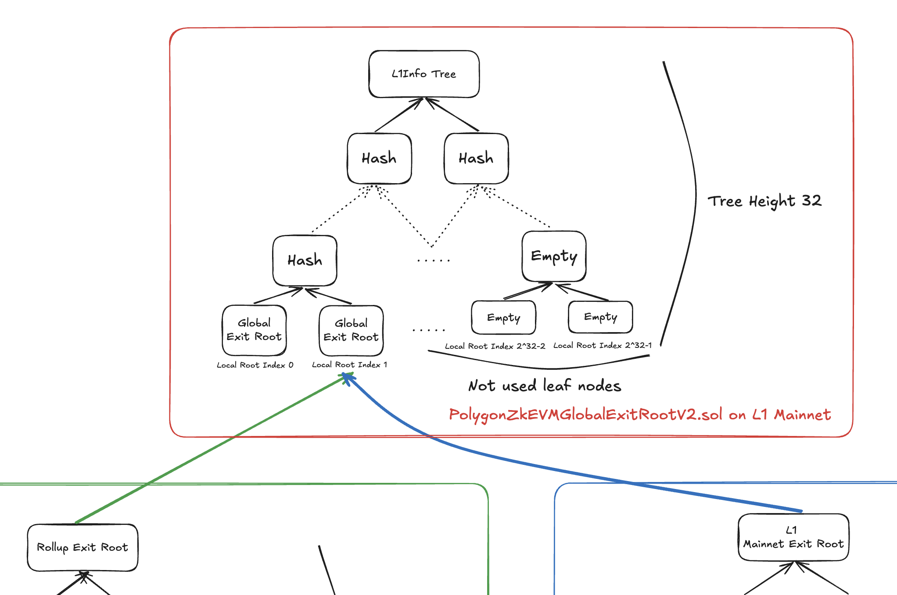
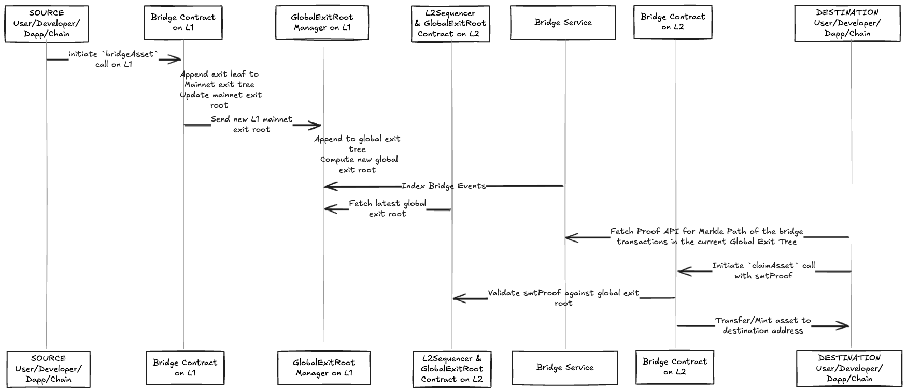
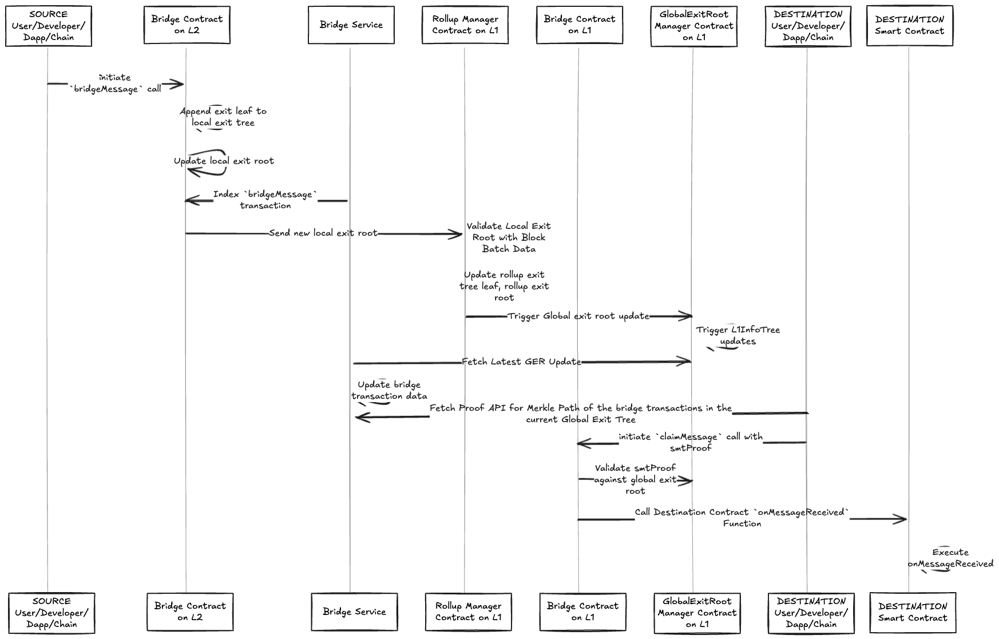
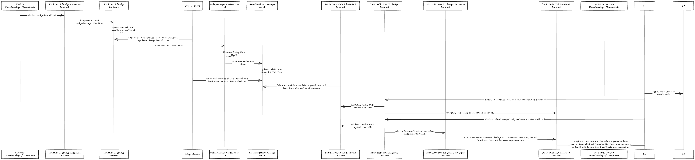

<!-- Page Header Component -->
<h1 style="text-align: left; font-size: 38px; font-weight: 700; font-family: 'Inter Tight', sans-serif;">
  Data Structures
</h1>

<div style="text-align: left; margin: 0.5rem 0;">
  <p style="font-size: 18px; color: #666; max-width: 600px; margin: 0;">
    Understanding the Merkle tree data structures that power the Unified Bridge's cross-chain verification system
  </p>
</div>

## Overview

The Unified Bridge maintains a sophisticated Merkle tree structure to track and verify all cross-chain transactions. This hierarchical system ensures that every cross-chain transaction is cryptographically verifiable and that source chain transactions are finalized on L1 before they can be claimed on the destination chain.


*Figure 1: Complete data structure hierarchy showing how Local Exit Roots, Rollup Exit Root, Mainnet Exit Root, and Global Exit Root work together*

## Local Exit Root & Local Index

Each Agglayer connected chain maintains its own Local Exit Tree (LET) that records all outgoing cross-chain transactions.

### Local Exit Tree (LET)

- **Structure**: A 32-level binary Sparse Merkle Tree that efficiently stores bridge transaction data. The tree uses a sparse representation, meaning it only stores non-zero values, making it highly efficient for storing mostly-empty trees with occasional transactions.

- **Purpose**: Records all bridge transactions initiated on the chain as cryptographic commitments. Each outgoing `bridgeAsset` or `bridgeMessage` transaction is hashed and stored as a leaf node, creating an immutable record of all cross-chain activities originating from this chain.

- **Storage**: Maintained in the `PolygonZKEVMBridgeV2.sol` contract deployed on each chain. This contract serves as both the user interface for bridge operations and the storage mechanism for the Local Exit Tree state.

- **Updates**: The tree root is recalculated and updated with each new cross-chain transaction. This ensures that the Local Exit Root always represents the current state of all bridge transactions from this chain.

### Local Index (depositCount)

- **Definition**: The sequential index of the leaf node in the Local Exit Tree, starting from 0 and incrementing by 1 for each new transaction. This creates a unique identifier for each bridge transaction within the chain's Local Exit Tree.

- **Value**: Each leaf at this index represents a Keccak256 hash of a complete cross-chain transaction, including all transaction details like destination chain, recipient address, token amount, and metadata.

- **Increment**: Automatically incremented with each new bridge transaction, ensuring that every cross-chain operation gets a unique position in the tree. This index is crucial for generating Merkle proofs during the claim process.



*Figure 2: Local Exit Tree structure showing how bridge transactions are recorded as leaves*

## Rollup Exit Root

The Rollup Exit Root (RER) is the Merkle root of all L2s' Local Exit Roots, maintained on L1.

### How it Works

1. **L2 Submission**: Connected L2s periodically submit their updated Local Exit Root to the `PolygonRollupManager.sol` contract on L1. This submission includes cryptographic proof that the Local Exit Root represents valid bridge transactions that have been properly sequenced and finalized on the L2.

2. **Frequency**: L2s have flexibility in submission timing - they can submit their Local Exit Root immediately after each bridge transaction for fastest finality, or batch multiple transactions together before submitting to optimize for L1 gas costs and throughput.

3. **RER Update**: The RollupManager validates the submitted Local Exit Root and updates the corresponding leaf in the Rollup Exit Tree. This creates a new Rollup Exit Root that represents the aggregated state of all connected L2s' bridge activities.

4. **GER Update**: When the Rollup Exit Root changes, it automatically triggers an update to the Global Exit Root in the `PolygonZkEVMGlobalExitRootV2.sol` contract, ensuring the unified state is always current.

### Key Contracts

- **PolygonRollupManager.sol**: Manages L2 state updates on L1 by validating submitted Local Exit Roots, maintaining the Rollup Exit Tree, and coordinating with the Global Exit Root contract for unified state updates.

- **PolygonZkEVMGlobalExitRootV2.sol**: Automatically updates the Global Exit Root whenever the Rollup Exit Root or Mainnet Exit Root changes, and manages the L1 Info Tree for historical GER tracking.



*Figure 3: Rollup Exit Tree showing how L2 Local Exit Roots are aggregated*

## Mainnet Exit Root

The Mainnet Exit Root (MER) tracks L1 to L2 bridge transactions, similar to how L2s track their outgoing transactions.

### How it Works

1. **L1 Bridge**: When users initiate bridge transactions from L1 to connected L2s, these transactions are recorded directly in L1's own Local Exit Tree (called Mainnet Exit Tree). This happens immediately within the same transaction that initiates the bridge operation.

2. **MER Update**: The Mainnet Exit Root is automatically updated in the `PolygonZkEVMGlobalExitRootV2.sol` contract whenever L1 bridge transactions occur. Unlike L2s, L1 doesn't need to submit its Local Exit Root separately since the Global Exit Root contract is on L1 itself.

3. **GER Update**: Any Mainnet Exit Root update immediately triggers a Global Exit Root recalculation, which then gets appended to the L1 Info Tree for L2 synchronization.

### Key Difference

- **L2s**: Must submit their Local Exit Roots to L1 via the RollupManager contract, creating a two-step process where L2 transactions are first finalized locally, then submitted to L1 for global state updates.

- **L1**: Updates its own Mainnet Exit Root directly within the Global Exit Root contract during the bridge transaction itself, eliminating the need for separate submission transactions.



*Figure 4: Mainnet Exit Tree showing how L1 bridge transactions are tracked*

## Global Exit Root

The Global Exit Root (GER) is the root hash that combines both Rollup Exit Root and Mainnet Exit Root.

### Formula

```
GER = hash(RollupExitRoot, MainnetExitRoot)
```

### L1 Info Tree

The L1 Info Tree is a 32-level binary Sparse Merkle Tree that maintains all Global Exit Roots:

- **Purpose**: Serves as a historical record of all Global Exit Root updates, enabling L2s to synchronize with specific points in time and generate valid Merkle proofs for claims. This tree is essential for the claim verification process.

- **Height**: Uses 32 levels to provide sufficient capacity for storing Global Exit Root updates over the system's lifetime. The sparse nature means only populated leaves consume storage.

- **Updates**: A new leaf is added to the tree each time the Global Exit Root changes (either from Rollup Exit Root or Mainnet Exit Root updates). Each leaf contains the new Global Exit Root value along with timestamp information.

- **Sync**: L2s periodically call the `updateExitRoot` function on their `PolygonZkEVMGlobalExitRootL2.sol` contract to fetch and synchronize with the latest Global Exit Root from L1, ensuring they can validate incoming claims.

### Global Index

The Global Index is a 256-bit identifier that uniquely locates each cross-chain transaction within the global system:

| Bits | Purpose | Description |
|------|---------|-------------|
| 191 bits | Unused | Reserved bits typically filled with zeros for cost efficiency in storage and computation |
| 1 bit | Mainnet Flag | Indicates transaction origin: 0 = transaction from L2 rollup, 1 = transaction from L1 mainnet |
| 32 bits | Rollup Index | Identifies the specific L2 rollup within the Rollup Exit Tree (only used when mainnet flag = 0) |
| 32 bits | Local Root Index | The depositCount/leaf index within the source chain's Local Exit Tree where this transaction is stored |

This structure enables efficient lookup of any transaction across the entire network by encoding the path through the hierarchical tree structure.



*Figure 5: L1 Info Tree structure showing how Global Exit Roots are maintained*

## Data Flow

### Flow for L1 -> L2 Bridge Asset

1. User/Developer/Dapp initiate `bridgeAsset` call on L1
2. Bridge contract on L1 appends an exit leaf to mainnet exit tree of the L1, and update its mainnet exit root.
3. Global exit root manager appends the new L1 mainnet exit root to global exit tree and computes the new global exit root.
4. L2 sequencer fetches and updates the latest global exit root from the global exit root manager.
5. User/Developer/Dapp/Chain initiates `claimAsset` call, and also provides the smtProof.
6. Bridge contract on destination L2 chain validates the smtProof against the global exit root on its chain. If passes next step.
7. Transfer/Mint the asset to the destination address.



### Flow for L2 -> L1 Bridge Message

1. User/Developer/Dapp initiate `bridgeMessage` call on L2
2. Bridge contract on L2 appends an exit leaf to local exit tree of the L2, and update its local exit root on L2.
3. Sends the new local exit root to L1 to verify, once passed the L2's local exit root, aka the leaf node in the rollup exit tree will be updated, which will cause a chain of updates to Global exit root updates on L1 and also L1InfoTree updates.
4. User/Developer/Dapp/Chain initiates `claimMessage` call, and also provides the smtProof.
5. Bridge contract on destination L1 chain validates the smtProof against the global exit root on its chain. If passes next step.
6. Execute `onMessageReceived` process.



### Flow for L2 -> L2 Bridge and Call

1. User/Developer/Dapp initiate `bridgeAndCall` call on L2 Source.
2. Similar to L2 -> L1 process, global exit root on L1 is updated, which includes the source chain bridging transaction.
3. Then destination L2 sequencer fetches and updates the latest global exit root from the global exit root manager.
4. Bridge contract on destination L2 chain validates the smtProof against the global exit root on its chain. If passes next step.
5. Process the `claimAsset`, `claimMessage` on destination L2 chain.



