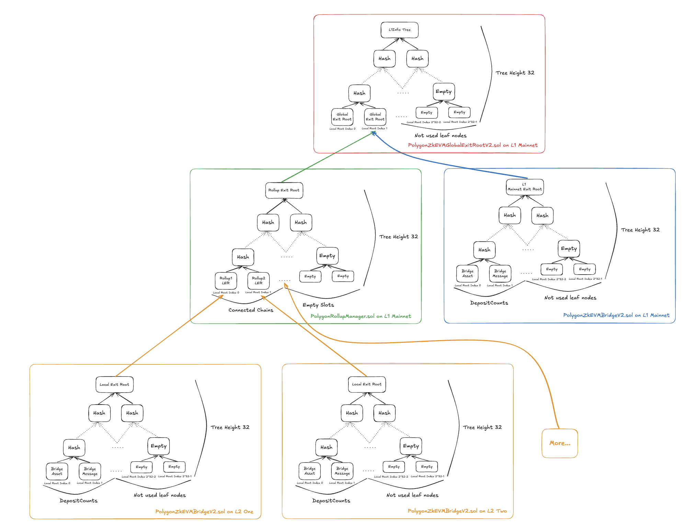

<!-- Page Header Component -->
<h1 style="text-align: left; font-size: 38px; font-weight: 700; font-family: 'Inter Tight', sans-serif;">
  Unified Bridge
</h1>

  

    The core interoperability layer enabling seamless cross-chain communication and asset transfers across Agglayer connected chains
  

## Overview

The Unified Bridge is the core interoperability layer that enables seamless cross-chain communication and asset transfers across Agglayer connected chains. It solves the fragmentation problem by providing a unified interface for L1 to L2, L2 to L1, and L2 to L2 transfers.

**Key Benefits:**

- **Unified Experience**: Single interface across all connected chains
- **Trustless Security**: Cryptographic verification of all transactions
- **Developer Friendly**: Simple APIs and comprehensive tooling

## What You Can Do

- **Transfer Assets**: Bridge tokens and native assets between any connected chains
- **Execute Cross-Chain Calls**: Trigger smart contract functions on destination chains
- **Build Cross-Chain Apps**: Create applications that work seamlessly across multiple chains

## How It Works

The Unified Bridge uses a sophisticated Merkle tree structure to securely track and verify all cross-chain transactions:

**Security Model:**

- All transactions are settled on Ethereum before claiming
- Cryptographic proofs verify every cross-chain operation  
- Immutable transaction data prevents incorrect claims

## Core Concepts

Understand the fundamental architecture and components:

  <!-- Architecture Card -->
  

    <h3 style="color: #0071F7; margin: 0 0 0.5rem 0; font-size: 18px; font-weight: 600;">
      Architecture
    </h3>
    

      Understand the complete system architecture and component interactions.
    

    <a href="/agglayer/core-concepts/unified-bridge/architecture/" style="color: #0071F7; text-decoration: none; font-weight: 500; font-size: 14px;">
      Learn more →
    </a>
  

  <!-- Data Structures Card -->
  

    <h3 style="color: #0071F7; margin: 0 0 0.5rem 0; font-size: 18px; font-weight: 600;">
      Data Structures
    </h3>
    

      Learn about Local Exit Root, Rollup Exit Root, Mainnet Exit Root, and Global Exit Root.
    

    <a href="/agglayer/core-concepts/unified-bridge/data-structures/" style="color: #0071F7; text-decoration: none; font-weight: 500; font-size: 14px;">
      Learn more →
    </a>
  

  <!-- Bridge Components Card -->
  

    <h3 style="color: #0071F7; margin: 0 0 0.5rem 0; font-size: 18px; font-weight: 600;">
      Bridge Components
    </h3>
    

      Understand the smart contracts, services, and tools that power the Unified Bridge.
    

    <a href="/agglayer/core-concepts/unified-bridge/bridge-components/" style="color: #0071F7; text-decoration: none; font-weight: 500; font-size: 14px;">
      Learn more →
    </a>
  

## Bridge Operations

Master the three types of cross-chain operations:

  <!-- Asset Bridging Card -->
  

    <h3 style="color: #0071F7; margin: 0 0 0.5rem 0; font-size: 18px; font-weight: 600;">
      Asset Bridging
    </h3>
    

      Learn how to bridge tokens and native assets between different chains.
    

    <a href="/agglayer/core-concepts/unified-bridge/asset-bridging/" style="color: #0071F7; text-decoration: none; font-weight: 500; font-size: 14px;">
      Learn more →
    </a>
  

  <!-- Message Bridging Card -->
  

    <h3 style="color: #0071F7; margin: 0 0 0.5rem 0; font-size: 18px; font-weight: 600;">
      Message Bridging
    </h3>
    

      Enable cross-chain smart contract communication and execution.
    

    <a href="/agglayer/core-concepts/unified-bridge/message-bridging/" style="color: #0071F7; text-decoration: none; font-weight: 500; font-size: 14px;">
      Learn more →
    </a>
  

  <!-- Bridge-and-Call Card -->
  

    <h3 style="color: #0071F7; margin: 0 0 0.5rem 0; font-size: 18px; font-weight: 600;">
      Bridge-and-Call
    </h3>
    

      Advanced cross-chain functionality combining asset transfers with contract execution.
    

    <a href="/agglayer/core-concepts/unified-bridge/bridge-and-call/" style="color: #0071F7; text-decoration: none; font-weight: 500; font-size: 14px;">
      Learn more →
    </a>
  

