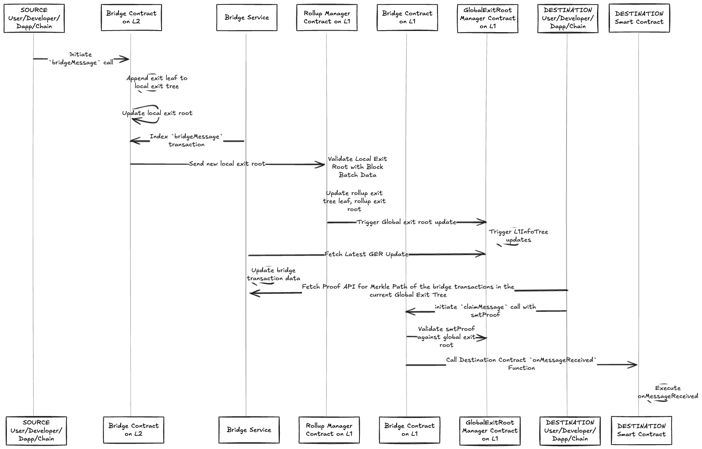

<!-- Page Header Component -->
<h1 style="text-align: left; font-size: 38px; font-weight: 700; font-family: 'Inter Tight', sans-serif;">
  Message Bridging
</h1>

<div style="text-align: left; margin: 0.5rem 0;">
  <p style="font-size: 18px; color: #666; max-width: 600px; margin: 0;">
    Enable cross-chain smart contract communication and execution using the Unified Bridge
  </p>
</div>

## Overview

Message bridging enables smart contracts on different chains to communicate and execute functions across chains. This allows for complex cross-chain applications where contracts can trigger actions on other chains.



*Figure 1: Complete message bridging flow from L2 to L1*

## Key Concepts

### Cross-Chain Execution

Message bridging enables:

- **Contract-to-Contract Communication**: Smart contracts can call functions on other chains
- **Cross-Chain State Updates**: Contracts can update state on destination chains
- **Complex Workflows**: Multi-chain applications with coordinated execution
- **Trustless Communication**: Cryptographic verification of all cross-chain messages

### Message Structure

Cross-chain messages contain:

- **Destination Contract**: Address of the contract to execute on destination chain
- **Function Data**: Encoded function call data
- **Value**: ETH value to send with the message (if any)
- **Gas Limit**: Maximum gas for execution on destination chain
- **Metadata**: Additional data for the message

## Bridge Message Function

The `bridgeMessage` function initiates message transfers between chains.

### Function Signature

```solidity
function bridgeMessage(
    uint32 destinationNetwork,
    address destinationAddress,
    uint256 gasLimit,
    bytes calldata data
) external payable
```

### Parameters

- **`destinationNetwork`**: Network ID of the destination chain
- **`destinationAddress`**: Address of the contract to execute on destination chain
- **`gasLimit`**: Maximum gas for execution on destination chain
- **`data`**: Encoded function call data

### Process Steps

1. **Validation**: Check destination network is not the source network
2. **Value Handling**: Handle ETH value if provided
3. **Event Emission**: Emit `BridgeEvent` with message details
4. **Tree Update**: Add message to Local Exit Tree as leaf node

### Example Usage

```solidity
// Bridge a message to call a function on destination chain
bridgeMessage(
    1, // destinationNetwork (L2)
    0x..., // destinationAddress (contract address)
    100000, // gasLimit
    abi.encodeWithSignature("updateValue(uint256)", 123) // data
);
```

## Claim Message Function

The `claimMessage` function claims and executes bridged messages on the destination chain.

### Function Signature

```solidity
function claimMessage(
    bytes32[_DEPOSIT_CONTRACT_TREE_DEPTH] calldata smtProofLocalExitRoot,
    bytes32[_DEPOSIT_CONTRACT_TREE_DEPTH] calldata smtProofRollupExitRoot,
    uint256 globalIndex,
    bytes32 mainnetExitRoot,
    bytes32 rollupExitRoot,
    uint32 originNetwork,
    address originAddress,
    uint32 destinationNetwork,
    address destinationAddress,
    uint256 gasLimit,
    bytes calldata data
) external
```

### Parameters

- **`smtProofLocalExitRoot`**: Merkle proof for Local Exit Root
- **`smtProofRollupExitRoot`**: Merkle proof for Rollup Exit Root
- **`globalIndex`**: Global index identifying the message
- **`mainnetExitRoot`**: Mainnet Exit Root at time of message
- **`rollupExitRoot`**: Rollup Exit Root at time of message
- **`originNetwork`**: Network ID of source chain
- **`originAddress`**: Address that sent the message
- **`destinationNetwork`**: Network ID of destination chain
- **`destinationAddress`**: Address of the contract to execute
- **`gasLimit`**: Maximum gas for execution
- **`data`**: Encoded function call data

### Process Steps

1. **Validation**: Verify destination network matches current chain
2. **Proof Verification**: Verify Merkle proofs against Global Exit Root
3. **Duplicate Check**: Ensure message hasn't been claimed before
4. **Message Execution**: Execute the message on destination contract
5. **Claim Record**: Mark message as claimed

### Message Execution

```solidity
// Execute the message on destination contract
(bool success, bytes memory returnData) = destinationAddress.call{
    value: msg.value,
    gas: gasLimit
}(data);

require(success, "Message execution failed");
```

**Important Notes:**

- Messages can only be executed if the `destinationAddress` is a smart contract that implements the `IBridgeMessageReceiver` interface
- If the receiving address is an EOA, the call will result as a success, meaning that the amount of ether will be transferred correctly, but the message will not trigger any execution
- If the native gas token is `ETH`, then transfer `ETH` to the `destinationAddress` and execute the message
- If `ETH` is not the native gas token, then mint `WETH` to the `destinationAddress` and execute the message

### IBridgeMessageReceiver Interface

For a contract to receive bridged messages, it must implement the `IBridgeMessageReceiver` interface:

```solidity
interface IBridgeMessageReceiver {
    function onMessageReceived(
        address originAddress,
        uint32 originNetwork,
        bytes calldata data
    ) external payable;
}
```

**Parameters:**

- `originAddress`: Address that sent the message on the source chain
- `originNetwork`: Network ID of the source chain  
- `data`: The message data/metadata sent from source chain

## Bridging Flows

### L1 to L2 Message Bridging


### L2 to L1 Message Bridging


### L2 to L2 Message Bridging


