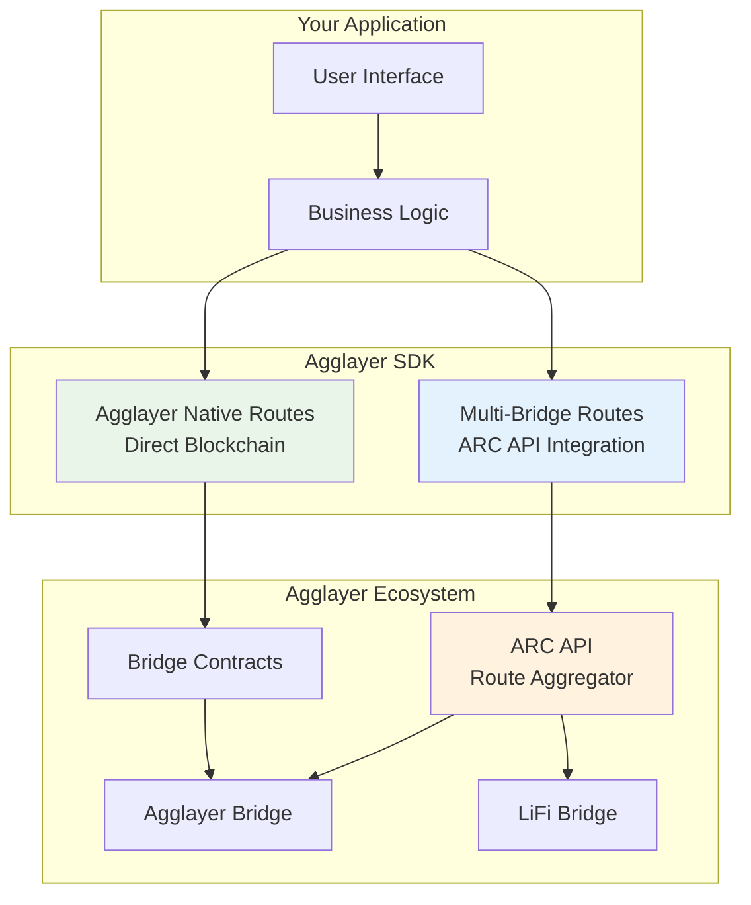

<!-- Page Header Component -->
<h1 style="text-align: left; font-size: 38px; font-weight: 700; font-family: 'Inter Tight', sans-serif;">
  Agglayer SDK
</h1>

<div style="text-align: left; margin: 0.5rem 0;">
  <p style="font-size: 18px; color: #666; max-width: 600px; margin: 0;">
    Modern TypeScript SDK for building cross-chain applications with Agglayer's unified bridge ecosystem
  </p>
</div>

## Overview

The Agglayer SDK is a comprehensive TypeScript library that provides seamless integration with the Agglayer ecosystem. It combines the power of **ARC API route aggregation** with **direct blockchain operations**, enabling developers to build sophisticated cross-chain applications with minimal complexity.

**Key Innovation:**

- **Multi-Bridge Routes**: Access aggregated routes from Agglayer Bridge + LiFi Bridge through ARC API
- **Native Routes**: Direct interaction with Agglayer bridge contracts for maximum control
- **TypeScript-First**: Full type safety with intelligent defaults and zero-config setup
- **Production Ready**: Enterprise-grade error handling and monitoring capabilities

## What You Can Build

With the Agglayer SDK, you can create powerful cross-chain applications that leverage the best of both worlds:

- **Cross-Chain DeFi Platforms**: Build lending protocols, DEXes, and yield farming applications that seamlessly operate across multiple chains with optimal routing
- **Multi-Chain Gaming Ecosystems**: Create games where assets, achievements, and progress flow effortlessly between different blockchain networks
- **Unified Wallet Applications**: Develop wallet interfaces that provide users with the best routes for any cross-chain operation, automatically comparing costs and execution times
- **Enterprise Bridge Solutions**: Build scalable applications that handle high-volume cross-chain operations with comprehensive monitoring and error recovery

## Two Powerful Approaches

The Agglayer SDK provides two complementary modules for different use cases:

<div style="display: flex; flex-direction: column; gap: 1rem; max-width: 800px; margin: 1rem 0;">

  <!-- Multi-Bridge Routes Card -->
  <div style="background: #f8f9fa; border: 1px solid #dee2e6; border-radius: 6px; padding: 1rem 1rem; margin: 0.25rem 0;">
    <h3 style="color: #0071F7; margin: 0 0 0.5rem 0; font-size: 18px; font-weight: 600;">
      Multi-Bridge Routes
    </h3>
    <p style="color: #666; margin-bottom: 0.75rem; line-height: 1.4; font-size: 14px;">
      Route aggregation and optimization using ARC API. Combines Agglayer Bridge + LiFi routes for cross-chain bridging operations.
    </p>
    <div style="margin: 0.5rem 0; font-size: 13px; color: #888;">
      <strong>Best for:</strong> Complex routing, cross-chain bridges, route optimization, UI applications
    </div>
    <div style="margin: 0.5rem 0; font-size: 13px; color: #888;">
      <strong>Testing:</strong> Mainnet only (ARC API dependency)
    </div>
    <a href="/agglayer/developer-tools/agglayer-sdk/multi-bridge-routes/" style="color: #0071F7; text-decoration: none; font-weight: 500; font-size: 14px;">
      Learn more →
    </a>
  </div>

  <!-- Agglayer Native Routes Card -->
  <div style="background: #f8f9fa; border: 1px solid #dee2e6; border-radius: 6px; padding: 1rem 1rem; margin: 0.25rem 0;">
    <h3 style="color: #0071F7; margin: 0 0 0.5rem 0; font-size: 18px; font-weight: 600;">
      Agglayer Native Routes
    </h3>
    <p style="color: #666; margin-bottom: 0.75rem; line-height: 1.4; font-size: 14px;">
      Direct blockchain operations with Agglayer bridge contracts. Full control over ERC20 operations, bridge transactions, and chain management without external APIs.
    </p>
    <div style="margin: 0.5rem 0; font-size: 13px; color: #888;">
      <strong>Best for:</strong> Direct control, custom logic, advanced integrations, protocol development
    </div>
    <div style="margin: 0.5rem 0; font-size: 13px; color: #888;">
      <strong>Testing:</strong> Local (AggSandbox), testnet, and mainnet
    </div>
    <a href="/agglayer/developer-tools/agglayer-sdk/agglayer-native-routes/" style="color: #0071F7; text-decoration: none; font-weight: 500; font-size: 14px;">
      Learn more →
    </a>
  </div>

</div>

## Getting Started

Ready to start building with the Agglayer SDK?

<div style="display: flex; flex-direction: column; gap: 1rem; max-width: 800px; margin: 1rem 0;">

  <!-- Installation Card -->
  <div style="background: #f8f9fa; border: 1px solid #dee2e6; border-radius: 6px; padding: 1rem 1rem; margin: 0.25rem 0;">
    <h3 style="color: #0071F7; margin: 0 0 0.5rem 0; font-size: 18px; font-weight: 600;">
      Installation
    </h3>
    <p style="color: #666; margin-bottom: 0.75rem; line-height: 1.4; font-size: 14px;">
      Install the SDK in your TypeScript or JavaScript project with npm. Includes setup verification and environment configuration.
    </p>
    <a href="/agglayer/developer-tools/agglayer-sdk/installation/" style="color: #0071F7; text-decoration: none; font-weight: 500; font-size: 14px;">
      Get started →
    </a>
  </div>

  <!-- Quickstart Card -->
  <div style="background: #f8f9fa; border: 1px solid #dee2e6; border-radius: 6px; padding: 1rem 1rem; margin: 0.25rem 0;">
    <h3 style="color: #0071F7; margin: 0 0 0.5rem 0; font-size: 18px; font-weight: 600;">
      Quickstart
    </h3>
    <p style="color: #666; margin-bottom: 0.75rem; line-height: 1.4; font-size: 14px;">
      Complete your first cross-chain bridge operation in 10 minutes. Includes a practical example: Base → Katana via route aggregation.
    </p>
    <a href="/agglayer/developer-tools/agglayer-sdk/quickstart/" style="color: #0071F7; text-decoration: none; font-weight: 500; font-size: 14px;">
      Start building →
    </a>
  </div>

</div>

## Development Path

The Agglayer SDK supports a complete development lifecycle:

### **Local Development**
Start with **AggSandbox** for rapid prototyping and testing. The Native Routes module integrates seamlessly with AggSandbox's local blockchain environment, providing instant feedback and comprehensive debugging.

### **Testnet Testing**
Use **Native Routes** on Sepolia and other testnets to validate your integration with real network conditions, gas costs, and timing without risking mainnet funds.

### **Production Deployment**
Deploy with confidence using both **Multi-Bridge Routes** for optimal user experience and **Native Routes** for direct control over bridge operations.

## Why Choose Agglayer SDK?

### **Unified Route Access**
The SDK is the only library that provides access to **ARC API route aggregation**, combining Agglayer Bridge and LiFi routes to give users the best possible cross-chain experience.

### **Developer Experience**
- **Zero Configuration**: Intelligent defaults get you started immediately
- **Full TypeScript Support**: Complete type safety with comprehensive interfaces
- **Modular Architecture**: Use only the components you need
- **Extensive Examples**: Working code examples for every use case

### **Production Ready**
- **Battle Tested**: Built on proven Agglayer infrastructure
- **Comprehensive Error Handling**: Robust error recovery and retry mechanisms
- **Performance Optimized**: Efficient API usage and blockchain interactions
- **Monitoring Ready**: Built-in support for transaction tracking and status monitoring

## Architecture Overview



*The SDK provides two complementary approaches: Multi-Bridge Routes for route aggregation and optimization, and Native Routes for direct blockchain control.*

## Quick Example

Here's how simple it is to discover and execute cross-chain routes:

```typescript
import { AggLayerSDK, SDK_MODES } from '@agglayer/sdk';

// Initialize with zero configuration
const sdk = new AggLayerSDK();

// Multi-Bridge Routes: Find optimal route
const core = sdk.getCore();
const routes = await core.getRoutes({
  fromChainId: 8453, // Base
  toChainId: 747474, // Katana
  fromTokenAddress: '0x833589fCD6eDb6E08f4c7C32D4f71b54bdA02913', // USDC
  toTokenAddress: '0x203a662b0bd271a6ed5a60edfbd04bfce608fd36',
  amount: '1000000000', // 1000 USDC
  fromAddress: '0xYourAddress',
});

// Build executable transaction
const transaction = await core.getUnsignedTransaction(routes[0]);
// Ready to sign and execute!
```

## Reference

<div style="display: flex; flex-direction: column; gap: 1rem; max-width: 800px; margin: 1rem 0;">

  <!-- API Reference Card -->
  <div style="background: #f8f9fa; border: 1px solid #dee2e6; border-radius: 6px; padding: 1rem 1rem; margin: 0.25rem 0;">
    <h3 style="color: #0071F7; margin: 0 0 0.5rem 0; font-size: 18px; font-weight: 600;">
      API Reference
    </h3>
    <p style="color: #666; margin-bottom: 0.75rem; line-height: 1.4; font-size: 14px;">
      Complete TypeScript API documentation with interfaces, methods, and working examples for both Multi-Bridge Routes and Native Routes modules.
    </p>
    <a href="/agglayer/developer-tools/agglayer-sdk/api-reference/" style="color: #0071F7; text-decoration: none; font-weight: 500; font-size: 14px;">
      View reference →
    </a>
  </div>

</div>
