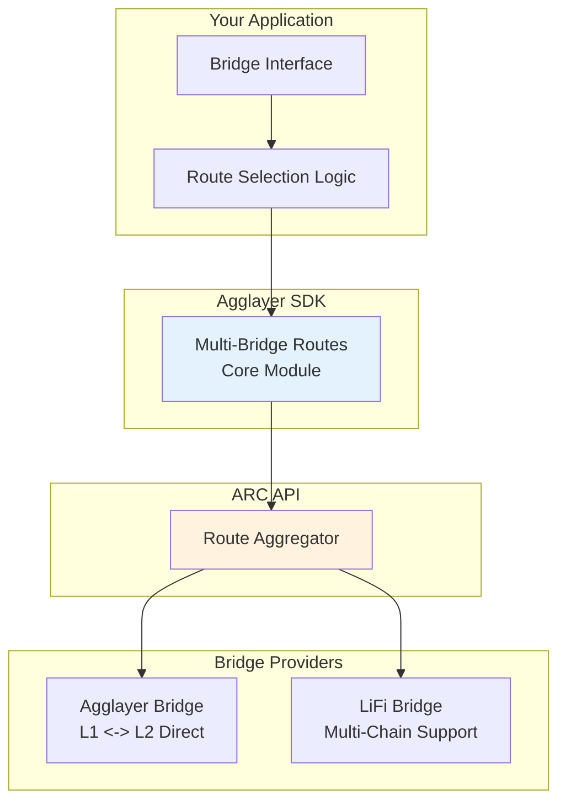

<!-- Page Header Component -->
<h1 style="text-align: left; font-size: 38px; font-weight: 700; font-family: 'Inter Tight', sans-serif;">
  Multi-Bridge Routes
</h1>

<div style="text-align: left; margin: 0.5rem 0;">
  <p style="font-size: 18px; color: #666; max-width: 600px; margin: 0;">
    Route aggregation and optimization using ARC API integration for complex cross-chain scenarios
  </p>
</div>

## Overview

Multi-Bridge Routes is the Agglayer SDK's **Core module** that provides access to **ARC API (Agglayer Route Consolidator)**. This powerful service aggregates routes from multiple bridge providers, enabling complex cross-chain operations that would otherwise require multiple separate integrations.

The ARC API combines routes from Agglayer Bridge and LiFi Bridge into a single interface, automatically finding the most cost-effective and fastest paths while providing risk assessment for each route.

## Core Features

<div style="display: flex; flex-direction: column; gap: 1rem; max-width: 800px; margin: 1rem 0;">

  <!-- Chain Metadata Card -->
  <div style="background: #f8f9fa; border: 1px solid #dee2e6; border-radius: 6px; padding: 1rem 1rem; margin: 0.25rem 0;">
    <h3 style="color: #0071F7; margin: 0 0 0.5rem 0; font-size: 18px; font-weight: 600;">
      Chain & Token Metadata
    </h3>
    <p style="color: #666; margin-bottom: 0.75rem; line-height: 1.4; font-size: 14px;">
      Access comprehensive information about supported chains, tokens, and bridge capabilities. Perfect for building dynamic UIs and token selectors.
    </p>
    <a href="/agglayer/developer-tools/agglayer-sdk/multi-bridge-routes/operations/chain-metadata/" style="color: #0071F7; text-decoration: none; font-weight: 500; font-size: 14px;">
      Learn more →
    </a>
  </div>

  <!-- Route Discovery Card -->
  <div style="background: #f8f9fa; border: 1px solid #dee2e6; border-radius: 6px; padding: 1rem 1rem; margin: 0.25rem 0;">
    <h3 style="color: #0071F7; margin: 0 0 0.5rem 0; font-size: 18px; font-weight: 600;">
      Route Discovery
    </h3>
    <p style="color: #666; margin-bottom: 0.75rem; line-height: 1.4; font-size: 14px;">
      Find optimal cross-chain routes with advanced filtering, optimization preferences, and risk assessment. Supports complex routing scenarios.
    </p>
    <a href="/agglayer/developer-tools/agglayer-sdk/multi-bridge-routes/operations/route-discovery/" style="color: #0071F7; text-decoration: none; font-weight: 500; font-size: 14px;">
      Learn more →
    </a>
  </div>

  <!-- Transaction Building Card -->
  <div style="background: #f8f9fa; border: 1px solid #dee2e6; border-radius: 6px; padding: 1rem 1rem; margin: 0.25rem 0;">
    <h3 style="color: #0071F7; margin: 0 0 0.5rem 0; font-size: 18px; font-weight: 600;">
      Transaction Building
    </h3>
    <p style="color: #666; margin-bottom: 0.75rem; line-height: 1.4; font-size: 14px;">
      Convert discovered routes into executable transactions with proper call data, gas estimates, and approval requirements.
    </p>
    <a href="/agglayer/developer-tools/agglayer-sdk/multi-bridge-routes/operations/transaction-building/" style="color: #0071F7; text-decoration: none; font-weight: 500; font-size: 14px;">
      Learn more →
    </a>
  </div>

  <!-- Transaction History Card -->
  <div style="background: #f8f9fa; border: 1px solid #dee2e6; border-radius: 6px; padding: 1rem 1rem; margin: 0.25rem 0;">
    <h3 style="color: #0071F7; margin: 0 0 0.5rem 0; font-size: 18px; font-weight: 600;">
      Transaction History
    </h3>
    <p style="color: #666; margin-bottom: 0.75rem; line-height: 1.4; font-size: 14px;">
      Track and monitor cross-chain transactions across all bridge providers. Essential for building user dashboards and transaction status interfaces.
    </p>
    <a href="/agglayer/developer-tools/agglayer-sdk/multi-bridge-routes/operations/transaction-history/" style="color: #0071F7; text-decoration: none; font-weight: 500; font-size: 14px;">
      Learn more →
    </a>
  </div>

  <!-- Step-by-Step Guide Card -->
  <div style="background: #f8f9fa; border: 1px solid #dee2e6; border-radius: 6px; padding: 1rem 1rem; margin: 0.25rem 0;">
    <h3 style="color: #0071F7; margin: 0 0 0.5rem 0; font-size: 18px; font-weight: 600;">
      Production Implementation Guide
    </h3>
    <p style="color: #666; margin-bottom: 0.75rem; line-height: 1.4; font-size: 14px;">
      Complete production implementation with service architecture, error handling, monitoring, and real-time transaction tracking for mainnet deployment.
    </p>
    <a href="/agglayer/developer-tools/agglayer-sdk/multi-bridge-routes/step-by-step-guide/multi-bridge-routing-mainnet/" style="color: #0071F7; text-decoration: none; font-weight: 500; font-size: 14px;">
      Learn more →
    </a>
  </div>

</div>

## What Multi-Bridge Routes Enables

Instead of integrating with multiple bridge APIs separately, Multi-Bridge Routes gives you access to all possibilities through a single interface:



## When to Use Multi-Bridge Routes

Use Multi-Bridge Routes when you need route optimization across multiple bridge providers, cross-chain bridging from non-Agglayer chains, or want to build user-friendly interfaces with automatic route comparison. It's perfect for handling complex bridge scenarios automatically with production-ready routing and comprehensive metadata.

## Quick Example

Here's how simple it is to discover and execute cross-chain routes:

```typescript
import { AggLayerSDK } from '@agglayer/sdk';

// Initialize SDK
const sdk = new AggLayerSDK();
const core = sdk.getCore();

// Discover routes from Base to Katana
const routes = await core.getRoutes({
  fromChainId: 8453,     // Base
  toChainId: 747474,     // Katana
  fromTokenAddress: '0x833589fCD6eDb6E08f4c7C32D4f71b54bdA02913', // USDC on Base
  toTokenAddress: '0x203a662b0bd271a6ed5a60edfbd04bfce608fd36',   // USDC on Katana
  amount: '1000000000',  // 1000 USDC
  fromAddress: '0xYourAddress',
  slippage: 0.5,
});

// Get best route and build transaction
const bestRoute = routes[0];
const transaction = await core.getUnsignedTransaction(bestRoute);

// Transaction ready for signing and execution
console.log('Bridge transaction built:', transaction.to);
```
