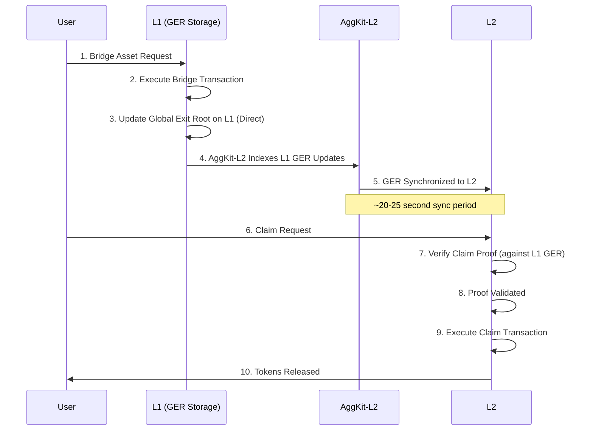
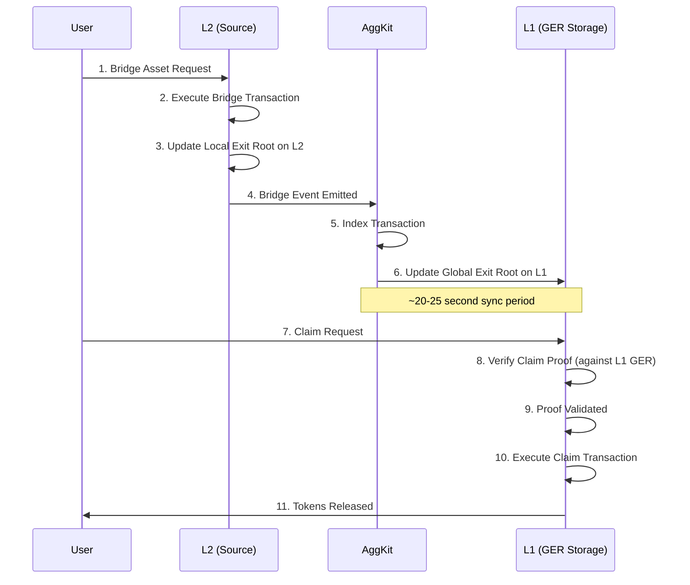
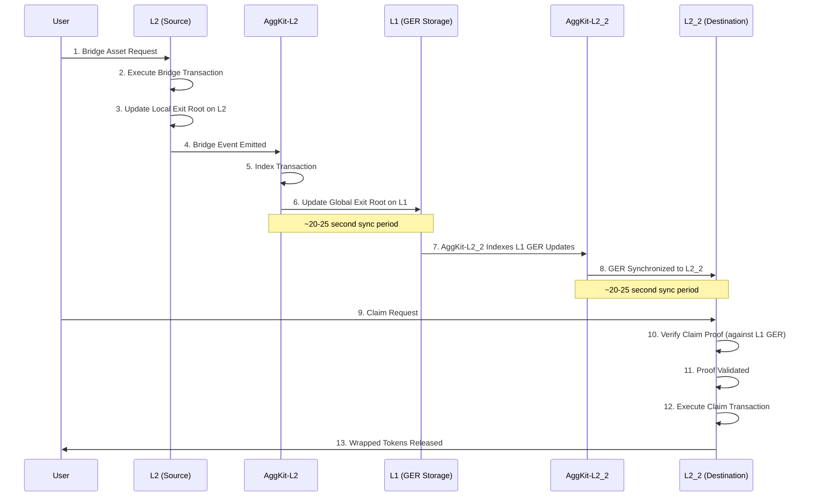

# Architecture Overview

## System Architecture

AggSandbox provides a complete local testing environment with multiple blockchain networks and bridge services, enabling developers to test and validate cross-chain operations in a controlled environment.

## Core Components

### **Network Layer**

| Network | Purpose | Technology | Port | Chain ID | Role |
|---------|---------|------------|------|----------|------|
| **L1 - Ethereum Mainnet Simulation** | Settlement layer and source of truth for cross-chain operations | Anvil (local Ethereum node) | 8545 | 1 | Primary coordination hub for bridge operations |
| **L2 - Polygon CDK** | Fast, low-cost L2 testing environment | Anvil configured for CDK simulation | 8546 | 1101 | Primary L2 for L1↔L2 bridge testing |
| **L3 - Additional Chain** | Third network for multi-chain and L2↔L2 testing | Anvil additional chain simulation | 8547 | 137 | Enables L2↔L2 bridging scenarios |

### **Bridge Services**

The bridge infrastructure uses separate AggKit services for each L1<->L2 bridge pair, enabling independent operation and scaling.

| Service | Purpose | Role | Ports | Networks | Database |
|---------|---------|------|-------|----------|----------|
| **AggKit-L2 Service** | L2↔L1 bridge coordination | Monitors L1 GER updates, syncs to L2 | 5577 (API), 8555 (RPC), 8080 (Telemetry) | L1 (1) ↔ L2 (1101) | `/app/data/aggkit_l2.db` |
| **AggKit-L3 Service** *(Multi-L2 mode)* | L3↔L1 bridge coordination | Monitors L1 GER updates, syncs to L3 | 5578 (API), 8556 (RPC), 8081 (Telemetry) | L1 (1) ↔ L3 (137) | `/app/data/aggkit_l3.db` |

## Bridge Operation Flow

### **L1 → L2 Bridge Flow**

### **L2 → L1 Bridge Flow**

### **L2 → L2 Bridge Flow**

## Performance Characteristics

### **Timing Expectations**

| Operation | Network Combination | Typical Time |
|-----------|-------------------|--------------|
| Bridge Transaction | Any → Any | ~5 seconds |
| AggKit Sync | L1 <-> L2 | ~30 seconds |
| AggKit Sync | L2 <-> L2 | ~60 seconds |L3
| Claim Transaction | Any | ~10 seconds |
| Full Bridge Flow | L1 <-> L2 | ~45 seconds |
| Full Bridge Flow | L2 <-> L2 | ~1 minute |

### **Scalability**

- **Concurrent Operations**: The architecture supports multiple bridge operations processing simultaneously across different networks without blocking or interference, enabling realistic load testing scenarios
- **Batch Processing**: AggKit services efficiently process multiple bridge operations in batches, optimizing performance and reducing the overhead of individual transaction processing
- **Network Isolation**: Each network (L1, L2, L3) operates independently with its own state, contracts, and processing, ensuring that issues in one network don't affect others
- **Resource Management**: Uses Docker-based containerization for efficient resource allocation, service isolation, and easy scaling of individual components based on testing needs

### **Configuration**

- **Accounts**: Provides 10 pre-funded test accounts with known private keys, enabling immediate testing without the need to acquire test tokens or manage wallet funding
- **Contracts**: All necessary bridge contracts, token contracts, and supporting infrastructure are pre-deployed and configured, eliminating complex setup requirements
- **Networks**: Each network is properly configured with realistic chain IDs, correct bridge contract addresses, and proper RPC endpoints that mirror production environments
- **Services**: Includes comprehensive health checks for all components and automatic dependency management to ensure services start in the correct order and remain operational

## Comparison with Production

### **Sandbox vs Production**

| Aspect | AggSandbox | Production Agglayer |
|--------|------------|-------------------|
| **Finality** | Instant (for testing) | Real network finality |
| **Timing** | Accelerated | Production timing |
| **Security** | Simulated | Full cryptographic security |
| **Scale** | Limited accounts | Unlimited accounts |
| **Cost** | Free | Real gas costs |
| **Reset** | Easy reset | Permanent state |

### **What Transfers to Production**

- **Bridge Logic**: Uses exactly the same smart contract code and business logic as production Agglayer, ensuring that testing results accurately predict production behavior
- **API Patterns**: Maintains identical CLI commands, response formats, and interaction patterns as production systems, enabling seamless transition from testing to production deployment
- **Proof System**: Implements the same cryptographic proof requirements, validation logic, and security constraints as production, providing realistic security testing
- **Error Handling**: Reproduces the same error conditions, error messages, and recovery mechanisms as production systems, enabling comprehensive error scenario testing
