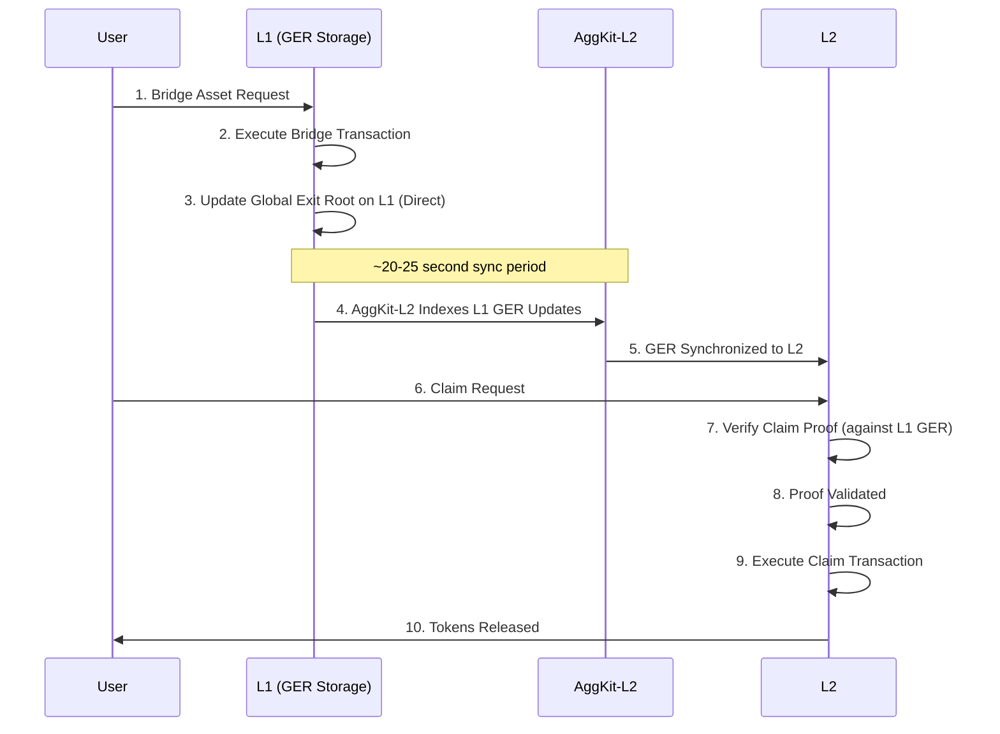
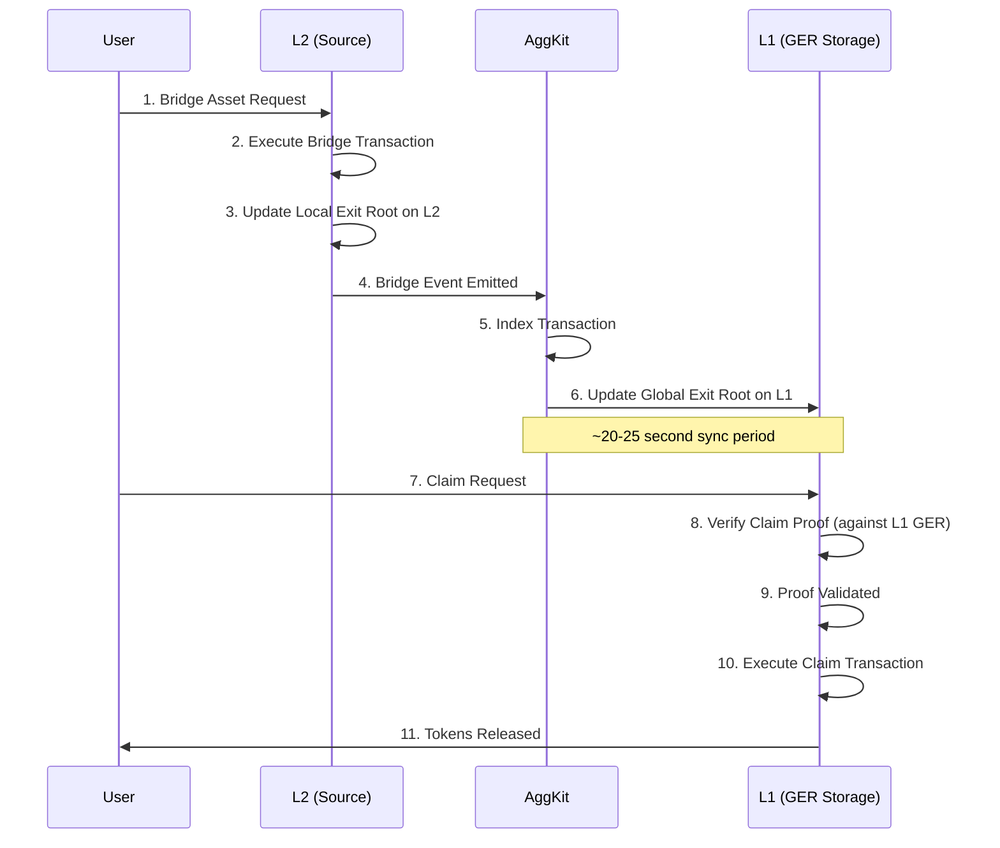
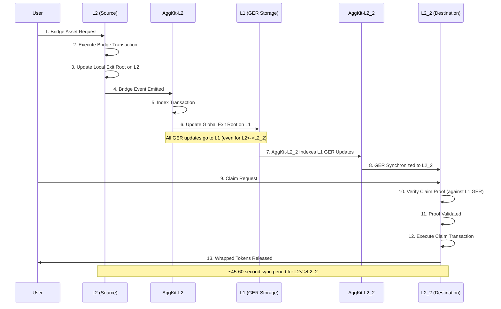

# Architecture Overview

## System Architecture

AggSandbox provides a complete local testing environment with multiple blockchain networks and bridge services, enabling developers to test and validate cross-chain operations in a controlled environment.

## Core Components

### **Network Layer**

| Network | Purpose | Technology | Port | Chain ID | Role |
|---------|---------|------------|------|----------|------|
| **L1 - Ethereum Mainnet Simulation** | Acts as the source of truth for cross-chain operations by maintaining the Global Exit Root and serving as the final settlement layer for all bridge transactions across the network | Anvil (local Ethereum node) that simulates a complete Ethereum environment with all the necessary smart contracts and state management capabilities | 8545 - the standard Ethereum RPC port that applications can connect to for interacting with the L1 network | 1 - matches mainnet Ethereum's chain ID to ensure compatibility with existing tools and wallets | Serves as the primary coordination hub for all bridge operations, providing finality guarantees and maintaining the authoritative record of cross-chain state changes |
| **L2 - Polygon CDK** | Represents a Polygon CDK-compatible Layer 2 network that enables developers to test cross-chain operations in a realistic L2 environment with fast transactions and low costs | Anvil configured to simulate CDK behavior, providing the same contract execution environment and bridge interfaces as production Polygon CDK | 8546 - dedicated port for L2 RPC connections, allowing applications to interact with the L2 network independently from L1 | 1101 - matches Polygon CDK mainnet's chain ID for tool compatibility and realistic testing scenarios | Functions as the primary L2 testing environment for L1↔L2 bridge operations, enabling developers to test token transfers, message passing, and complex cross-chain workflows |
| **L3 - Additional Chain** | Provides a third network for testing advanced multi-chain scenarios, particularly L2↔L2 bridging operations that require coordination through L1 settlement | Anvil configured as an additional chain simulation that maintains its own state while participating in the unified bridge ecosystem | 8547 - separate port for the third network, enabling complex multi-network testing scenarios with distinct RPC endpoints | 137 - uses Polygon mainnet's chain ID to provide another realistic testing environment with different characteristics | Enables testing of L2↔L2 bridging scenarios where assets move between two L2 networks via L1 coordination, essential for understanding complex cross-chain workflows |

### **Bridge Services**

The bridge infrastructure uses separate AggKit services for each L1<->L2 bridge pair, enabling independent operation and scaling.

| Service | Purpose | Role | Ports | Networks | Database |
|---------|---------|------|-------|----------|----------|
| **AggKit-L2 Service** | Manages all communication and coordination between L2 and L1 networks, ensuring that bridge operations are properly synchronized and that cross-chain state remains consistent | Continuously monitors L1 for Global Exit Root updates and synchronizes them to L2, while also processing bridge events from L2 to L1 and updating the global state accordingly | 5577 (REST API for bridge queries), 8555 (RPC for direct chain interaction), 8080 (Telemetry for monitoring service health and performance metrics) | Specifically handles the bridge connection between L1 (Chain ID 1) and L2 (Chain ID 1101), maintaining separate state tracking for this network pair | Stores bridge transaction history, claim status, and synchronization state in `/app/data/aggkit_l2.db` for persistent operation across restarts |
| **AggKit-L3 Service** *(Multi-L2 mode only)* | Handles communication and bridge coordination between the L3 additional chain and L1, enabling multi-L2 testing scenarios where multiple L2s can interact through L1 | Monitors L1 for Global Exit Root updates and propagates them to L3, while processing bridge events from L3 to L1 and coordinating with other AggKit services for L2↔L2 operations | 5578 (REST API for L3 bridge queries), 8556 (RPC for L3 chain interaction), 8081 (Telemetry for L3 service monitoring and performance tracking) | Manages the bridge relationship between L1 (Chain ID 1) and L3 (Chain ID 137), maintaining independent state tracking from the L2 service | Maintains L3-specific bridge data, transaction history, and synchronization state in `/app/data/aggkit_l3.db` separate from other network data |

## Bridge Operation Flow

### **L1 → L2 Bridge Flow**

### **L2 → L1 Bridge Flow**

### **L2 → L2 Bridge Flow**

## Key Concepts

### **Pessimistic Proof System**

The Agglayer uses a **pessimistic proof approach** for cross-chain security:

- **Assumption**: Takes a security-first approach by treating all cross-chain operations as potentially invalid until they are mathematically proven to be correct through cryptographic verification
- **Validation**: Uses advanced cryptographic proofs to validate each cross-chain state transition, ensuring that every bridge operation is backed by legitimate transactions and proper authorization
- **Security**: Implements multiple layers of protection to prevent invalid state transitions, double-spending attacks, and other malicious activities that could compromise the bridge ecosystem
- **Finality**: Ensures that bridge operations achieve true finality only after complete proof validation, preventing rollbacks and providing strong guarantees for cross-chain transactions

### **Global Exit Root (GER)**

The GER is a **Merkle tree root** that coordinates state across all networks:

- **Storage**: The Global Exit Root is always stored on L1 as the authoritative record, regardless of whether bridge operations originate from L1↔L2, L2↔L1, or L2↔L2 transactions
- **L1 Communication**: Even direct L2↔L2 bridge operations must communicate with L1 to update the Global Exit Root, ensuring that all cross-chain state changes flow through the secure L1 settlement layer
- **Synchronization**: The process follows a strict sequence where the root is first updated on L1, then AggKit services monitor these updates and synchronize them to the appropriate destination L2 networks for claim processing
- **Verification**: All asset and message claims must provide valid Merkle proofs that demonstrate inclusion in the L1-stored Global Exit Root, creating cryptographic certainty about transaction legitimacy
- **Security**: L1 acts as the ultimate source of truth for all cross-chain state, leveraging Ethereum's security guarantees to protect the entire bridge ecosystem from manipulation or fraud

### **Bridge Types**

#### **Asset Bridges**

- **Function**: Enable seamless token transfers between different blockchain networks while maintaining 1:1 backing and preserving token value across chains
- **Input**: Requires specification of the source token contract address, transfer amount in token units, and destination network/address for receiving the bridged assets
- **Output**: Creates wrapped or native representations of tokens on the destination network, with automatic token mapping and proper metadata preservation
- **Use Case**: Essential for DeFi liquidity movement, cross-chain portfolio management, arbitrage opportunities, and enabling unified token experiences across multiple networks

#### **Message Bridges**

- **Function**: Enable smart contracts on one network to trigger function calls and state changes on contracts deployed on different networks, creating true cross-chain interoperability
- **Input**: Requires target contract address on destination network, encoded function call data with parameters, and optional ETH value for payable functions
- **Output**: Executes the specified function call on the destination network's target contract, with proper gas handling and execution guarantees
- **Use Case**: Powers cross-chain governance systems, multi-chain protocol interactions, synchronized state updates, and complex DeFi operations that span multiple networks

#### **Bridge-and-Call**

- **Function**: Combines asset bridging with contract execution in a single atomic operation, ensuring that both the token transfer and function call succeed together or fail together
- **Input**: Requires both token transfer parameters (amount, token address) and contract call parameters (target contract, function data), creating a comprehensive cross-chain transaction
- **Output**: Simultaneously transfers tokens to the destination network and executes a contract function using those tokens, with atomic success/failure guarantees
- **Use Case**: Enables sophisticated DeFi integrations like cross-chain lending, automated market making, yield farming strategies, and complex multi-step financial operations that require both asset movement and contract interaction

## Performance Characteristics

### **Timing Expectations**

| Operation | Network Combination | Typical Time |
|-----------|-------------------|--------------|
| Bridge Transaction | Any → Any | ~5 seconds |
| AggKit Sync | L1 <-> L2 | ~30 seconds |
| AggKit Sync | L2 <-> L2 | ~60 seconds |L3
| Claim Transaction | Any | ~10 seconds |
| Full Bridge Flow | L1 <-> L2 | ~45 seconds |
| Full Bridge Flow | L2 <-> L2 | ~1 minute |

### **Scalability**

- **Concurrent Operations**: The architecture supports multiple bridge operations processing simultaneously across different networks without blocking or interference, enabling realistic load testing scenarios
- **Batch Processing**: AggKit services efficiently process multiple bridge operations in batches, optimizing performance and reducing the overhead of individual transaction processing
- **Network Isolation**: Each network (L1, L2, L3) operates independently with its own state, contracts, and processing, ensuring that issues in one network don't affect others
- **Resource Management**: Uses Docker-based containerization for efficient resource allocation, service isolation, and easy scaling of individual components based on testing needs

### **Configuration**

- **Accounts**: Provides 10 pre-funded test accounts with known private keys, enabling immediate testing without the need to acquire test tokens or manage wallet funding
- **Contracts**: All necessary bridge contracts, token contracts, and supporting infrastructure are pre-deployed and configured, eliminating complex setup requirements
- **Networks**: Each network is properly configured with realistic chain IDs, correct bridge contract addresses, and proper RPC endpoints that mirror production environments
- **Services**: Includes comprehensive health checks for all components and automatic dependency management to ensure services start in the correct order and remain operational

## Comparison with Production

### **Sandbox vs Production**

| Aspect | AggSandbox | Production Agglayer |
|--------|------------|-------------------|
| **Finality** | Instant (for testing) | Real network finality |
| **Timing** | Accelerated | Production timing |
| **Security** | Simulated | Full cryptographic security |
| **Scale** | Limited accounts | Unlimited accounts |
| **Cost** | Free | Real gas costs |
| **Reset** | Easy reset | Permanent state |

### **What Transfers to Production**

- **Bridge Logic**: Uses exactly the same smart contract code and business logic as production Agglayer, ensuring that testing results accurately predict production behavior
- **API Patterns**: Maintains identical CLI commands, response formats, and interaction patterns as production systems, enabling seamless transition from testing to production deployment
- **Proof System**: Implements the same cryptographic proof requirements, validation logic, and security constraints as production, providing realistic security testing
- **Error Handling**: Reproduces the same error conditions, error messages, and recovery mechanisms as production systems, enabling comprehensive error scenario testing
