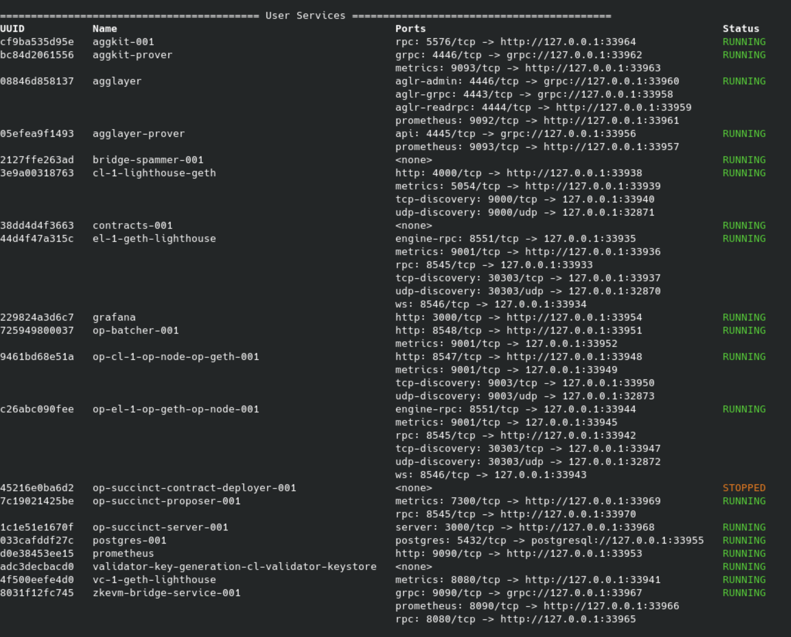
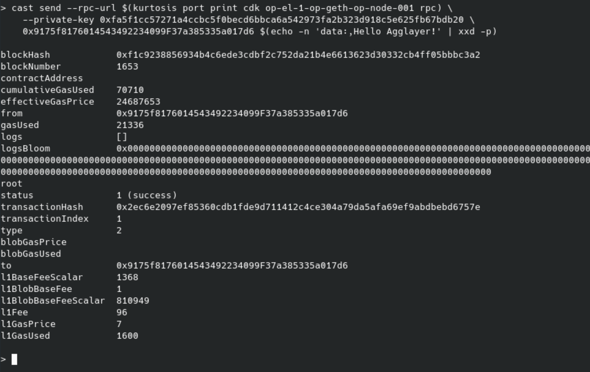

# Quickstart: Run CDK-opgeth locally with Kurtosis

Use this guide to deploy a local testnet instance of cdk-opgeth using Kurtosis. This includes a local L1 + L2 environment with Agglayer components and OP Stack infrastructure.

---

## 1. Install Kurtosis

Follow installation instructions from the official docs:
👉 [https://docs.kurtosis.com/install](https://docs.kurtosis.com/install)

---

## 2. Launch the cdk-opgeth Stack

Use the command below to run the Kurtosis package:

```bash
kurtosis run \
  --enclave cdk \
  --args-file https://raw.githubusercontent.com/0xPolygon/kurtosis-cdk/refs/tags/v0.4.0/.github/tests/chains/op-succinct.yml \
  github.com/0xPolygon/kurtosis-cdk@v0.4.0
```

This will:

* Start an L1 devnet (Ethereum-like chain)
* Deploy Agglayer common contracts
* Deploy op-geth, op-node, and op-batcher
* Deploy Aggkit and op-succinct infrastructure



---

## 3. Bridge Funds from L1 to L2

Use `polycli` to bridge assets from L1 to L2:

```bash
polycli ulxly bridge asset \
  --bridge-address $(kurtosis service exec cdk contracts-001 'jq -r '.polygonZkEVMBridgeAddress' /opt/zkevm/combined.json') \
  --private-key 0x12d7de8621a77640c9241b2595ba78ce443d05e94090365ab3bb5e19df82c625 \
  --destination-address 0x9175f8176014543492234099F37a385335a017d6 \
  --destination-network 1 \
  --value 1000000000000000000 \
  --rpc-url http://$(kurtosis port print cdk el-1-geth-lighthouse rpc)
```

📸 `cdk-opgeth-quickstart-2.png`


---

### Let’s break down this command:

* `polycli ulxly bridge asset`: Initiates the bridge
* `--bridge-address`: Reads from `combined.json`
* `--private-key`: Specifies sender wallet
* `--destination-address`: L2 recipient
* `--destination-network`: Target network ID (1 for devnet)
* `--value`: Amount to bridge in wei
* `--rpc-url`: Dynamically resolved RPC from Kurtosis

If successful, you'll see a transaction confirmation.

📸 `cdk-opgeth-quickstart-3.png`

---

## 4. Check Balance on L2

```bash
cast balance --ether \
  --rpc-url $(kurtosis port print cdk op-el-1-op-geth-op-node-001 rpc) \
  0x9175f8176014543492234099F37a385335a017d6
```

📸 `cdk-opgeth-quickstart-4.png`

---

## 5. Send a Transaction on L2 (Inscription)

```bash
cast send \
  --rpc-url $(kurtosis port print cdk op-el-1-op-geth-op-node-001 rpc) \
  --private-key 0xfa5f1cc57271a4ccbc5f0becd6bbca6a542973fa2b323d918c5e625fb67bdb20 \
  0x9175f8176014543492234099F37a385335a017d6 \
  $(echo -n 'data:,Hello Agglayer!' | xxd -p)
```

This command sends a transaction with `Hello Agglayer!` embedded in the calldata.

📸 `cdk-opgeth-quickstart-5.png`

---

## 6. View the Inscription

```bash
cast tx \
  --rpc-url $(kurtosis port print cdk op-el-1-op-geth-op-node-001 rpc) \
  0x2ec6e2097ef85360cdb1fde9d711412c4ce304a79da5afa69ef9abdbebd6757e input | \
  xxd -r -p
```

Expected output:

```bash
data:,Hello Agglayer!
```