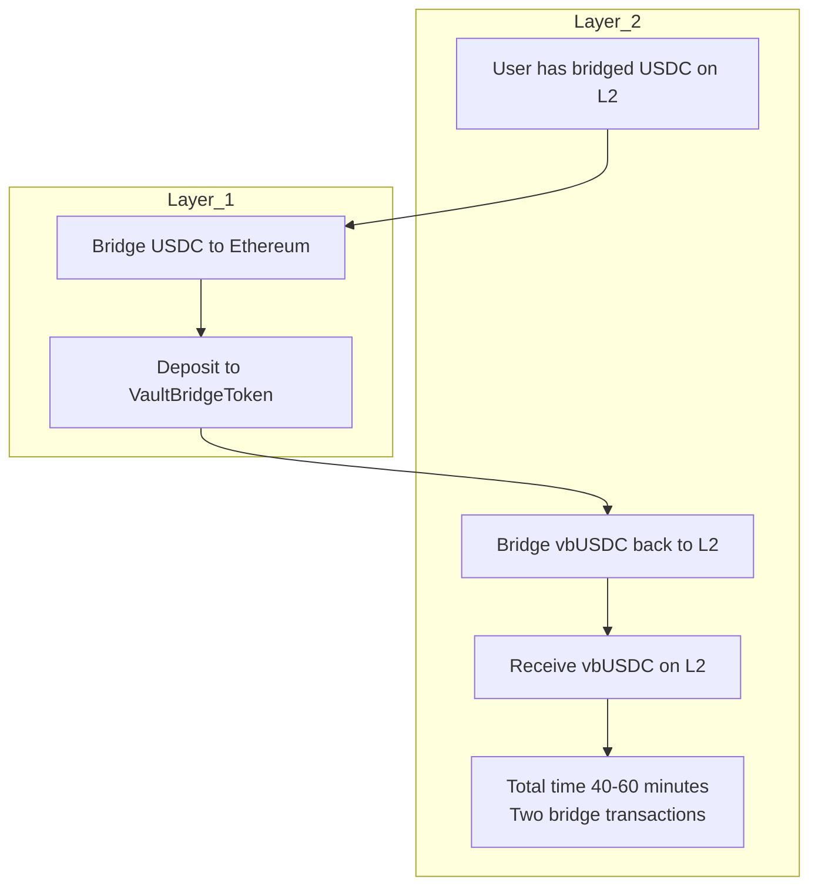
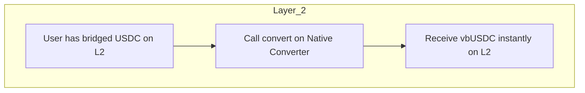
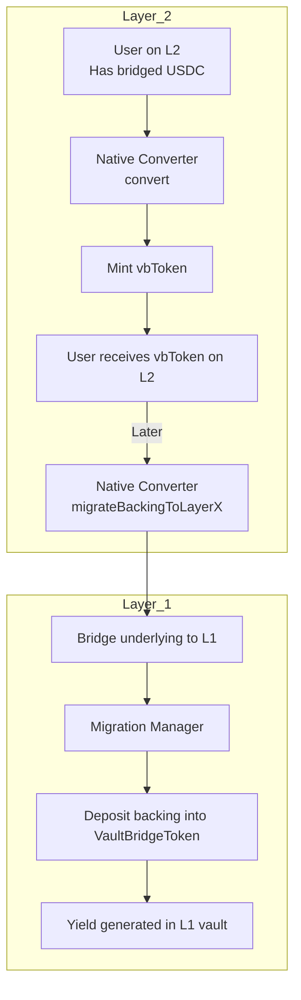

<!-- Page Header Component -->
<h1 style="text-align: left; font-size: 38px; font-weight: 700; font-family: 'Inter Tight', sans-serif;">
  Native Converter Integration
</h1>

<div style="text-align: left; margin: 0.5rem 0;">
  <p style="font-size: 18px; color: #666; max-width: 600px; margin: 0;">
    Enable local vbToken conversion on L2 without bridging to Ethereum
  </p>
</div>

## Overview

The Native Converter is an optional Layer&nbsp;Y component that upgrades the user experience. Instead of bridging back to Ethereum every time they want to access yield, users can swap local bridged assets (such as bridged USDC) directly into vbTokens, or deconvert back to the local asset when they need liquidity. The diagrams below illustrate the difference between operating with and without a converter.

**Without Native Converter:**



**With Native Converter:**



## How Native Converter Works

### Core Concept

At its core, the converter keeps a backing pool of the bridged underlying token on Layer&nbsp;Y. When users convert, the contract mints Custom Tokens (or bridged vbTokens) 1:1 against that pool. Periodically, operators call `migrateBackingToLayerX()`, which bridges the accumulated backing to Ethereum, hands it to the MigrationManager, and deposits it into the VaultBridgeToken so the assets continue earning yield. The process is summarized below.



### Components

The Layer&nbsp;Y `NativeConverter` contract owns the conversion logic, while the Layer&nbsp;X `MigrationManager` finalizes migrations and updates vbToken supply. Together they keep local liquidity aligned with the vault’s collateral on Ethereum.

## Using Native Converter

### Convert & Deconvert

```solidity
// SPDX-License-Identifier: MIT
pragma solidity ^0.8.20;

import "@openzeppelin/contracts/token/ERC20/IERC20.sol";

interface INativeConverter {
    function convert(uint256 assets, address receiver) external returns (uint256 shares);
    function deconvert(uint256 shares, address receiver) external returns (uint256 assets);
    function maxDeconvert(address owner) external view returns (uint256);
}

/// @title VbTokenVault
/// @notice Simple vault that uses Native Converter for yield access
contract VbTokenVault {
    IERC20 public immutable underlyingToken;
    IERC20 public immutable vbToken;
    INativeConverter public immutable nativeConverter;
    
    mapping(address => uint256) public userShares;
    uint256 public totalShares;
    
    event Deposited(address indexed user, uint256 underlyingAmount, uint256 shares);
    event Withdrawn(address indexed user, uint256 shares, uint256 underlyingAmount);
    
    constructor(
        address _underlyingToken,
        address _vbToken,
        address _nativeConverter
    ) {
        underlyingToken = IERC20(_underlyingToken);
        vbToken = IERC20(_vbToken);
        nativeConverter = INativeConverter(_nativeConverter);
    }
    
    /// @notice Deposit underlying and convert to vbToken
    function deposit(uint256 amount) external {
        // Take underlying from user
        underlyingToken.transferFrom(msg.sender, address(this), amount);
        
        // Convert to vbToken via Native Converter
        underlyingToken.approve(address(nativeConverter), amount);
        uint256 shares = nativeConverter.convert(amount, address(this));
        
        // Track user's share
        userShares[msg.sender] += shares;
        totalShares += shares;
        
        emit Deposited(msg.sender, amount, shares);
    }
    
    /// @notice Withdraw by deconverting vbToken back to underlying
    function withdraw(uint256 shares) external {
        require(userShares[msg.sender] >= shares, "Insufficient balance");
        
        // Check if deconversion is possible
        uint256 maxDeconvertable = nativeConverter.maxDeconvert(address(this));
        require(shares <= maxDeconvertable, "Insufficient backing on L2");
        
        // Approve and deconvert
        vbToken.approve(address(nativeConverter), shares);
        uint256 assets = nativeConverter.deconvert(shares, msg.sender);
        
        // Update tracking
        userShares[msg.sender] -= shares;
        totalShares -= shares;
        
        emit Withdrawn(msg.sender, shares, assets);
    }
    
    /// @notice Check user's vbToken balance
    function balanceOf(address user) external view returns (uint256) {
        return userShares[user];
    }
}
```

