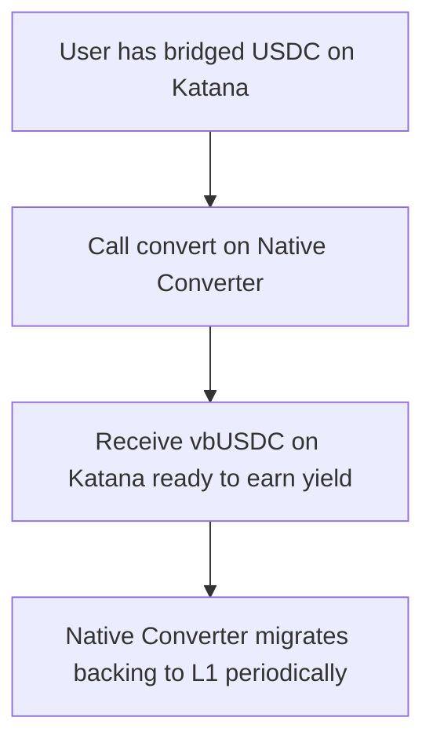

<!-- Page Header Component -->
<h1 style="text-align: left; font-size: 38px; font-weight: 700; font-family: 'Inter Tight', sans-serif;">
  Vault Bridge Tokens
</h1>

  

    Understand how vbTokens behave across Ethereum and Layer 2 chains
  

## Overview

Vault Bridge Tokens (vbTokens) are yield-bearing ERC-20 tokens that can be bridged between Ethereum (Layer 1) and connected Layer 2 chains. This guide explains the core concepts and mechanics of vbToken bridging.

## What Are vbTokens?

vbTokens are Vault Bridge’s native representation of deposit positions. Each token wraps the underlying asset in an ERC‑4626 vault, inherits standard ERC‑20 semantics, and understands how to bridge across the Agglayer. Today the family includes vbETH, vbUSDC, vbUSDT, vbWBTC, and vbUSDS; every instance is minted 1:1 against collateral held on Ethereum, accrues yield from curated strategies, and redeems back to the base asset on demand.

## How vbToken Bridging Works

### Layer 1 (Ethereum)

On Ethereum, vbTokens are native ERC‑20s owned by their VaultBridgeToken contracts. Every share corresponds to one unit of the underlying (for example, 1 vbUSDC equals 1 USDC). When users deposit, the contract mints new vbTokens and routes the collateral into approved yield vaults such as Morpho or Yearn. Holders can redeem at any time: withdrawals first draw from an internal reserve and then unwind positions in the yield vault if necessary. Because the contract tracks the Agglayer network ID, any minted vbToken can be bridged directly to Layer&nbsp;Y.

### Layer 2 (Katana, etc.)

On Layer&nbsp;Y networks, vbTokens arrive as bridged assets. Depending on how a chain integrates, users either receive the standard bridge-wrapped vbToken or a Custom Token that mirrors local conventions (decimals, naming, upgradeability) while staying mapped 1:1 to the mainnet supply. Both variants represent the same claim on Ethereum collateral; the difference is purely in UX and extensibility.

## Bridging Directions

The bridging process differs depending on direction:

### L1 → L2 (Ethereum to Layer 2)

Moving value from Ethereum to Layer&nbsp;Y is a single `depositAndBridge()` call. After approving the underlying, the user invokes the method with a destination network ID. The contract acquires the collateral, mints vbTokens one-for-one, and immediately passes those shares to the Agglayer bridge. Roughly 20–30 minutes later, the destination bridge releases the bridged vbToken (or mapped Custom Token) to the specified receiver.

### L2 → L1 (Layer 2 to Ethereum)

Returning value to Ethereum involves a short wait and a proof. Users begin by calling `bridgeAsset()` on Layer&nbsp;Y to send vbTokens back. Once the bridge finalizes the transfer (again, roughly 20–30 minutes), they fetch an inclusion proof from the Bridge Service API and submit it alongside a `claimAndRedeem()` call on Ethereum. The vbToken is claimed, burned, and the underlying asset is released. Some integrators prefer to split the process—first claiming the vbToken with `claimAsset()`, then redeeming in a second transaction—but the summed flow is the same.

## Key Differences Between Directions

| Aspect | L1 → L2 | L2 → L1 |
|--------|---------|---------|
| **Complexity** | Simple (1 transaction) | Complex (multi-step + proofs) |
| **Special Function** | `depositAndBridge()` | `claimAndRedeem()` or `claimAsset()` + `redeem()` |
| **Proof Required** | No | Yes (from Bridge Service API) |
| **Developer Effort** | Minimal | Requires API integration |
| **User Experience** | Seamless | Needs proof fetching automation |

## Understanding the Agglayer Unified Bridge

vbToken bridging leverages the [Agglayer Unified Bridge](../../agglayer/core-concepts/unified-bridge/index.md), a trustless cross-chain bridge secured by cryptographic proofs. 

**How it works:**

1. **Local Exit Tree**: Each chain maintains a Merkle tree of outgoing bridge transactions
2. **Global Exit Root**: The Agglayer aggregates all chain exit trees into a global root
3. **Cryptographic Proofs**: Claims on destination chains require Merkle proofs of inclusion
4. **Verification**: Bridge contract verifies proofs before releasing assets

For vbTokens, the VaultBridgeToken contract extends this bridge functionality with automatic minting and redemption.

> For deeper understanding of bridge mechanics, see [Agglayer Unified Bridge Architecture](../../agglayer/core-concepts/unified-bridge/architecture.md) and [Asset Bridging](../../agglayer/core-concepts/unified-bridge/asset-bridging.md).

## vbToken vs Standard Token Bridging

Standard ERC‑20 bridges operate by locking the token on Layer&nbsp;X and minting a wrapped representation on Layer&nbsp;Y, then reversing the process on the way back. vbTokens invert that flow: during the L1 → L2 leg the user deposits the underlying, the contract mints new vbTokens, and those shares are what cross the bridge. On the way home, the vbTokens are claimed and burned while the underlying is released. Because the underlying is continuously invested on Ethereum, vbTokens circulating on Layer&nbsp;Y still accrue yield for the depositor.

## Native Converter (Optional)

For improved Layer&nbsp;Y UX, chains can deploy the optional Native Converter. It lets users swap between the bridged version of the underlying (for example, bridged USDC) and vbTokens without ever leaving the rollup. Someone who already holds bridged USDC can convert it into vbUSDC locally, start accruing yield, and later deconvert back to USDC—all without making a round trip to Ethereum.

**Example Flow:**

See [Native Converter Integration](native-converter.md) for detailed implementation.

## Network IDs and Bridge Addresses

Each chain in the Agglayer has a unique network ID:

| Network | Network ID | Bridge Address |
|---------|-----------|----------------|
| Ethereum Mainnet | 0 | `0x2a3DD3EB832aF982ec71669E178424b10Dca2EDe` |
| Ethereum Sepolia | 0 | `0x528e26b25a34a4A5d0dbDa1d57D318153d2ED582` |
| Katana | 747474 | Check [Assets & Vaults](../reference/assets-and-vaults.md) |

> For complete list of addresses, see [Assets & Vaults Reference](../reference/assets-and-vaults.md).

## Security Considerations

**On L1 (Ethereum):**

- vbTokens are always redeemable 1:1 for underlying assets
- Underlying assets are held in audited yield vaults (Morpho, Yearn)
- Solvency is enforced by contract with slippage protection

**On L2:**

- vbTokens are backed by bridged liquidity through Unified Bridge
- Bridge security relies on cryptographic proofs (pessimistic proof + state transition proof)
- No trusted intermediaries required

**Yield Generation:**

- Curated by professional teams (Gauntlet, Steakhouse Financial)
- External credit ratings (Credora)
- See [Risk & Security](../reference/risk-security.md) for detailed information

