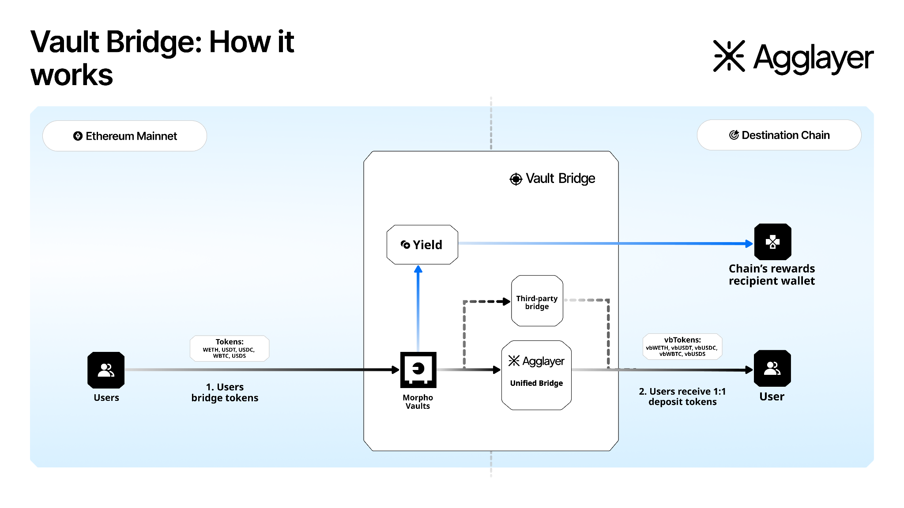

## **Vault Bridge**  
Vault Bridge turns idle bridged assets into productive reserves. Here’s how it works: Assets (including USDC, USDT, USDS, ETH, and WBTC) are deposited into Vault Bridge contracts on Ethereum and routed into curated yield vaults. Yield accrues on the underlying assets and is distributed periodically as newly minted vbTokens to a chain-provided wallet on Ethereum, administered by an independent third-party escrow.

vbTokens can be bridged to L2s, used across DeFi, and are redeemable 1:1 for the underlying assets.

## **Why it matters**

Most chains don’t have durable, non-inflationary revenue streams. Sequencer fees are limited, and inflationary token issuance dilutes token value in the long-term. Vault Bridge converts idle liquidity into a recurring, programmatic revenue stream.

## **Asset Flow** 

1. **Deposit on Ethereum**:  A supported asset (e.g., USDC) is deposited into a Third Party ERC-4626 yield-generating vault smart contract.   
2. **Mint vbToken**: A 1:1 vbToken (vbUSDC) is minted on Ethereum.  
3. **Bridge to L2**: vbTokens are bridged to L2.  
4. **Periodic yield distributions** : Yield earned on the underlying collateral is periodically minted as new vbTokens and distributed to the chain’s designated wallet address, managed by the escrow agent.  
5. **Redeem 1:1 on Ethereum**: Holders of vbTokens can bridge back and redeem them for the underlying asset that was originally deposited.

## **Use Cases** 

* **Accounts (chains, rollups, fintechs):** Earn sustainable, non-inflationary revenue from idle bridged assets.  
* **Agents (bridges, RaaS):** Add value to chains you support and capture part of the fee share.

## Explore Vault Bridge

  

    <h3 style="color: #0071F7; margin: 0 0 0.5rem 0; font-size: 18px; font-weight: 600;">
      Quickstart
    </h3>
    

      Bridge vbUSDC from Ethereum to L2 in five minutes with step-by-step guidance and sample code.
    

    <a href="/vault-bridge/get-started/quickstart/" style="color: #0071F7; text-decoration: none; font-weight: 500; font-size: 14px;">
      Get started →
    </a>
  

  

    <h3 style="color: #0071F7; margin: 0 0 0.5rem 0; font-size: 18px; font-weight: 600;">
      Routes
    </h3>
    

      Choose the interoperability route that matches your chain: Agglayer or Hyperlane, each with full walkthroughs and code samples.
    

    <a href="/vault-bridge/routes/agglayer/" style="color: #0071F7; text-decoration: none; font-weight: 500; font-size: 14px;">
      Explore routes →
    </a>
  

## **How to get started**

* Before using Vault Bridge, certain legal documentation is necessary, including entry into an agreement with the escrow agent. [Contact our team to get started on the documentation process.](https://info.polygon.technology/vaultbridge-intake-form) 
