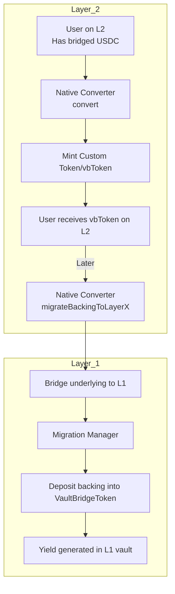

<!-- Page Header Component -->
<h1 style="text-align: left; font-size: 38px; font-weight: 700; font-family: 'Inter Tight', sans-serif;">
  Native Converter Integration
</h1>

<div style="text-align: left; margin: 0.5rem 0;">
  <p style="font-size: 18px; color: #666; max-width: 600px; margin: 0;">
    Enable local vbToken conversion on L2 without bridging to Ethereum
  </p>
</div>

## Overview

The Native Converter is an optional L2 component that dramatically improves user experience by allowing users to convert local assets (e.g., bridged USDC) directly into vbTokens (e.g., vbUSDC) without needing to bridge back to Ethereum first.

**Without Native Converter:**
```
L2 User has bridged USDC
  ↓
Bridge to Ethereum → Deposit to VaultBridgeToken → Bridge vbUSDC back to L2
  ↓
Total time: ~40-60 minutes, 2 bridge transactions
```

**With Native Converter:**
```
L2 User has bridged USDC
  ↓
Call convert() on Native Converter
  ↓
Receive vbUSDC instantly on L2
```

## How Native Converter Works

### Core Concept

The Native Converter maintains a **backing pool** of underlying tokens on L2 that backs the Custom Tokens (vbTokens) it mints locally. Periodically, this backing is migrated to L1 where it's deposited into the VaultBridgeToken to generate yield.



### Components

1. **NativeConverter Contract (L2)**: Handles local conversion/deconversion and migration
2. **CustomToken Contract (L2)**: Mintable/burnable version of vbToken
3. **MigrationManager Contract (L1)**: Receives and processes migrated backing

## When to Deploy Native Converter

**Deploy if:**

- Your L2 already has significant bridged asset liquidity (USDC, USDT, etc.)
- Users want to access yield without complex bridging
- You want to improve UX for converting to vbTokens
- You plan to actively manage backing migration

**Skip if:**

- You're launching a new chain with no existing liquidity
- Users are comfortable with L1→L2 bridging flow
- You want simpler initial deployment

## Deployment Guide

The full deployment scripts live in [`vault-bridge/script`](https://github.com/agglayer/vault-bridge/tree/main/script). At a high level:

1. **Deploy Custom Token** – Upgradeable ERC-20 mirroring underlying decimals.
2. **Deploy Native Converter** – Configure `underlyingToken`, `lxlyBridge`, `layerXLxlyId`, and `migrationManager`.
3. **Grant Roles** – Give Native Converter mint/burn permissions on the Custom Token and assign `MIGRATOR_ROLE`.
4. **Map Tokens** – Bridge governance links the Custom Token to the L1 vbToken so users receive the custom asset on L2.

Run the ready-made Foundry scripts (`DeployNativeConverter.s.sol`, `RegisterNativeConverters.s.sol`) with your environment variables—no need to rewrite them here.

## Using Native Converter

### Convert & Deconvert

```solidity
// SPDX-License-Identifier: MIT
pragma solidity ^0.8.20;

import "@openzeppelin/contracts/token/ERC20/IERC20.sol";

interface INativeConverter {
    function convert(uint256 assets, address receiver) external returns (uint256 shares);
    function deconvert(uint256 shares, address receiver) external returns (uint256 assets);
    function maxDeconvert(address owner) external view returns (uint256);
}

/// @title VbTokenVault
/// @notice Simple vault that uses Native Converter for yield access
contract VbTokenVault {
    IERC20 public immutable underlyingToken;
    IERC20 public immutable vbToken;
    INativeConverter public immutable nativeConverter;
    
    mapping(address => uint256) public userShares;
    uint256 public totalShares;
    
    event Deposited(address indexed user, uint256 underlyingAmount, uint256 shares);
    event Withdrawn(address indexed user, uint256 shares, uint256 underlyingAmount);
    
    constructor(
        address _underlyingToken,
        address _vbToken,
        address _nativeConverter
    ) {
        underlyingToken = IERC20(_underlyingToken);
        vbToken = IERC20(_vbToken);
        nativeConverter = INativeConverter(_nativeConverter);
    }
    
    /// @notice Deposit underlying and convert to vbToken
    function deposit(uint256 amount) external {
        // Take underlying from user
        underlyingToken.transferFrom(msg.sender, address(this), amount);
        
        // Convert to vbToken via Native Converter
        underlyingToken.approve(address(nativeConverter), amount);
        uint256 shares = nativeConverter.convert(amount, address(this));
        
        // Track user's share
        userShares[msg.sender] += shares;
        totalShares += shares;
        
        emit Deposited(msg.sender, amount, shares);
    }
    
    /// @notice Withdraw by deconverting vbToken back to underlying
    function withdraw(uint256 shares) external {
        require(userShares[msg.sender] >= shares, "Insufficient balance");
        
        // Check if deconversion is possible
        uint256 maxDeconvertable = nativeConverter.maxDeconvert(address(this));
        require(shares <= maxDeconvertable, "Insufficient backing on L2");
        
        // Approve and deconvert
        vbToken.approve(address(nativeConverter), shares);
        uint256 assets = nativeConverter.deconvert(shares, msg.sender);
        
        // Update tracking
        userShares[msg.sender] -= shares;
        totalShares -= shares;
        
        emit Withdrawn(msg.sender, shares, assets);
    }
    
    /// @notice Check user's vbToken balance
    function balanceOf(address user) external view returns (uint256) {
        return userShares[user];
    }
}
```

TypeScript helpers (`convert-to-vbtoken.ts`, `auto-migrate.ts`, dashboards, etc.) live in [`examples/native-converter`](https://github.com/agglayer/vault-bridge/tree/main/examples/native-converter).

### User Flow Template

Combine the convert/deconvert helpers with periodic migrations to offer a full user vault. Reference implementation: [`examples/native-converter/VbTokenVault.sol`](https://github.com/agglayer/vault-bridge/blob/main/examples/native-converter/VbTokenVault.sol).

### Monitoring & Analytics

Track:

- **Backing ratio** (`backingOnLayerY / totalSupply`)
- **Migratable backing** (`migratableBacking()`)
- **Conversion volume** (`Convert` / `Deconvert` events)

Sample dashboards are included in the examples folder for quick integration with your observability stack.

## Security Considerations

1. **Role Management**
   - MINTER_ROLE and BURNER_ROLE: Only Native Converter
   - MIGRATOR_ROLE: Trusted automated system or multisig
   - DEFAULT_ADMIN_ROLE: Multisig recommended

2. **Backing Sufficiency**
   - Always check `maxDeconvert()` before deconversions
   - Monitor backing ratio (should be ~100%)
   - Set appropriate `nonMigratableBackingPercentage`

3. **Migration Safety**
   - Verify migration completes on L1
   - Monitor MigrationManager events on L1
   - Implement migration failure handling

## Testing

See [Testing Guide](testing-guide.md) for:
- Unit tests for Native Converter
- Integration tests with VaultBridgeToken
- Migration workflow tests

## Troubleshooting

| Issue | Cause | Solution |
|-------|-------|----------|
| `AssetsTooLarge` on deconvert | Insufficient backing on L2 | Wait for migration or reduce amount |
| Mint/burn fails | Missing role permissions | Grant MINTER/BURNER roles to Native Converter |
| Migration fails | Insufficient migratable backing | Check `migratableBacking()` |
| Custom token not received after claim | Token not mapped on bridge | Configure bridge token mapping |


